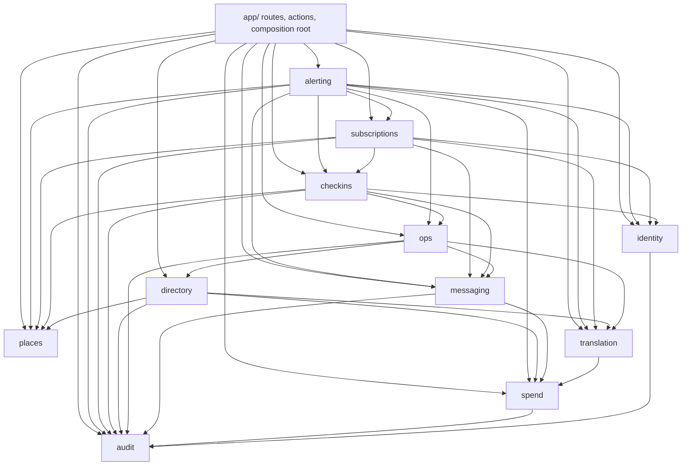
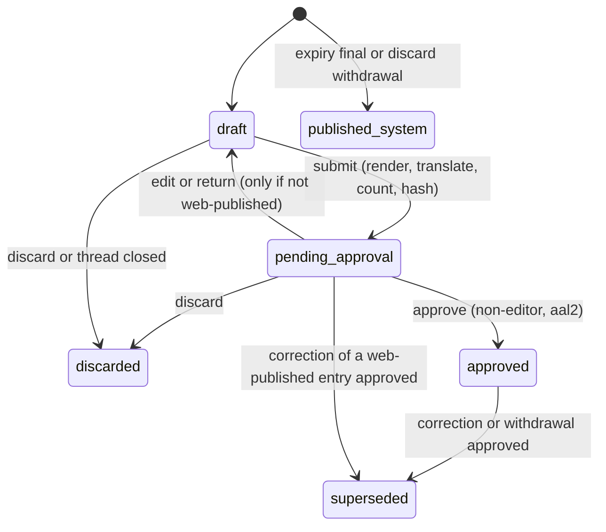
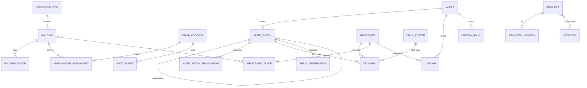
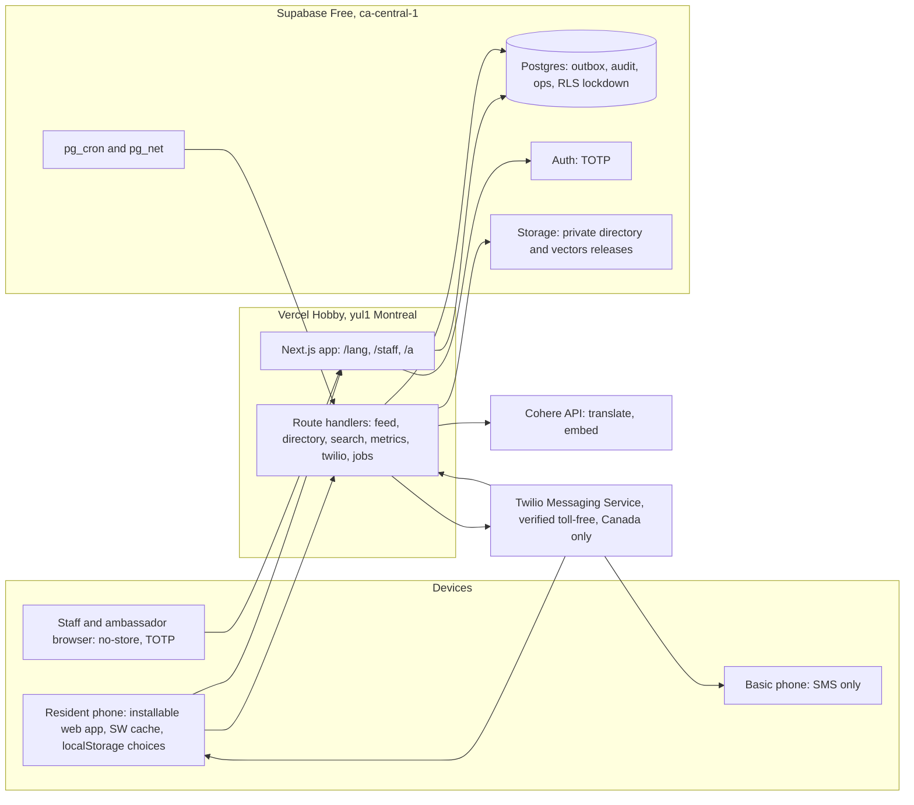

# Architecture Spine — CVH Pilot

## Design Paradigm

**Modular monolith, hexagonal per module, one Next.js app on Vercel.** Each module owns its tables and exposes one import surface; vendors (Supabase, Twilio, Cohere) sit behind ports.

| Layer | Lives in | May import |
| --- | --- | --- |
| Routes, server actions, route handlers, composition root | `src/app/` | module `index.ts` files, `src/contracts`, `src/platform`, `src/ui`, `src/i18n` |
| Wire contracts (zod schemas, code lists, the pure audience matcher) | `src/contracts/` | nothing but zod; safe to import in client code |
| Domain (pure rules, state machines) | `src/modules/<m>/domain/` | own `domain/`, `src/contracts`, `src/i18n` catalogs; no I/O, no clock |
| Application (use cases, port interfaces) | `src/modules/<m>/application/` | own `domain/`, other modules' `index.ts` per the graph |
| Adapters (Drizzle repos, Twilio, Cohere, Storage) | `src/modules/<m>/adapters/` | own `application/` ports |
| Platform (config, db, logger, clock, ids, http) | `src/platform/` | nothing in `src/modules` |

Every module may import `src/platform`, `src/contracts` and `src/i18n`; the diagram shows only module-to-module edges.



## Invariants & Rules

### AD-1 — One app, two surfaces, one origin

- **Binds:** all screens; N3; R-3
- **Prevents:** check-in phone numbers cached on an ambassador's phone; resident and staff code drifting on tokens, strings and auth.
- **Rule:** resident surface at `/[lang]/…` (public, service-worker cached); staff and ambassador surface at `/staff/…` (authenticated, `Cache-Control: no-store`). The service worker caches only `/[lang]/**`, `/api/feed`, the immutable `/api/directory/{v}/**` files, static assets; viewed map tiles (the only cross-origin resident fetch) are kept by the map page itself, up to 200 (S02.07); `/api/directory/manifest` is network-first with the last copy as offline fallback; every `/staff/**` and `/api/staff/**` response, and every subscription edit page and API (`/[lang]/subscription/**`, `/api/subscription/**`), is network-only and `no-store`. The one exception is the open check-in round page: once loaded, its data lives only in that page's memory (never the service worker, `localStorage`, IndexedDB or any other storage API, asserted by a test), marks made without signal queue in memory and send when signal returns, and the page clears its data when closed or after 10 minutes in the background. Apart from map tiles, residents fetch everything from the app's own origin (directory files are proxied, AD-11).

### AD-2 — Modules own their tables; dependencies point one way

- **Binds:** all modules
- **Prevents:** two modules writing one table; cycles; tables created with no owner.
- **Rule:** a table is written only by its owning module (Structural Seed ownership table); others call that module's `index.ts`. Imports follow the dependency diagram only. The dependency-cruiser config is generated from that diagram; a cycle, an undeclared edge or a deep import fails CI, and changing either needs a spine update. A migration that creates a table missing from the ownership table fails CI. Downstream modules return values; there is no event bus. The only writes that cross module tables are declared foreign-key actions (`ON DELETE CASCADE` / `SET NULL`). Ports whose implementations live in other modules (for example `messaging`'s `ContactResolver`) are wired in the app's composition root.

### AD-3 — Residents have no identity; personalisation is on the device

- **Binds:** P3, P4, P5, P10, A1, A12, A13, N3
- **Prevents:** the server learning a non-subscriber's building, floor or groups.
- **Rule:** resident choices (language, buildings, floors, groups, muted topics, basic mode) live only in `localStorage`. Resident routes set no cookies: next-intl runs with `localeCookie: false`, Supabase middleware matches only `/staff/**` and `/api/staff/**`, and an end-to-end test asserts no `Set-Cookie` on `/[lang]/**`, `/api/feed`, `/api/buildings`, `/api/search`, `/api/directory/**`, `/api/metrics`, `/api/twilio/status` (S06.04) and `/a/**`. Resident requests never carry building, floor or groups, except the SMS sign-up and edit-link POSTs. The server serves whole-neighbourhood data; the device orders and highlights with the same matcher as SMS targeting (AD-7). Language is a URL segment. Usage counts come only from `/api/metrics`, which accepts `{evt, lang, nbhd?}`, stores daily counts and nothing else (no IP, no identifier).

### AD-4 — Staff identity, roles and authority

- **Binds:** G1, G2, C3, D-2, E2, N5
- **Prevents:** a leaked anon key exposing data; authorization split between SQL and TypeScript; removed staff keeping access; two readings of who may author or approve.
- **Rule:** Supabase Auth, invite-only, with no email sent in the pilot: an Admin creates each account with a unique username and the staff member's email recorded as a contact detail (no mail is sent; the sign-in identity is confirmed at creation). The starting password is `rvh-firstname-lastname`, valid once: `staff_account.must_change_password` blocks every `/staff` action except choosing a new password until it is cleared, and an account whose starting password is unused after 24 hours is locked until an Admin re-issues it. After that, only an Admin resets a password or a second factor (both audited). The first Admin is created once by an audited CLI script. There are always at least two usable Admins (active, not locked, own password, enrolled authenticator): a suspension, removal or demotion that would leave fewer is refused, under a lock on the Admin rows and a database trigger; only recovery (an Admin-issued password or authenticator reset) and the automatic locks may leave fewer, audited with `admin_shortfall` and shown to every Admin until two are usable again. TOTP (`aal2`) is required for every Admin and Coordinator session; their approve, correct, withdraw, drill, publish, cap, pause and account actions therefore run at `aal2`. Ambassadors and Directors sign in at `aal1`. Sessions end after 30 minutes idle for Ambassadors and after 12 hours for Coordinators, Directors and Admins. Every staff request loads `staff_account` and rejects unless `status = 'active'`; suspension also signs out globally. Authority is one table-driven function `identity/domain/policy.ts#can(role, action, context)`, evaluated at submit and again at approve against the author's current status and assignments:

| Action | Ambassador | Coordinator | Director | Admin |
| --- | --- | --- | --- | --- |
| Author ack, update, final for any floor of an assigned building | yes | yes | no | yes |
| Author neighbourhood scope, or heat, smoke, winter | no | yes | no | yes |
| Author correction or withdrawal | own pending entries only | yes | no | yes |
| Approve (never an editor of that entry, AD-5) | no | yes | no | yes |
| Drills, publish directory, accounts, cap, pause | no | no | no | yes |
| See open check-in rows | assigned floors, open alerts | no | no | yes |
| See counts and coverage | no | yes | yes (read-only) | yes |
| See spend | no | no | yes (read-only) | yes |

  Every table has RLS enabled with no anon or authenticated policies; the app reaches Postgres only server-side through Drizzle. `supabase-js` is used for Auth and Storage only.

### AD-5 — Alert threads and entries

- **Binds:** A4, A5, A7, A15, A16, D-1, E2
- **Prevents:** sending what nobody approved; self-approval through editing; quiet replacement of anything residents saw; two ways to close a thread.
- **Rule:** an `alert` is a thread (`open → closed{resolved|expired|withdrawn}`); an `alert_entry` (`ack|update|correction|withdrawal|final`) is anything published. Entry transitions exist only in `alerting/domain/lifecycle.ts`, and a trigger rejects any other. Dispatch progress is not an entry state (AD-8).
  - **Approval:** binds to `content_hash` (AD-21). `alert_entry.editor_ids` holds the author and every account that edited it; approval requires `approver_id <> ALL(editor_ids)` (also a trigger).
  - **Return to draft (S04.03):** `pending_approval → draft` carries `returned_for` (`edit`: anyone who may author the entry pulls it back; `return`: an approver sends it back; `retranslate`: "Try translation again"). `edit` and `retranslate` add the actor to `editor_ids`, `return` does not. The return clears the approval binding (`content_hash`, `sms_bodies`, `submitted_at`) and deletes the entry's translations; `version` only ever goes up, by one at each submit. Approval stores the `approved_version` and `approved_hash` it was shown, which the trigger requires to equal the entry's. Every human entry change names its actor in the session variable `cvh.actor_id` (E05's expire job extends the trigger for the system actor, `cvh.system_actor`). Only an editor submits and only an editor adds a translation (trigger). A closed thread's entry is discarded only while the session variable `cvh.closing` is `on`.
  - **Web publication:** an entry is web-published when `web_published_at` is set: at submit if D-1-eligible, else at approval. A web-published entry never returns to `draft`; changing it means a `correction` that supersedes it. Discarding a web-published entry creates a system `withdrawal` entry that supersedes it in the same transaction.
  - **D-1 eligibility:** decided only by `alerting/domain/d1.ts#isD1Eligible`: author role Ambassador, not a drill, kind `ack|update|correction`, and every type in `entry.types` has `disruption_type.direct = true` (null counts as false).
  - **Supersession:** a correction or withdrawal may target an entry that is `approved` (including mid-dispatch) or `pending_approval` and web-published. Its approval moves the target to `superseded` and cancels the target's queued deliveries in the same transaction; a superseded pending entry stays visible until its correction is published.
  - **Closing:** only `alerting.closeAlert(alertId, reason)` closes a thread, called from: approval of a `final` (`resolved`); approval of a withdrawal, or a discard or duplicate merge, that leaves no published, non-superseded substantive entry (`ack|update|correction|final`; withdrawal notices never count) (`withdrawn`); the expire job (`expired`, never shown as resolved). An ambassador's "mark resolved" submits a `final`. Closing a thread for its approved `final`, or for the withdrawal that leaves no substantive entry, cancels the queued deliveries of every other entry but never that closing entry's own, which stay sendable after the close. A `final` reaches every recipient of the thread on every channel used.
  - **System entries:** the only transition without a human author is `[*] → published_system`, for an expiry `final` or a discard `withdrawal`; it is web-only, creates no deliveries, and the trigger allows it only when the session variable `cvh.system_actor` is set by the expire job or the discard use case.
  - **Duplicates:** a new thread overlapping an open non-drill thread in audience and type shows the approver a "possible duplicate" link; in the pilot a duplicate is withdrawn with reason "duplicate" (merging threads is deferred to the MVP).



### AD-6 — Drills are isolated by data

- **Binds:** A17, R-2
- **Prevents:** a drill reaching a resident, a real check-in round, or a resident-facing page; a drill turning into a real alert.
- **Rule:** `alert.is_drill` is set at creation and immutable. A drill entry can create `delivery` rows only to `drill_roster` recipients (trigger). Inserting a `checkin` row for a drill alert is rejected (trigger). Every resident-reachable read (feed, archive, status, share landing, building page) goes through `alerting`'s resident queries, which select from the `nondrill_alert` view only; a lint rule forbids other alert relations in those query files, and an integration test hits every resident route and API with a drill present. `/a/{slug}` of a drill returns 404. Staff lists show drills in a separate labelled section. Every drill SMS and screen carries the exercise marker. Metrics partition by `is_drill`.

### AD-7 — One audience type and one matcher

- **Binds:** A1, A9, A13, A16, C7
- **Prevents:** web, SMS and check-in rounds disagreeing on who an alert is for; recipients or languages shifting after approval.
- **Rule:** `Audience` (in `src/contracts/audience.ts`) is `{scope:'neighbourhood', neighbourhood_ids} | {scope:'buildings', buildings:[{rsn, floors: string[] | null}]}` plus `groups` and `types`; floors are floor ids (`building_floor.id`, never a label or number), a sorted, deduplicated list (a range such as floors 4 to 6 is expanded at input by the building's `sort_order`, and a reversed range is refused), `null` means the whole building. Floor ids rather than floor numbers are pending owner decision 28. This exact value is stored in `alert_entry.audience`, hashed, sent in the feed and taken by the matcher. `src/contracts/audience.ts#matches(audience, profile)` (pure, used by the server and the device) is the only matching rule (neighbourhood → everyone there; building → that building and, when floors are given, those floors or no floor recorded; no building recorded → neighbourhood alerts only, of every neighbourhood, because a device's neighbourhoods come from its saved buildings (default decided in S04.04, owner to confirm); groups → intersection; several places match once). Topic opt-outs and the fire and evacuation override are applied inside `matches`, never by callers: a muted topic suppresses only when every type of the alert is muted, and fire never. The SQL query in `subscriptions` must equal it (property test). At approval the recipient set, each recipient's language and SMS body are written into `delivery` rows. Correction and withdrawal recipients = the target's recipients (opt-outs never remove them) ∪ the entry's own audience, deduplicated. A final has no target: its recipients = the union of the recipients of every entry in the thread on the channels each used ∪ the final's own audience, deduplicated by recipient and channel. Language is each recipient's current language.

### AD-8 — One outbox for every outbound message

- **Binds:** A2, A15, A16, G6, N4, N9, D-7
- **Prevents:** double sends; sends that skip approval, spend accounting or masking; transactional texts with no sanctioned path.
- **Rule:** every outbound SMS is a `delivery` row with `kind`:
  - `alert`: created only by an approval.
  - `transactional`: confirmation, welcome, prompts, replies, approver and Hub notifications, ops alerts; created by `alerting`, `subscriptions`, `checkins` and `ops` use cases.
  - `campaign`: D-7 re-consent; needs an Admin with `aal2`.

  `recipient_kind` is `subscriber|pending_signup|roster|staff|oncall|inbound_reply` (`inbound_reply`: a number with no subscription, held at most 30 minutes and deleted in the hand-off transaction); staff on-duty and on-call numbers live in `ops.oncall_roster`. `idempotency_key` is unique (`entry_id:recipient:channel` for alerts, `kind:subject:purpose:nonce` otherwise). The dispatcher resolves phone numbers at the hand-off point through a `ContactResolver` port, wired to `subscriptions`, `identity` and `ops` in the composition root. Delivery states: `queued → claimed → submitted → delivered|failed|undelivered|unknown`, plus `cancelled`, `skipped`, `skipped_env`. A dispatcher (run right after approval and every minute by pg_cron) commits `claimed` with `claimed_at` in its own short transaction before calling the provider, commits `submitted` with the provider id right after each call, and claims only `queued` rows, in one fixed order: fire and evacuation alert entries first, then on-call and other `transactional` texts, then building-level before neighbourhood-level alerts, then oldest first; `alerting` cancels queued rows whenever an entry is superseded or discarded, or its thread closes, except the rows of the closing entry (the approved `final`, or the withdrawal that left no substantive entry), which stay sendable after the close (AD-5, AD-18). A row claimed but not handed off for 5 minutes returns to `queued`; one handed off with no recorded outcome for 5 minutes, or `submitted` with no final status after 24 hours, becomes `unknown` and is never re-sent automatically. Retries (at most 3) apply only when the provider clearly did not accept the text (HTTP 429, or a connection that failed before sending); a 5xx, timeout or dropped connection after sending makes the row `unknown`. Only one dispatcher sends at a time (a lease row with an ownership token checked at every claim and hand-off), at a shared pace. The hand-off transaction locks the delivery row, checks the lease token, re-reads the pause, entry, thread and recipient, and commits `handed_off_at` only if the row is still sendable. Every change that must stop a send writes the delivery rows itself, in its own transaction: corrections, withdrawals, discards and closes cancel the affected entries' `queued` and claimed-but-not-handed-off rows (the closing entry's rows excepted); a recipient deletion sets that recipient's rows `skipped` before the recipient is deleted. So cancellation wins whenever it commits before the hand-off; a pause committed during an open hand-off lets that one text go, shown as in flight (disclosed allowance). Status callbacks carry an opaque delivery reference in their signed URL. The guarantee is no automatic duplicate submission, not exactly-once delivery. Before each claim and at the hand-off the dispatcher checks the pause on `messaging_control`, which only an Admin sets (audited); on-call texts are still sent during a pause. Sends go through one Twilio Messaging Service on a verified toll-free number; status comes from signed webhooks. Nothing else calls the SMS adapter. **Spend:** a text's estimate is counted once, when the provider accepts it or its outcome becomes `unknown`; actual SMS cost comes from reconciliations, each with an exact UTC interval and a stable id (`month:{YYYY-MM}` for a Toronto calendar month). A reconciliation lists the interval's outbound messages from the Twilio Messages API to the last page and records each message's price once by `MessageSid` (unique across all reconciliations), only when the listing is complete and every message is priced. An actual retires the delivery estimate whose provider id equals its `MessageSid`, whatever interval or timestamp either falls in, including an estimate found after the actual was imported; repeating an import changes nothing. Estimates with no matching actual stay counted as "unresolved estimates", and actuals with no matching delivery are counted as "unmatched actuals", both shown separately; an interval whose reconciliation is incomplete is labelled "pending reconciliation" with its estimates still counted, never zero. **Spend cap:** when month-to-date plus the entry's estimate (calendar month in `America/Toronto`) exceeds the cap, the approval view shows the shortfall, approval records `cap_overrun` in the audit and notifies Admins; it never refuses. There are no spend reservations in the pilot.

  **The outbox table (S06.01).** `delivery` holds, per text: `kind`, `recipient_kind`, `recipient_id` (the id in the table `recipient_kind` names, so not a foreign key; null once the recipient is deleted), `entry_id` (alerts), `campaign_id` (campaigns), the creating module and `purpose` (transactional and campaign), the language of the frozen `body`, `segments`, the cost estimate in cents, the unique `idempotency_key`, the `callback_ref` (an opaque random UUID the database makes), `state`, `attempts`, `due_at`, `send_by`, the claim (`claimed_at`, `claimed_by`, `claim_token`), `handed_off_at`, `submitted_at`, the provider's id and error code, and the times; there is no column for a number. Triggers refuse, whoever asks: any change of state not in the transition table of the E06 definitions (`messaging/domain/deliveryState.ts` is the same table; a test checks every pair of states against both) and any change at all to a terminal row; a change to what was frozen at creation; a cancel or skip of a row already handed off; a second automatic submission (a handed-off row returns to `queued` only with `attempts` raised, at most 3; a claimed row gets an outcome only after its hand-off; a `queued` row holds no provider id); an `alert` row outside the approval transaction of its entry (the approval use case sets the transaction-local setting `cvh.approval_entry_id`, `messaging`'s `markApprovalTransaction`; the entry must be `pending_approval` or approved by that same transaction, `approved_at = now()`, and the row's body and segments must be the entry's frozen SMS body for its language); a `transactional` row whose purpose is not on its creating module's allow-list (`delivery_purpose_rule()`, mirrored by `messaging/domain/deliveryRules.ts`), whose recipient kind that purpose never texts, or with no `send_by` within the purpose's window, or whose key holds a phone number; and a `campaign` row unless its campaign was started by an Admin at `aal2` (`delivery_campaign_started_by_admin()`, which answers false for every campaign until S09.07 creates the `campaign` table, so every campaign row is refused until then; a campaign text goes to a subscriber). An insert whose key exists returns the existing row without error (`ON CONFLICT DO NOTHING`, then a read). The recipient's table (any module) carries `delivery_forget_recipient('<recipient_kind>')` as its `AFTER DELETE` trigger, the declared `ON DELETE SET NULL` of this polymorphic link (AD-2; created with the recipient's table), and its deletion use case first calls `messaging`'s `skipRecipientDeliveries`. The `ContactResolver` port (`messaging/application/deliveryPorts.ts`) asks a `RecipientNumberSource` per recipient kind, given by the module that owns the kind (`subscriptions`, `identity`, `ops`) and wired in `src/app/messaging.ts`; it runs inside the hand-off transaction, keeps the number in memory only, takes an `inbound_reply` number by deleting its row in that transaction, and logs a number only as its last two digits.

  **The sender (S06.02).** One use case, `messaging`'s `createDispatcher(...).run()`, is the only code that hands a text to the SMS provider; `/api/jobs/dispatch` (pg_cron every minute, with the job secret) and `kickDispatcher()` (called once the approving transaction has committed) are its two ways in (`src/app/dispatch.ts` is its composition root); the kick's run lives inside the approving request's function after the response, so it is shorter (20 s, sending for 10 s) and the approving route sets `maxDuration = 60`, while the job route's run has the full 60 s. A run takes the **sender lease** (`dispatcher_lease`, one row that holds a random ownership token and an expiry 60 s ahead, taken by a conditional update only when the previous lease has expired, renewed every 20 s, given up at the end of the run, after which a holder whose queue ran dry looks once more and takes the lease again if a text is due, so a kick that found the lease held on its last, empty claim is not left waiting for pg_cron) or exits without claiming; every renewal, claim and hand-off compares `token = mine and expires_at > now()` (the database's `now()`; a test moves it with a skew, so no app clock decides), and a worker that finds its token changed stops without calling the provider. A new holder returns the rows its predecessor claimed and never handed off to `queued` (a handed-off row is left for its callback or the sweep) and sweeps (`claimed` for 5 minutes with no hand-off returns to `queued`; handed off with no outcome for 5 minutes, or `submitted` for 24 hours, becomes `unknown` with an `ops_event` `delivery.unknown` written in the same transaction; none is ever sent again). Each `unknown` is settled in a transaction of its own (at most 200 rows per run): a row whose event cannot be written stays as it was and is tried again at the next run, the spend hook runs in a savepoint so a failing hook never keeps a row from becoming `unknown`, and a failure of the whole upkeep is logged and never stops the run from claiming and sending. **Claim order** is one number, `delivery.claim_rank`, set by the insert trigger from the entry's frozen types and audience (`delivery_claim_rank()`, which `messaging/domain/dispatchRules.ts#claimRank` repeats; a test compares them): 0 fire alert entries (the one type that ranks first is `fire`, "Fire alarm or evacuation", the audience rules' `SAFETY_OVERRIDE_TYPES`), 1 on-call texts, 2 other transactional texts, 3 building-level alerts, 4 neighbourhood-level alerts, 5 campaign texts, then oldest first. A run claims a few rows at a time (`FOR UPDATE SKIP LOCKED`, `claimed` with its worker and lease token in its own short transaction), never more than it can send at the **shared pace** (at most `SMS_SEGMENTS_PER_SECOND`, default 3, in any one second, a sliding window kept across runs through `dispatcher_lease.paced_until`) before its time limit less a 10 s margin (which covers the adapter's 8 s wait for the provider and the outcome's write), so a fire alert approved during a burst is claimed at the next batch. The **hand-off** is one transaction: lock the delivery row `FOR UPDATE` (the row a cancellation, a skip or a requeue also writes, so whichever commits first wins), check the lease token, then the pause, `send_by`, the entry and thread (`AlertStandingReader`, implemented by `alerting`) or the campaign (`CampaignStandingReader`, S09.07), then the recipient and its number (the ContactResolver, with the delivery's kind and purpose), and commit `handed_off_at`; a row that is not sendable becomes `cancelled` (what was withdrawn) or `skipped` (too late, or no recipient), a paused one returns to `queued`, and under `SMS_MODE=log` every sendable row becomes `skipped_env` with no number asked for and no credential read. Only after that commit is the Messaging Service called, once (`SmartEncoded=false` on every request, the frozen body byte for byte, the status callback `PUBLIC_BASE_URL/api/twilio/status?ref={callback_ref}` with Twilio's retry fragment, see S06.04 below), and the outcome written only while the row is still `claimed` by this token (a callback's state is never overwritten; a missing provider id is filled): `submitted`; not accepted (HTTP 429 with an error body, or a connection that failed before any of the request was sent, classified by the adapter) back to `queued` with 30 s, 2 min and 10 min backoff and the attempt counted, then `failed`; a provider 4xx other than 429 `failed`; anything else `unknown`. A 401 answer stops the run at once, and so do three 403 answers in a row (wrong credentials would fail the whole queue). `messaging_control` (one row, the pause, set by S06.06) is only read here, and `afterOutcome` is the seam S06.08 uses to write the spend estimate in the outcome's own transaction. Messaging may not import `ops`, so `OpsRecorder` is a port wired in the composition root. The daily `/api/jobs/messaging-config` reads the Messaging Service's Smart Encoding setting and records `messaging.smart_encoding_on` (the health job's on-call alert, S06.07).

  **The status callbacks (S06.04).** A text's delivery status comes only from Twilio's signed status callbacks, `POST /api/twilio/status?ref={callback_ref}` (`messaging`'s `createStatusCallbacks(...).handle`, composed in `src/app/statusCallback.ts`; the route sets no cookie, is never cached and never logs a number, a text, a signature or a reference). **The signature comes first, before any other work:** `X-Twilio-Signature` must be the base64 HMAC-SHA1, keyed by the Twilio account's Auth Token (`TWILIO_AUTH_TOKEN`), of the URL `PUBLIC_BASE_URL` + `/api/twilio/status` + the query string as received (so the `ref` is signed, and the request's host header, which a proxy can change, is never used) followed by the form body's parameters sorted by name, each as name and value (Twilio's documented algorithm, `domain/twilioSignature.ts`, tested with vectors computed by hand and against the official library's helper). The comparison is constant-time; a missing or wrong signature answers 403, does nothing else, and records `webhook.signature_invalid` in `ops_event` (a code only; capped at 50 such events in 10 minutes because anyone can send the request, which is far above the alert's threshold of more than 5 in 10 minutes, S06.07). With no Twilio account configured (every environment but production) nothing can be validated: 503, nothing touched. **Retries.** By default Twilio retries a webhook once, and only when the connection fails, so a 5xx would lose the status for good; the `StatusCallback` the dispatcher gives it is therefore `PUBLIC_BASE_URL/api/twilio/status?ref={callback_ref}#rc=3&rp=ct,5xx` (`providerStatusCallbackUrl`): up to three retries, on a connection failure or a 5xx (the route answers 500 with no detail when the database fails, and the transaction has rolled back), never on a 4xx. The fragment is never sent and Twilio leaves it out of the signature, so the signed URL is unchanged and every callback is idempotent; Twilio's total time of 15 seconds covers the retries, so a database that stays down longer leaves the text to the sweep (`unknown` after 5 minutes if still `claimed`, after 24 hours if `submitted`), visible and never sent again. **A signed callback** with no `ref`, a `ref` that matches no delivery, or no usable `MessageSid` and `MessageStatus` changes nothing, answers 200 and is counted (`delivery.callback_ignored`: `no_ref`, `unknown_ref`, `invalid_payload`). Otherwise one transaction locks the delivery row `FOR UPDATE` (the row the dispatcher's outcome write, the sweep and a cancellation also lock, so whichever commits first wins and the others find the row as it then is) and applies the status by the transition table (`domain/statusCallback.ts#decideCallback`, stricter than the `delivery_guard` trigger, which still refuses anything else): `queued`, `sending`, `sent`, `accepted` and `scheduled` mean `submitted` (for a `claimed` or `unknown` row only); `delivered`, `undelivered` and `failed` are final (from `claimed`, `submitted` or `unknown`, with Twilio's `ErrorCode` kept for the last two); a row with no provider id takes the callback's `MessageSid`, and one that has a different id is left alone and recorded (`delivery.provider_id_mismatch`); a terminal state never changes, so a repeat, a late non-terminal status and any status after a final one change nothing and are not counted; a callback for a row the provider cannot have a text for (`queued`, `claimed` and never handed off, or finished without ever having an id) changes nothing and is counted (`delivery.callback_ignored`, `not_in_flight`); a row that was `unknown` and moves on is marked resolved in the same transaction (`delivery.unknown_resolved`), so the health job (S06.07) can record the recovery; an `unknown` row that was once `submitted` (the sweep gave up on it after 24 hours with no final status) moves only on a final status, because a non-terminal one would put it back in `submitted` with its first `submitted_at` and the next sweep would make it `unknown` again, so every replay would change the row and write a false recovery: such a status changes nothing. A callback that arrives before the dispatcher has recorded Twilio's response ends the row at the callback's status with the provider id, and the dispatcher's late write (conditional on `claimed` and its claim token) changes nothing; the other order gives the same row. The callback that moves a `claimed` row is the first record that the provider accepted the text, so it is where the spend estimate is counted for that text (`afterOutcome`, S06.08, in a savepoint: a failing hook never undoes a status).

### AD-9 — Inbound SMS, consent and the end of the pilot

- **Binds:** A2, A12, C4, C6, D-6, D-7
- **Prevents:** two handlers acting on one reply; unconfirmed numbers receiving alerts; basic-phone users unable to change choices.
- **Rule:** one router, `subscriptions/application/handleInbound`, uses a decision table keyed by (keyword, the number's state `none|pending|active`, open prompt). A number receives alerts only after replying YES to its confirmation; pending sign-ups expire after 48 hours. Twilio Advanced Opt-Out owns STOP, START and HELP and sends their replies (its configured START and HELP replies include the sign-up link); on an opt-out event the app deletes the subscription and sends nothing itself. Inbound messages are de-duplicated by `MessageSid` (hash kept 48 hours), and deletion requests are handled before rate limits. Numbered replies: 1 and 2 start an SMS menu (state in `sms_prompt`) that goes street → building on that street → floor, or language by list number; options are numbered 1 to 7 per page; 0 is Back, 8 is More and 9 is the Hub's number at every step; menu 1 replaces all saved buildings and warns first when more than one is saved; a menu idle for 10 minutes resets with a message saying so. Every menu message is a catalog string in the subscriber's language and must fit one segment in that language's encoding (AD-21). A single-use 30-minute web edit link is offered as an alternative; 3 withdraws the check-in request and deletes its open check-in rows; outside a menu, 0 asks for confirmation and a second 0 deletes. After deletion the app sends nothing to that number. YES resolves to the open prompt with the latest `sent_at`. Every app-sent reply is a catalog string in the subscriber's language; the STOP, START and HELP replies are Twilio's and are tested on the verified toll-free number before launch. Inbound bodies are not stored, only keyword counts. D-7: at pilot end an Admin sends a `campaign`; `subscriber.retention_state` moves `active → reconsent_pending`; YES sets `retained`; receiving subscribers are `active`, `reconsent_pending` before the deadline, or `retained`; the campaign text is a frozen catalog string reviewed before the pilot; one Admin at `aal2` starts it after a rehearsal on the drill roster, idempotently; starting it deletes pending sign-ups and closes sign-ups; the purge job deletes `reconsent_pending` subscribers after the deadline (30 days after the campaign), re-checking state under the row lock.

### AD-10 — Translation is routed, checked, cached and labelled

- **Binds:** A3, D-4, D-5, D7, D2, N1
- **Prevents:** wrong-language text reaching residents; model choices scattered in code; vendor language codes leaking into data.
- **Rule:** all translation goes through `translation`'s `Translator` port using Cohere models only. `translation_route` (config, not code) holds per language: the ordered models and the check, which is either an `eld` code (for example `prs → fa`) plus the script check, or, for languages `eld` does not support (`ps`), the script and marker-letter check alone (Pashto letters ټ ډ ړ ږ ښ ګ ڼ ې ۍ; Urdu letters ٹ ڈ ڑ ں ے ھ ہ must be absent from Pashto and Dari). Languages run in parallel. Every attempt has its own timeout per route position (language, model), set from that model's measured p99 for the language (provisional, re-measured during the pilot), and each language has a route deadline (the sum of its attempt timeouts, at most 30 s) after which the attempt in flight is cancelled; a timeout counts as a failure. On failure the next model runs; if all fail, the result is `fallback_en`. Alert entries are translated once at submit into every launch language, and frozen; approval never re-translates. (Clarification: web readers may use any launch language, so for the web every language is present in the audience, as FR-A3 requires.) A recipient whose language has no frozen text gets the English text with `translation.unavailable`, and the approver sees how many. The app never translates directory listings: they come pre-translated by the offline scripts from `data/catalogue/` (AD-11). They are not all reviewed by a person: under the product owner's pilot decisions of 2026-10-03 (decision 39: unreviewed machine translations of ordinary provider descriptions may ship, labelled "Machine-translated; not reviewed by a person"; decision 42: not for safety-critical providers), the rest still ships only when reviewed (AD-11). Guides are translated once at seed time by the same offline scripts and reviewed like the catalogue. `zh-Hant` is produced from approved `zh` by OpenCC conversion (`script_converted`). Cache key `(source_hash, lang, model_id, prompt_version, check_version)`, plus the OpenCC version and configuration for `zh-Hant`; only passing results are cached. Each call records its usage in `spend`. Vendor codes live only in adapters; everything else uses `LangCode` (AD-20).
- **As built (S04.02):** `translation_route` has one row per route position, `(lang, position)`: the model, that position's attempt timeout in milliseconds (a whole number of seconds, 1 to 20), the language's check (`eld_code`, `script`, `marker_letters` of which one must be present, `excluded_letters` of which none may be, the same on every row of a language) and `source` (`provisional` or `measured`). A language's route deadline is not stored: it is the sum of its attempt timeouts, and a deferred constraint trigger refuses a language over 30 s or whose rows disagree about its check. English (the source) and `zh-Hant` (converted) have no route. The migration seeds the addendum's routing table in the order of the offline catalogue script, with every language at a provisional 20 s route deadline (one model 20 s, two models 10 s each). **These attempt timeouts and deadlines are provisional (`source = 'provisional'`): they were chosen before any latency was measured. S04.01 measures every model per language and replaces them by a later migration, setting `source = 'measured'`; S04.02 builds no measurement.** The app can read `translation_route` and cannot change it. `translation_cache` keeps a passing result under `(source_hash, lang, model_id, prompt_version, check_version, opencc_version, opencc_config)`; the OpenCC columns are empty except for `zh-Hant`, whose `model_id` is the model that wrote the zh text it was converted from and whose row also names the sha256 of that zh text, which must equal the current zh text for the row to be used. The table accepts only the statuses `ok` and `script_converted`, so a failure or the English fallback cannot be cached whatever the code does. The app's update right on the table reaches only a zh-Hant conversion's body and source hash (a column grant, and an update policy that sees only `script_converted` rows of zh-Hant before and after the change), so a model's text is written once and the app cannot change it. `prompt_version` is the Cohere adapter's `PROMPT_VERSION`, bumped with any change to the prompt or the language names in it (a test pins a fingerprint of both); `check_version` is made per language from the checks' own version (`CHECK_LOGIC_VERSION`), the `eld` version and that language's check row, so changing a row's check, the rules or `eld` gives a fresh translation of the language while other languages stay cached; a change of OpenCC's version or configuration converts `zh-Hant` again and leaves the zh text cached. `translation`'s `createAlertTranslator` runs the languages in parallel; each position has its own timeout and the language its deadline; an attempt that reaches either is aborted, and an answer that arrives later is never read; an error, a timeout, an empty answer and a failed check each count as a failed attempt and the next model runs; when all fail the text is the English with status `fallback_en` (not machine text, no model). Digits are Western in every language (design note D-13): the digits of any script in a model's output are mapped to 0-9 before the output is checked, cached or returned, and `CHECK_LOGIC_VERSION` is 2 for that, so nothing cached before is reused. A cached model text is checked again as it is read, and one that fails is not used (the model is asked; the key holds the check's version, so a failing hit was changed outside the app). No store is waited for without limit: a cache read ends at the language's route deadline or the caller's cancel and, when it does not answer within `STORE_GRACE_MS` (1 s) or fails, is a miss; a cache write and a spend write are given up after the same grace and the language does not wait for them, so a language ends by its route deadline whatever the stores do, and a translation resolves within the longest route deadline plus a few graces, inside the submit budget's 5 s. If `translation_route` cannot be read the translation rejects (what the read threw, or `AlertRoutesUnavailableError` when it did not answer within the grace) rather than wait or guess; a caller that cancels meanwhile gets every language as `fallback_en`. Failed and late reads and writes are counted (`cacheFailures`, `spendFailures`) and never fail a language. `zh-Hant` waits for zh, is converted with OpenCC (version and configuration from directory's converter, which the composition root passes in because translation may not import directory) and is `script_converted`, with `source_hash` equal to zh's and `conversion {from: 'zh', from_text_hash, opencc_version, config}`; if zh fell back, so does zh-Hant. The checks add two refusals to those above: Dari output may also not contain a Pashto marker letter (asked for Dari, North Small Translate can answer in Pashto, and `eld` reads Pashto as Persian), and the English handed back is refused in every language; an `eld`-known language passes only if `eld`'s best language is its code. Each call to a model records a `spend_event` of kind `translate` and purpose `alert`, without text: the billed input and output tokens, an estimate for a call aborted before it answered (it may still be billed), 0 tokens for a vendor error, and its time in milliseconds, which is what S04.01's re-measurement from production call times reads; a result taken from the cache records nothing. The `Translated` contract is `src/contracts/translated.ts`.

### AD-11 — Directory publishes versioned files; search runs in memory

- **Binds:** D2, D2-Q, D3, D7, G4, N7
- **Prevents:** directory edits tied to deploys; search ids that don't match the listings on the device; queries embedded with a different model than the release.
- **Rule:** `data/catalogue/` in the repository is the single source of truth for directory content in all 15 languages: `providers.json` (English source, 99 providers, stable `id`) and `translations/{lang}.json`, produced and reviewed by the offline scripts in `scripts/` (translate, review, back-translation check, apply corrections, build), which re-translate only changed text. The app never translates or edits listing text. A text change means updating the seed CSV, re-running the scripts and committing the result; staff screens may only publish or unpublish a provider and set its last-confirmed date. Loading the catalogue and publishing it are two steps. IT runs `npm run seed:providers` from the deployed commit: it loads the committed catalogue into Postgres and, in the same transaction and under the advisory lock a publish takes, records the sha256 of `data/catalogue/` in `catalogue_load`. The Admin's Publish builds a release from the providers as Postgres holds them. Publish is a resumable job: it refuses (`catalogue_not_loaded`) unless the latest `catalogue_load` is the hash of the catalogue this deployment carries, takes one snapshot of the published providers under row locks, writes one listing file per language (the launch languages, English and zh-Hant) to a private Storage bucket as `releases/{number}/{lang}.json`, and marks the release current. A release is one numbered row of `directory_release`; it is `building` until every file is stored, then `complete`, and exactly one complete release is current (a unique partial index; the pointer moves in one transaction together with the `directory.published` audit record). A complete release is never changed (a trigger refuses it); a change is a new release with a new number, built from one snapshot, so a publish is safe against concurrent provider changes, against the seed and (under an advisory lock and a lease) against concurrent publishes. The job works under the function time limit: it stops retrying after 40 s of the function's 60 s and lets go of its lease, and a stopped job resumes from the last stored file; after three failed passes the release is closed `failed`, the previous release stays current, and the failure goes to `ops_event`. A translation ships only if S02.09's `evaluateTranslation` accepts it: current and complete, and reviewed by a person, except an ordinary provider description, which may ship as a labelled, unreviewed machine translation under the pilot change below (decisions 39 and 42); the seed leaves one that is not accepted out of the provider's texts and notes it in `provider.withheld`, and a stale one is listed in the release report by provider and language. Languages whose catalogue entry is null, or whose translation is withheld, show the English text with `translation.unavailable`. zh-Hant is converted from the zh text with OpenCC (`script_converted`): from reviewed zh, or, for a description under the pilot change below, from the labelled machine zh, and then labelled the same way. Each release records `catalogue_hash` (the sha256 of the committed `data/catalogue/` files) and the commit the build was made from. E03 adds to the same job the embedding of each provider's English text, a vectors file and the embedding model: the job refuses to make a release current if its search data's `catalogue_hash` or release number differs from its listings. The client reads `/api/directory/manifest` (no-store), then same-origin `/api/directory/{v}/{lang}.json` (immutable). `/api/search` takes `{q, lang, v}` (`lang` is the page language), detects the language the question was written in, holds the current vectors in memory, embeds the question with the release's model (usage recorded in `spend`), adds an English translation of the question for `ps`, `prs`, native-script `ur` (owner decision 40, 2026-10-03), romanized or mixed (except one or two plainly English words), and ambiguous Arabic-script input and merges rankings (RRF) (S03.05: the translated-question leg goes through `translation`'s `Translator` port with the model `search_question_route` names per kind of question, set as `SEARCH_QUESTION_ROUTE` like the other search settings rather than in the `translation_route` table, which E04 seeds for alerts; the translation must pass an English check (`eld` plus "no letters of another script") and must not be far longer than the question, starts with the request and runs in parallel with both the snapshot read and the direct leg (only its embedding waits for the snapshot), is cancelled at 2.2 s like any leg, is never cached, and its usage is recorded in `spend_event` as kind `translate`, tokens being the request's and the answer's together; a vendor failure of either leg that the other leg covered is an `ops_event` `search.leg_failed`, once a minute per reason and model; when the routed model is past a vendor limit (HTTP 429) the leg retries once with the model `SEARCH_QUESTION_FALLBACK` names for that kind of question (owner decision 45, 2026-10-03) within the same deadline, and ops hears `translate_quota` and `translate_fallback_used`, and `translate_quota_near` when `SEARCH_TRANSLATE_MONTHLY_CALLS` gives a model a limit and its month reaches 80% of it), and returns `SearchV1` (AD-20). Results are shown in the language the question was written in: `query_lang` is that language when detection is confident and it is a launch language, otherwise the page language (romanized or mixed questions use the page language); the client loads that language's listing file if it doesn't have it. If the release is newer than the client's `v`, the client refreshes the manifest first. Below the similarity threshold the status is `no_clear_match` and the client shows categories and the Hub's number; `emergency_first` (set by the server) puts 911 first. It is set when any result is a provider of an emergency category, and also, as a fail-safe (owner decision 41, 2026-10-03), when such a provider is among the top 3 of either completed leg with a similarity of at least `SEARCH_EMERGENCY_THRESHOLD` (default 0.25, no greater than `SEARCH_THRESHOLD`), even when the status is `no_clear_match`: the results then stay empty and only the flag is set, and the rule never turns the flag off. No answer text is generated. Unconfirmed providers are loaded but not published. The map groups nearby pins with `leaflet.markercluster`; cooling spaces, water fountains and public washrooms are categories in the listing files, shown with distinct markers.
- **Pilot change (product owner, 2026-10-03; decision 39, with decision 42 for safety-critical providers):** listings are no longer reviewed-only. For the pilot, one kind of text may ship without a person's review. Boundaries:
  - **What:** a provider's ordinary directory description (`services`) may ship in every translated language, Pashto included (and zh-Hant converted from it), while no person has reviewed it, labelled **"Machine-translated; not reviewed by a person"** (`x04.unreviewed`) with the English original one tap away (the directory's existing "Read it in English" toggle). In the listing file it is `machine: true`, `status: "ok"` (or `script_converted`), `review_status: "none"`, `reviewed_on: null`; `DirectoryListingV1` is unchanged, so releases before and after the change parse with the same contract.
  - **Source-version checks stay:** a translation whose `source` is not the current English is stale and shows the English with `translation.unavailable`.
  - **Authoritative facts:** phone numbers, addresses, web addresses, emails and opening hours come only from the catalogue's own fields. In addition, an unreviewed description is refused (English shown, reason `facts_changed`) unless its facts match the English exactly (`lostFacts` in `src/contracts/translationFacts.ts`, applied by the seed and again by the release): the same groups of digits in the same order and number, the same times in order with the same a.m./p.m. (or an unambiguous 24-hour form), the same weekdays in order (English names and each language's own), every phone number, postal code, email and web address of the English and none it does not have, and no bidirectional control character. When a fact cannot be checked reliably the text is refused.
  - **Emergency instructions and safety-critical guidance keep human review:** emergency roles (`emergencyRole`), category and subcategory names, and the guides and essential numbers (S02.09/S02.10) still ship only when `reviewed`.
  - **Safety-critical providers keep human review (decision 42):** the description of a provider that has an emergency role, or is in the category "Support & Emergency Services", or whose English description names a crisis or emergency line, is shown in English with `translation.unavailable` until its translation is `reviewed` (reason `safety_critical`; `safetyCriteria` in `src/modules/directory/domain/safetyCritical.ts`, decided on the English and the catalogue's fields, applied by the seed and again by the release, counted apart in both). The crisis-line detector (`safetyCriticalTerms`) matches 911, 988, crisis (not a housing, affordability, climate or cost-of-living crisis), distress, suicide, helpline, hotline, Kids Help Phone, rape, overdose, poison control/centre, emergency department/room/line/number, and non-emergency; "emergency" alone ("Emergency Energy Fund", "emergency food", "emergency shelter"), "urgent", "mental health" and "violence" counselling are deliberately not matched. In the current catalogue 40 providers are safety-critical (all 40 have an emergency role; 8 are in the category; 6 name a non-emergency line).
  - **Machine checks are recorded apart from human review:** the seed and release never write `reviewer`, `reviewedOn` or `status: "reviewed"` for these texts; their provenance says `status: "machine"`. A translation record may list `machineChecks` (`automated`, `line_review`, `back_translation`, `claude_correction`); they are not evidence of accuracy, are not a review, and nothing loads because of them.
  - **Human review remains the target:** a reviewed translation ships as before, with no "not reviewed" label. The seed report and the `seed.run` audit count reviewed, machine-labelled (`translations_machine`) and not-loaded texts (with why) separately, and the release counts the labelled ones (`machine`).

### AD-12 — Check-in rounds live only while needed

- **Binds:** C1, C3, C6, C7, E1, E3, E5
- **Prevents:** rounds that never start for heat; duplicate rows; phone numbers outliving a withdrawal, an unsubscribe or the disruption; unresolved help requests deleted mid follow-up.
- **Rule:** a check-in request is `subscriber.checkin_method` (`call|text|null`). Turning it on shows, in the resident's language, that an ambassador on her floor will see her phone number and floor, and records `subscriber.consent_version`. `disruption_type.checkin` marks round types (pilot: heat, power; Hub-editable). One round per thread: approving a non-drill `ack|update|correction` in an open thread with a round type calls `checkins.ensureRound(alertId, rows)` with the matched requesters (a neighbourhood audience covers every building), inserting `UNIQUE(alert_id, subscriber_id)` rows with `ON CONFLICT DO NOTHING`; a covered request activated while a matching round is open joins it at once (`checkins.joinActiveRounds`); changing the "where I live" building or floor withdraws the request (the resident asks again with fresh consent); D-1 publication never creates a round. `checkin` stores `subscriber_id` (`ON DELETE CASCADE` as a backstop), `rsn`, `floor` and status, never a phone number; unsubscribing and withdrawing both call `checkins.removeRequester` first, which tallies the rows and turns them into closed stubs; the round screen composes contacts in the app layer from `subscriptions` and keeps them in page memory only (AD-1). `ambassador_assignment(staff_id, rsn, floors | null)` limits round visibility; posting is building-level. `identity.coversFloor(rsn, floor)` is the only coverage test, used by the sign-up warning (C6), the round filter and the coverage view (E5). Each row has a stable, opaque random `round_ref`, used by the round page and marks. A removed row becomes a closed stub `(round_ref, alert, building, floor, closed_at)` with no resident data, deleted 2 hours later; a late mark is accepted only against an unexpired stub, from a signed-in, active Ambassador who covers that floor (or an Admin), with one escalation per `round_ref` and status; after expiry it is refused and the Ambassador is told to call the Hub. Marking "not reached" or "needs help" adds one escalation to the Hub list at once and sends a `transactional` SMS (exempt from the pause) to the on-duty Admin with a link, never a resident's number. Closing a thread tallies every row and turns `pending` and `done` rows into stubs; `needs_help` and `not_reached` rows keep their subscriber link until an Admin marks them handled or 24 hours after close. `checkin_tally` is keyed `(alert_id, rsn, floor, status)` with statuses `requested|done|not_reached|needs_help|withdrawn|unmarked`; `requested` is cumulative and the outcomes are mutually exclusive, one per row, recorded when the row leaves the round.

### AD-13 — Personal data is confined and deletable

- **Binds:** P4, P9, C4, D-7, N5
- **Prevents:** phone numbers or resident text spreading into logs, audit, search records or delivery history.
- **Rule:** personal data exists only in `subscriber`, `subscriber_place`, `subscriber_topic_optout`, `pending_signup`, `sms_prompt`, `subscription_edit_token`, `checkin`, `staff_account`, `drill_roster`, `oncall_roster`, `inbound_reply` (a number with no subscription awaiting one reply, at most 30 minutes) `rate_limit` (salted hash, 24 hours) and `sign_in_failure`, `sign_in_lock` (keyed hashes of the username and the client's IP, 24 hours). `inbound_seen` holds only hashed message ids for 48 hours. `delivery` never stores a phone number: the dispatcher resolves it at the hand-off point, and `delivery.recipient_id` becomes null (and the row's key forgets the recipient) when the recipient is deleted, by the trigger each recipient table carries (AD-8). Unsubscribe is a hard delete. Access and deletion on a resident's behalf require verified control of the number; in the pilot this is a call-back to the number and a read-only script (the access-request screen is deferred to the MVP). `audit_event` and `ops_event` hold no phone numbers, resident message bodies or subscriber ids. `search_log` holds `{at, lang, query_lang, release_v, ms, result_count, status, top_score, translated_leg}` and never the question; the logger rejects a `q` field and masks phone numbers to the last two digits. The pilot's Supabase Free project has no backups, so a deletion is final (backups, restore and the deletion ledger are deferred to the MVP). The terms name one privacy contact. A resident's access or correction request is handled by Hub staff, who look up the phone number, read back or correct what is held, and record the request in the audit trail. Sign-up states a minimum age of 16, or younger with a parent's or guardian's help, and records `subscriber.consent_version` (the terms version accepted).

### AD-14 — Audit is append-only and transactional

- **Binds:** G5, Section 9 measures
- **Prevents:** an action without a record, or a record rewritten.
- **Rule:** every send, approval, correction, withdrawal, discard, close, drill, publish, cap, pause and account change writes an `audit_event` in the same transaction. UPDATE and DELETE on `audit_event` are blocked. Section 9 timings are SQL views over `audit_event`, `delivery` and `alert.reported_at` (set by the author).

### AD-15 — Environments cannot reach residents by accident

- **Binds:** N4, N5, N6, R-2
- **Prevents:** a preview build sending real SMS or running production jobs.
- **Rule:**
  - **Regions:** production is Vercel `yul1` with Supabase `ca-central-1`. The pilot has one Supabase project (Free plan), shared by production and previews; a separate staging project is deferred to the MVP.
  - **Separate accounts:** only production has a Twilio subaccount and a (verified) toll-free number; previews have none. There is one Cohere key, production only, with a spend limit; previews and local runs have none (the env schema rejects a `COHERE_` variable outside production). The pg_cron target URL and job secret in the project's Vault point at production only.
  - **SMS mode:** `SMS_MODE` is `live` only in production and `log` everywhere else (records each would-be send as `skipped_env`). Drills are rehearsed in production against the drill roster, relying on AD-6. The env schema (zod, checked at boot) rejects any other combination and requires `PUBLIC_BASE_URL`, which webhook signature checks use.
  - **Previews:** run no cron and apply no migrations; they use the shared Supabase project, including its live data (accepted pilot risk).
  - **Deploys:** `main` deploys to production through Vercel after CI passes (lint, dependency rules, tests, migrations applied to production first). Migrations stay backward-compatible for one release so app rollback is safe.
  - **Secrets:** live in Vercel env and Supabase Vault, and are rotated at pilot start, on departure of anyone who held them, and at pilot end. Twilio rotation uses the secondary token, and job routes accept the current and previous secret during rotation (`JOB_SECRET` and `JOB_SECRET_PREVIOUS`, sent as `Authorization: Bearer`; a route answers 401 for any other request and 503 while no secret is set, so it never runs unauthenticated; the environment schema keeps them out of `NEXT_PUBLIC_` variables, `docs/config.md`).

### AD-16 — Interface strings and look come from the prototype

- **Binds:** N1, N2, P1, P5
- **Prevents:** re-authored strings and tokens drifting from the approved prototype; RTL layouts breaking.
- **Rule:** UI strings are generated from `design/prototype/cvh/strings.*.js` into `next-intl` catalogs by a script; missing keys show the visible "[EN]" fallback and CI reports missing counts per language. Directions come from `design/prototype/cvh/data.js` (`ur`, `ps`, `prs` are RTL). Styling uses logical CSS properties only. Design tokens are generated from `design/prototype/ds/cvrh/tokens.json` in an early foundation story (S01.16), so the Hub and resident surfaces share them. `tokens.json` is first reconciled with the approved prototype: one spacing scale taken from the prototype's values, each rare value kept as a named step where an approved screen needs it or changed by a recorded design decision (done 2026-10-02: `tokens.json` version 3, decisions G1–G10). The slide and document spacing in `tokens.json` is not generated for the app. The Hub has one viewport breakpoint for its shell (700 px) and a separate container query for two-column pages (800 px of content width); resident pages have none. The generator fails rather than default a missing token. Spacing in `src/` comes only from tokens, enforced proportionately: literal values in padding, margin and gap fail unless they carry a reviewed `spacing-exception` comment, while borders, icon sizes, positioning and line height are not checked. Layout primitives and spacing rules are specified in `docs/design-framework/spacing-container/`. Helpers ported from `design/prototype/cvh/lib.js` keep the prototype's outputs as test fixtures. Basic mode is a device choice that switches to the prototype's basic layouts. One catalog 911 block (when to call, what the CVH is not) appears on every alert, guide, essential-numbers page and check-in screen.

### AD-17 — Residents get alerts from a versioned public feed

- **Binds:** A1, A7, A11, D6, N3, N4
- **Prevents:** per-resident server queries; withdrawn or expired alerts lingering on screens; share previews in the wrong language.
- **Rule:** `/api/feed?lang=` returns `FeedV1` (AD-20): threads that are open and have a web-published entry, plus derived statuses (AD-19); `/api/feed/archive?lang=` returns closed threads. Every transaction that changes web-visible state increments `alerting.feed_version` and calls `revalidateTag('feed')` after commit; the feed is edge-cached for 15 seconds. The client polls every 60 seconds while visible and, like the service worker, keeps the highest `feed_version` seen and discards lower ones; offline views show when they were last updated. Share URLs are `/a/{slug}?l={lang}`; the server-rendered preview uses `l` and the thread's current verification and correction state, cached at most 15 seconds; after load the client switches to the device's language if set.

### AD-18 — Lifecycle changes are serialized per thread

- **Binds:** A7, A15, A16, C7, G6
- **Prevents:** approval, dispatch, correction, expiry and close interleaving into deliveries on closed threads, recreated check-in rows or deadlocks.
- **Rule:** every use case that changes a thread (submit, approve, discard, return, correct, withdraw, close, expire, round create, tally) runs in one transaction that starts with `SELECT … FROM alert WHERE id = $1 FOR UPDATE`, then locks rows in the order `alert → alert_entry → feed_version → delivery → recipient row → checkin → checkin_tally → spend_cap` (the dispatcher's hand-off locks only its delivery row, and an `inbound_reply` row after it), re-reads the thread state and refuses with `ALERT_CLOSED` when closed. Closing moves every `draft` and `pending_approval` entry to `discarded` and cancels every `queued` and claimed-but-not-handed-off delivery (except the closing entry's) in the same transaction.

### AD-19 — Building and neighbourhood status are derived, never stored

- **Binds:** D6, D4-P, E2
- **Prevents:** two sources of "building status" disagreeing.
- **Rule:** status is computed only by `alerting/domain/status.ts#statusOf(place, threads)` over non-drill threads that are open or were closed `resolved` within the last 12 hours, whose covering entry (the latest published, non-superseded substantive entry) has an audience covering the place (a neighbourhood audience covers each building in it). Each `ack|update|correction` carries a required `phase` (`problem|in_progress`). `active` = an open thread whose latest published entry has phase `problem`; `in_progress` = latest phase `in_progress`; `resolved` = closed `resolved` within 12 hours; otherwise `none`. Precedence: active > in_progress > resolved > none. `verified` is true when at least one thread giving the winning status has a verified covering entry, and false only when all of them rest on unverified (D-1) entries. The `building` table holds facts only.

### AD-20 — Wire contracts are shared, versioned schemas

- **Binds:** all resident and staff JSON; A3, A7, A16, D2, D2-Q
- **Prevents:** client and server disagreeing on the shape of the feed, directory, search, translations, audience or language codes.
- **Rule:** every JSON body crossing the client–server boundary is a zod schema in `src/contracts/` with a `v` field, imported by both sides and contract-tested. The core types are below. Expected outcomes the resident must see (`no_clear_match`, sign-up already pending, edit link expired) are success bodies with `status`; `{error:{code, message_key}}` is only for failures.

| Contract | Shape |
| --- | --- |
| `LangCode` | The 15 `data.js` codes plus `zh-Hant`; the only language codes in the database, URLs, `localStorage` and payloads |
| `Translated` | `{lang, body, machine, model, status: source\|ok\|fallback_en\|script_converted, source_hash}` (`src/contracts/translated.ts`). For `fallback_en` the client and SMS renderer add the catalog string `translation.unavailable` in the target language; `lang` is then the language the reader asked for and `body` is the English. A `script_converted` text (zh-Hant) also carries `conversion: {from: 'zh', from_text_hash, opencc_version, config}` and names OpenCC as its `model` (S04.02) |
| `FeedV1` | `{v, feed_version, server_now, threads[], places: {buildings: [{rsn, status, verified}], neighbourhoods: [{id, status, verified}]}}` |
| `Thread` | `{id, slug, types, audience, state, close_reason?, valid_until, entries[]}` |
| `Entry` | `{id, kind, supersedes_id?, phase?, verified, attribution: {role, rsn?}, published_at, text: Translated, original: {lang: 'en', body}}` |
| `DirectoryManifestV1` | `{v, release_v, published_at, catalogue_hash, search, files: {lang: path}}`, where `v` is the contract version and `release_v` the release number (the `{v}` of `/api/directory/{v}/{lang}.json`). `search` is `{status: "unavailable"}` for a release without search data (every release until E03) or `{status: "available", embed_model, vectors_path}`; it replaces the earlier `embed_model` field (AD-20 change, S02.05). `files` has a same-origin path for every `LangCode`. |
| `DirectoryListingV1` | `{v, release_v, lang, catalogue_hash, categories[], providers[]}`: one language's listing file of one release. Each translatable text is a `Translated` plus its traceability: `{lang, body, machine, model, status, source_hash, original: {lang: 'en', body}, review_status, reviewed_on, conversion?, notice?}`; `status` is `fallback_en` with `notice: "translation.unavailable"` when English stands in for a missing, withheld (not reviewed where review is required, safety-critical, facts changed) or stale translation; a text is not necessarily reviewed: `review_status` is `reviewed` for a person's review and `none` for an unreviewed machine translation of a provider description (AD-11 pilot change, decisions 39 and 42), which the client labels "Machine-translated; not reviewed by a person"; and `status` is `script_converted` (with `conversion: {from: 'zh', from_text_hash, opencc_version, config}`) for zh-Hant. |
| `SearchV1` | `{v, release_v, query_lang, status: ok\|no_clear_match\|unavailable, emergency_first, results: [{provider_id, score}]}`. `unavailable` is the expected outcome when the current release has no search data or the deployment has no embedding key (S03.04); a search whose legs all fail is the error `{error:{code: "search_unavailable", message_key}}` |

### AD-21 — One renderer for every outbound text, frozen at submit

- **Binds:** A2, A3, A5, A11, A15, A17, E2, G6
- **Prevents:** the approver approving different text than residents receive; segment counts and costs that miss the footer; inconsistent markers across SMS, feed and share.
- **Rule:** `messaging/domain/smsBody.ts#render(entry, lang, isDrill, slug, baseUrl)` is the only SMS body builder (`baseUrl` is the public origin: domain code reads no environment, so the composition root passes `PUBLIC_BASE_URL` in). It fixes order and wording from catalog strings, leaving out parts that do not apply: exercise marker, correction marker, the 911 line (here only for fire, evacuation and "Other"), verification marker ("Verified by the Hub" / "Not yet verified"), role-and-building attribution, the text, the machine-translation label, the 911 line (here for every other type), the `/a/{slug}` link, and "Reply STOP". Every alert body has exactly one 911 line. Every SMS the app sends (alerts, menus, prompts, replies, notifications) is built by this module; menu and prompt messages must render to one segment per language, enforced by a CI fixture per language that counts the frozen body with the real encoder. The renderer applies its own fixed character normalisation before freezing (Unicode NFC, typographic quotes, dashes, the ellipsis and odd spaces to their plain forms, no stray control characters; letters and accents are never changed) and counts the frozen body itself: GSM-7 when every character is in the default alphabet or its extension table (an extension character such as `{`, `[`, `~` or `€` counts as two septets), otherwise UCS-2, with 160/153 or 70/67 per segment. **Twilio Smart Encoding must be off on the Messaging Service**, because it rewrites characters after the approver has seen the body and would change the segment count that was shown and costed: the provider must send the frozen body byte for byte. Every send request therefore sets `SmartEncoded=false`, and E06 reads the service's Smart Encoding setting before sending and raises an on-call alert if it is on (S06.02). Only `messaging` may import an SMS adapter (the dependency rule `sms-adapter-outside-messaging`), so no other code can build or send a body. A fallback language's body is the English text with `translation.unavailable` in that language in the machine-translation label's place, and a language with no frozen text is a fallback. For alerts the renderer runs at submit (outside any lock): its outputs are stored on the entry as `sms_bodies`, counted for segments, costed, shown to the approver and sent byte-for-byte. The estimated cost is segments × recipients × the configured price per segment (whole cents CAD, rounded up), always labelled an estimate: at submit it uses the preview count, at approval the snapshot count. The 911 line comes first for the `fire` type ("Fire alarm or evacuation", the same type that ignores topic opt-outs) and for `other`, after any exercise or correction marker. Staff screens are phone-first: the approval view shows the English text, audience, recipient count, estimated cost and any fallback languages above the fold, every other language one tap away, and Approve within thumb reach. `content_hash` = sha256 of the RFC 8785 canonical JSON of `{kind, alert_id, supersedes_id, types, phase, audience, channels, is_drill, valid_until, sms_bodies, web_texts}` with lists sorted by language, computed only in `alerting/domain/hash.ts`.
- **As built (S04.06):** the renderer is `messaging/domain/smsBody.ts` (`render`, `renderAll`), its character rules and segment counter `messaging/domain/smsEncoding.ts` (NFC runs before and after the table and control-character removals, so the normalisation is idempotent), the cost estimate `messaging/domain/smsCost.ts` (integer thousandths of a cent, rounded up; the result carries `estimate: true` and a `preview` or `snapshot` basis, and the visible "estimate" label is S04.07's), and the content hash `alerting/domain/hash.ts` (RFC 8785 through `canonicalize`). `alerting/application/freezeContent.ts` runs them at submit, outside any lock: it stores each language's `{body, encoding, segments}` as `alert_entry.sms_bodies` (no new column) and refuses to freeze, naming only a language, when a body is over Twilio's 1600 characters (`SMS_BODY_TOO_LONG`) or a translation's `sourceHash` is not the SHA-256 of the draft's text (`TRANSLATION_STALE`, a set translated from earlier English). `src/app/staff/freezeEntry.ts` is the one place `PUBLIC_BASE_URL` is read, through `src/platform/config/env.ts`. Every word comes from the catalog through `src/i18n/smsStrings.ts`: the fallback label is `x04.unavailable` (`translation.unavailable`), and a Hub post's attribution is the whole sentence `R04.fromHub`, the first sentence of `R04.levelCommunity`, never `x02.community` filled with `x02.hub` (that joined a preposition to an article: "de le Hub", "de el Hub", "od Hub"). The price is `SMS_PRICE_PER_SEGMENT_CENTS` (cents CAD, a positive number of at most three decimals and at most 100), PROVISIONAL at 1.5 until IT records Twilio's price for Canadian toll-free numbers. The dependency rules `sms-adapter-outside-messaging` (every file in `messaging/adapters`) and `sms-strings-only-from-the-renderer` keep the senders and the words of a text message inside `messaging`. The S01.15 Twilio adapter already sends `SmartEncoded=false`; E06's sender (S06.02) keeps it and adds the check of the service's setting. For S04.05: `EntryPreparer` (`alerting/application/ports.ts`) must widen its context beyond `{alertId, entryId, isDrill}` to what `freezeContent` takes (kind, `supersedesId`, channels, slug, `verified`, attribution) and return the `FreezeResult`, so that `SMS_BODY_TOO_LONG` and `TRANSLATION_STALE` reach the author as a refusal to submit, with `verified: true` for texts the Hub approves.

### AD-22 — Public endpoints are throttled

- **Binds:** A2, D2-Q, G6, N9
- **Prevents:** scripts using sign-up or search to send texts to arbitrary numbers or drain the budget.
- **Rule:** sign-up accepts only Canadian `+1` numbers. The Twilio Messaging Service is limited to Canada by geo-permissions, with SMS pumping protection on. There is at most one pending confirmation per number per 48 hours. Per-client limits on sign-up and search are kept in Postgres against a salted IP hash that is deleted after 24 hours. Staff-assisted sign-up (a staff screen used at launch events and the Hub desk) is limited per staff account, not per IP; the resident still confirms with YES herself (A2). Search questions are capped at 200 characters. A daily ceiling on `transactional` sends (menu and prompt traffic included) raises an ops alert (AD-23) when crossed; one number may run at most 5 menus a day.

### AD-23 — Failures are detected and recorded

- **Binds:** N4, N6, G6
- **Prevents:** a stuck outbox, failed job, rejected webhook, translation outage or failed publish going unnoticed.
- **Rule:** `/api/jobs/health` runs every minute. It writes an `ops_event` (no personal data) and sends a `transactional` SMS to the Admin on-call roster when:
  - a delivery is `queued` more than 5 minutes (outside a pause), or `unknown` (the sender records `delivery.unknown`, S06.02), or still handed off with no outcome after 10 minutes (the sweep makes it `unknown` after 5, so an older one is a row it could not settle), or the sender lease has not been renewed for 3 minutes while rows are due (`dispatcher_lease.renewed_at`);
  - Smart Encoding is found on in the Twilio Messaging Service (`messaging.smart_encoding_on`, from S06.02's daily check);
  - a pg_cron run failed;
  - webhook signature failures exceed 5 in 10 minutes (`ops_event` kind `webhook.signature_invalid`, S06.04; the app keeps at most 50 in any 10 minutes, so a count of 6 or more is always visible and a flood cannot grow the table);
  - a translation falls back for a whole language, or a publish fails;
  - the transactional ceiling is crossed;
  - a `cap_overrun` is recorded.

  The weekly N4 review is a SQL view over `ops_event`, `delivery` and `audit_event`. Written procedures (N6) cover pause, resend of failed deliveries (an Admin action that creates new idempotency keys), cap overrun and incident ownership.

### AD-24 — Tests prove the rules where they are enforced

- **Note:** the build happens before the two-month pilot starts, so this AD applies in full.

- **Binds:** all ADs
- **Prevents:** database triggers and constraints that no test exercises; vendor calls in tests.
- **Rule:** domain rules have pure unit tests. Every trigger, constraint and lock rule has an integration test against a local Supabase started in CI. Twilio and Cohere are reached only through port fakes in tests. End-to-end tests run on previews with `SMS_MODE=log`. The audience property test (AD-7), the contract tests (AD-20) and the no-cookie test (AD-3) are required. The search test set (about 150 questions, 10 per language) runs in CI on any change to the embedding model, question route, threshold, emergency categories or catalogue, and manually before launch and at week 4; the translation checks run on any model or route change and before launch.

### AD-25 — Reference data is seeded idempotently

- **Binds:** G3, G4, D7, A17
- **Prevents:** environments with different buildings, providers or routes.
- **Rule:** buildings (from `data/seed/apartment_building_reg.geojson`, keyed by `rsn`; duplicate addresses fail unless listed in `data/seed/building-merge.csv`), providers and their translations (from `data/catalogue/`, keyed by provider `id`, unconfirmed ones unpublished), guides and essential numbers are loaded by idempotent upsert scripts run by an Admin through CI. Drill-roster and on-call phone numbers are entered by an Admin in the staff screens (audited), never stored in the repository or CI. `disruption_type` and `translation_route` are seeded by migration.

## Consistency Conventions

| Concern | Convention |
| --- | --- |
| IDs | `building.rsn` is the building's primary key everywhere (FKs, payloads, `localStorage`); other rows use UUIDv7; threads expose a short public slug |
| Time | `timestamptz` in UTC; every payload timestamp is ISO-8601 with `Z`; staff wall-clock input is interpreted as `America/Toronto` by `platform/clock#fromToronto`; date arithmetic is done in the Toronto zone (never by adding milliseconds, e.g. across the 1 November 2026 change); `valid_until` is required, "until resolved" means now + 24 hours renewed by an update; "ago" is computed from the feed's `server_now` |
| Phone numbers | E.164 in storage; display formatting from the prototype's `phone()` |
| Languages | `LangCode` only (AD-20); BCP-47 for `Intl` from the prototype's `bcp` map (`prs → fa-AF`, `zh-Hant → zh-Hant-TW`) |
| Errors | Domain returns `Result<T, DomainError{code}>`; failures map to `{error:{code, message_key}}`; expected outcomes use `status` (AD-20); thrown exceptions are bugs |
| Logging | Structured JSON to stdout: `{evt, module, alert_id?, entry_id?, ms}`; masking per AD-13; operational failures also go to `ops_event` (AD-23) |
| Naming | Tables `snake_case` singular; modules lowercase nouns; use cases `verbNoun`; route handlers under `app/api/<area>/` |
| Database | SQL migrations in `db/migrations/` are canonical, created with the Supabase CLI and applied by CI; the Drizzle schema is hand-maintained beside each module's adapters and a CI drift test compares it with a migrated database; Drizzle connects through the Supabase transaction pooler with `prepare: false`; pg_cron and pg_net are enabled by the first migration |
| Jobs | `/api/jobs/{dispatch,expire,purge,health,publish}`; called by pg_cron with the environment's secret; idempotent |
| Webhooks | Twilio webhooks validate `X-Twilio-Signature` against `PUBLIC_BASE_URL` before any work (`messaging`'s `isValidTwilioSignature`: HMAC-SHA1 keyed by the account's Auth Token over the URL as the app gave it to Twilio and the sorted form parameters, compared in constant time); a refused request answers 403, does nothing and is counted in `ops_event` (`webhook.signature_invalid`, AD-23); a webhook route sets no cookie and never logs the request's numbers, texts or signature |
| Money | Integer cents CAD; SMS cost from the renderer's segment count; translation cost from returned usage |
| Accessibility | Status never by colour alone; touch targets ≥ 44 px; WCAG 2.1 AA |

## Stack

| Name | Version |
| --- | --- |
| Next.js (App Router) | 16.3.8 |
| React | 19.3.0 |
| Serwist (`@serwist/turbopack`) | 9.5.12 |
| drizzle-orm | 0.45.3 |
| @supabase/supabase-js | 2.117.2 |
| @supabase/ssr | 0.12.7 |
| Supabase CLI | 2.119.0 |
| twilio (Node SDK) | 6.1.2 |
| cohere-ai (TypeScript SDK) | 8.1.0 |
| zod | 4.6.5 |
| next-intl | 4.14.8 |
| tailwindcss | 4.3.3 |
| leaflet | 1.9.4 |
| eld | 2.1.0 |
| leaflet.markercluster | 1.5.3 |
| opencc-js | 1.4.2 |
| canonicalize (RFC 8785) | 5.1.0 |
| postgres (driver) | 3.4.9 |
| drizzle-kit | 0.31.11 |
| dependency-cruiser | 18.5.0 |
| vitest | 5.0.3 |
| @playwright/test | 1.63.0 |
| axe-core (end-to-end accessibility checks, dev only) | 4.13.0 |
| Vercel | Hobby, region `yul1` |
| Supabase | Free (one project, shared by production and previews), region `ca-central-1` |

## Structural Seed

```text
src/
  app/
    [lang]/(resident)/     # resident screens (R-xx in pilot scope)
    staff/                 # Hub, Coordinator, Director and ambassador screens (O-xx, A-xx)
    a/[slug]/              # share landing (A11)
    api/                   # feed, directory, search, metrics, staff, twilio/{inbound,status}, jobs/*
  contracts/               # zod wire schemas and code lists (AD-20)
  modules/
    identity/ places/ alerting/ subscriptions/ messaging/
    checkins/ translation/ directory/ audit/ spend/ ops/
      domain/ application/ adapters/ index.ts
  platform/                # config, db, logger, clock, ids, http
  ui/                      # tokens and components
  i18n/                    # generated catalogs
db/migrations/             # SQL, incl. constraints and triggers
scripts/                   # seed loaders, string and token generators, search test-set runner, first-Admin script
```

| Module | Owns |
| --- | --- |
| identity | `staff_account`, `staff_bootstrap`, `staff_session`, `sign_in_failure`, `sign_in_lock`, `ambassador_assignment`, `ambassador_assignment_floor` |
| places | `neighbourhood`, `building`, `building_floor`, `disruption_type` |
| alerting | `alert`, `alert_entry`, `alert_entry_translation`, `feed_version` |
| subscriptions | `subscriber`, `subscriber_place`, `subscriber_topic_optout`, `pending_signup`, `sms_prompt`, `subscription_edit_token`, `inbound_keyword_count`, `inbound_seen`, `inbound_reply`, `drill_roster`, `rate_limit`, `campaign` |
| messaging | `delivery`, `messaging_control` (pause), `dispatcher_lease`, `sms_test_send` (S01.15's first-text spike; E06 removes it) |
| checkins | `checkin`, `checkin_tally` |
| translation | `translation_cache`, `translation_route` |
| directory | `provider`, `provider_location`, `category`, `provider_category`, `guide`, `essential_number`, `directory_release`, `catalogue_load`, `search_log`, `usage_count` |
| audit | `audit_event` |
| spend | `spend_cap`, `spend_event` |
| ops | `ops_event`, `oncall_roster` |

Partial entity view (relationships only):





## Capability → Architecture Map

| Capability / Area | Lives in | Governed by |
| --- | --- | --- |
| A1, A9, A13 targeting and tailoring | `src/contracts` (matcher), `subscriptions` (SQL), device | AD-3, AD-7 |
| A2, D-6 SMS sign-up, keywords, dialogues | `subscriptions`, `messaging` | AD-8, AD-9, AD-22 |
| A3, D-4, D-5, N1 languages | `translation`, `i18n` | AD-10, AD-16, AD-20 |
| A4, A5, A7, A15, A16, D-1, E2 alerts | `alerting` | AD-5, AD-7, AD-8, AD-18, AD-21 |
| A10 official alert (stretch) | `alerting` entry attribution | AD-5, AD-21 |
| A11 share | `app/a/[slug]` | AD-6, AD-17, AD-21 |
| A17 drills | `alerting`, `messaging`, `checkins` | AD-6, AD-15 |
| C1, C3, C4, C6, C7, E1, E3 check-ins | `checkins`, `subscriptions`, `identity` | AD-4, AD-12, AD-13 |
| D2, D2-Q, D3, D7, G4 directory, search, map, guides, numbers | `directory` | AD-11, AD-20, AD-25 |
| D4-P, D6, G3 buildings, facts, status | `places`, `alerting` | AD-19, AD-25 |
| E5 coverage | `identity` | AD-12 |
| G1, G2 roles and accounts | `identity` | AD-4 |
| G5 audit, Section 9 measures | `audit`, `directory` (usage), `messaging` | AD-3, AD-14 |
| G6, N9 spend | `spend`, `messaging`, `translation` | AD-8, AD-10, AD-22 |
| D-7 end of pilot | `subscriptions`, `messaging` | AD-9 |
| N3 offline, N4 reliability, N6 procedures | service worker, outbox, `ops` | AD-1, AD-8, AD-17, AD-23 |
| N5 privacy | all | AD-3, AD-4, AD-12, AD-13 |
| Environments, deploys, secrets | platform, CI | AD-15, AD-24 |

## Deferred

| Item | Why it can wait |
| --- | --- |
| Web push | Browsers require a visible notification for every push, so device-side filtering is impossible; targeted push would store choices centrally (P3). MVP. |
| Persisted offline check-in rounds | The pilot keeps a loaded round in page memory only (AD-1); storing rounds on the device waits for MVP safeguarding and device controls. |
| Supabase Realtime for staff screens | Needs browser database access and RLS policies (AD-4); staff screens poll every 15 seconds. |
| pgvector, rerank, generated answers | About 100 providers fit in memory; generated answers are out of pilot scope. |
| Embedding model comparison | The pilot uses `embed-v4.0` (a config value under AD-11); the three-way comparison (embed-multilingual-v3, v4, v5 fast) runs before launch only if v4 misses the search launch bar. |
| Official alert feeds, partner space, moderation, resident submissions, confirm receipt, need-help, audio | MVP scope (pilot PRD Section 6.3). |
| Canadian processing for Twilio and Cohere | Pilot accepts disclosed processors (P9); Vercel may fail over to a US region during a regional outage. MVP enforces residency. |
| Point-in-time recovery, multi-region, SLOs | Pilot sets no reliability targets (N4). |
| Single Supabase project (2026-10-02) | Deferred to the MVP: a separate staging project, Supabase Pro and Vercel Pro, backups and restore (including the restore rehearsal, `scripts/restore-reconcile` and restore spend reconciliation), and the deletion ledger. The pilot runs one Supabase Free project shared by production and previews. |
| Pilot lean cut (2026-10-01) | Deferred to the MVP: merging duplicate alerts, the access-request screen with texted codes, spend reservations, the weekly-review and Director measures screens (SQL views and exports instead), the hourly Twilio price job (monthly reconciliation instead), signed check-in mark tickets with 24-hour validity (2-hour stubs instead), moving round rows on a location change, automated restore gating (reconciliation script instead), Lighthouse checks in CI, two-Admin campaign approval, and the official alert relay. The approved full spine is kept unchanged in `docs/planning/mvp/reference/architecture-spine-full.md`. |

## Pilot Risks Carried to the MVP

| Risk | Pilot stance |
| --- | --- |
| A fire, evacuation or "Other" post made when no second approver is awake reaches no one until someone approves it (AD-5, AD-8) | Accepted for the pilot; the welcome text says messages are checked by Hub staff and may not be sent overnight; MVP must define Hub hours, approval timeouts and an overnight path |
| SMS sending runs at the toll-free default of 3 segments per second; a neighbourhood alert in a non-Latin script to 400 subscribers takes about 11 minutes to finish | Accepted for the pilot; MVP decides on high-throughput sending |
| Every alert SMS carries the full footer (markers, attribution, machine-translation label, 911, link, STOP), adding about two segments in non-Latin scripts | Accepted for the pilot; cost estimate raised accordingly; MVP decides on a compact footer |
| Approvers cannot read most target languages; translations are machine output checked only for language, not meaning (AD-10) | Accepted: ambassadors are trusted to report bad translations, and residents can compare with the English original or their own translation tools |

## Open Questions

| Question | Owner | Needed by |
| --- | --- | --- |
| Toll-free verification: Hub business number, address and website submitted to Twilio (lead time days to weeks) | Hub | Week 1 |
| Cohere prices for Command A Translate, North Small Translate and Tiny Aya; organisation spend limit | Hub / IT | Before launch |
| Tiny Aya CC-BY-NC terms for the Hub's use | Hub | Before launch, if Tiny Aya is routed |
| Fire and evacuation alerts ignore topic opt-outs (safety default in AD-7; PRD A9 is silent) | Product owner | Before alert build |
| Who receives cap-overrun and ops alerts out of hours (Admin on-call roster) | Hub | Before launch |
| Translation timeout per language and total submit budget, from p99 latency tests against Cohere (AD-10). S04.02 seeds provisional values (every route deadline 20 s); S04.01 replaces them by a later migration | IT | Before launch |
| Keep unresolved "needs help" and "not reached" check-ins up to 24 hours after an alert closes, so the Hub can finish follow-up (AD-12; PRD C7 deletes at close). If approved, state it in the terms | Product owner | Before check-in build |

## Map Tile Provider (S02.07)

**Status: Confirmed by IT on 2026-10-02: CARTO Positron, key registered (set in Vercel production and preview as `MAP_TILE_URL`; not stored in the repo).** This closes the "Map tile provider" item that was deferred to build. Switching provider later is a configuration change (`MAP_TILE_*`, `docs/config.md`, `src/platform/config/mapTiles.ts`), not a code change.

Researched 2026-10-02. Assumed pilot volume: about 3,000 residents × 3 map sessions × about 40 tiles ≈ 360,000 tiles over 3 months, or about **120,000 tiles a month**. The phone's own cache of viewed tiles lowers this.

| Provider | Licence; allowed here? | Browser caching of viewed tiles | Attribution required | Free tier vs ~120k tiles/month | Residency and privacy | Neutral style |
| --- | --- | --- | --- | --- | --- | --- |
| **CARTO Positron** (confirmed) | Basemap terms define non-commercial use as "personal, educational, academic, research and non-profit use". This is free up to 5,000,000 tile requests/month (commercial use is free up to 1M). Since 2026-09-23 a free API key (`?key=`) is required. Keys registered before then keep keyless legacy access until 2026-11-30. Allowed. | Allowed: map content must not be cached "on an end user's device or in an end user's browser for longer than thirty (30) days". No server-side caching or proxying. | "© OpenStreetMap contributors © CARTO" (links to openstreetmap.org/copyright and carto.com/attributions), "prominent and conspicuous" | Free. About 2% of the non-commercial allowance. | CARTO sees the resident's IP, referrer (the app's origin) and user agent. IPs are truncated on ingestion and kept 30 days. CDN location unverified; not in Canada by default. | Yes: Positron (`light_all`) |
| Stadia Maps (Alidade Smooth) | The free plan is "non-commercial or evaluation" use. Its terms also require a paid plan for a site "in conjunction with any commercial purpose". A non-profit pilot is probably non-commercial, but this needs written confirmation. Production auth is by domain, so no key appears in the page. | Allowed: "standard client-side caching … not retained for longer than the HTTP caching headers, or 7 days" | "© Stadia Maps © OpenMapTiles © OpenStreetMap" | 200,000 credits/month free, at 1 credit per raster tile. That leaves about 40% headroom. Starter is US$20/month for 1M. | US company. Server logs (IP, referrer) are kept about 7–14 days. No cookies. Server location unverified. | Yes: Alidade Smooth |
| OpenStreetMap standard (tile.openstreetmap.org) | Usage policy: free with no key, but no SLA. The service "may block access, without notice". A valid Referer is required. Allowed for light use. | Tiles must be cached per HTTP headers ("or at least 7 days"). Prohibited: "pre-emptive fetching of tiles other than those a user is actively viewing", and "offline use is not permitted". A viewed-tile cache with no prefetch fits the policy, but offering the map offline is doubtful. | "© OpenStreetMap contributors" | Free; no published threshold | OSMF publishes aggregated tile logs. Tile-log retention unverified. | No (the standard style is busy) |
| MapTiler Cloud | The free plan is non-commercial and requires the MapTiler logo | A "temporary personal cache (browser cache)" for a single end user is allowed; no duration is given | "© MapTiler © OpenStreetMap" plus the logo | **Over**: the free plan is 100,000 requests/month. Flex is US$30/month. | Swiss company; processing location unverified | Yes (light styles) |
| Esri (ArcGIS Location Platform) | Needs an account and an API key; no non-commercial tier | Not verified (Product-Specific Terms E300) | "Powered by Esri" plus data credits | 2M tiles/month free, then US$0.15 per 1,000 | Hosting location unverified | Yes: Light Gray Canvas |
| Mapbox (Static Tiles) | Standard terms; needs an access token | Allowed for up to 30 days on the same device | Mapbox wordmark plus "© Mapbox © OpenStreetMap" | 200,000 requests/month free, then US$0.50 per 1,000 | US company; IPs kept 30 days in CDN logs | Yes |
| Protomaps PMTiles, self-hosted | ODbL data with no third-party terms | Unrestricted (our own origin) | "© OpenStreetMap" | Hosting egress only | **Best**: no third party sees residents, and it can be hosted in Canada | Yes. But these are vector tiles and need a renderer (protomaps-leaflet is in maintenance mode, or MapLibre), which is a larger change than this story. |

**Why CARTO.** It is the only free option whose terms name non-profit use explicitly. Its allowance is about 40 times the pilot's volume. It explicitly permits keeping viewed tiles in the browser (up to 30 days). The credit is one short line, and the style is neutral. Stadia is the fallback if IT prefers no key in the URL; it needs Stadia's written confirmation of non-commercial status, or US$20/month. If residency becomes a requirement, self-hosted PMTiles is the path for the MVP.

**Settings in Vercel (production and preview), set by IT on 2026-10-02:**

- `MAP_TILE_URL=https://basemaps.cartocdn.com/rastertiles/light_all/{z}/{x}/{y}.png?key=…` This is the keyed URL format: `/rastertiles/light_all/` on one host, with no `{s}`. The key is a public browser key that appears in every tile URL, but it is kept out of the repository.
- `MAP_TILE_SUBDOMAINS` empty, because the keyed URL has no `{s}`.
- `MAP_TILE_ATTRIBUTION=© OpenStreetMap contributors © CARTO`
- `MAP_TILE_ATTRIBUTION_URL=https://carto.com/attributions`
- `MAP_TILE_CACHEABLE=true` and `MAP_TILE_CACHE_DAYS=30`; the limit stays the default 200. These must be set explicitly: a set `MAP_TILE_URL` counts as a new provider, so without them nothing is kept.

The defaults in `mapTiles.ts` are the keyless URL `https://{s}.basemaps.cartocdn.com/light_all/{z}/{x}/{y}.png` (subdomains `abcd`, cacheable, 200 tiles, 30 days). They are only a fallback for local runs and tests: keyless legacy access ends 2026-11-30. If the provider changes, use `MAP_TILE_CACHE_DAYS=7` for Stadia, and consider `MAP_TILE_CACHEABLE=false` for OpenStreetMap, whose policy forbids offline use.

**How tiles are kept (AR-3).** The map page keeps tiles itself, not the service worker. With a provider that permits it, each tile the map draws is downloaded once with `fetch` (no cookies, `credentials: "omit"`) and kept in Cache Storage (`cvh-map-tiles-v1`). Its least-recently-used order is kept in `localStorage` (`cvh.map.tiles`). The phone keeps at most `min(MAP_TILE_CACHE_LIMIT, 200)` tiles, removes the least recently used tile first, and never uses a tile older than `MAP_TILE_CACHE_DAYS`. Only tiles the map shows are requested: Leaflet asks for the tiles on screen, with `keepBuffer: 0`, and nothing is fetched ahead. With `MAP_TILE_CACHEABLE=false`, nothing is kept and any earlier copy is deleted. Without signal, the map then says "The map is not available without signal" and offers the list. S02.12's service worker must leave tile requests to the map, so tiles are not cached twice. AD-1's "up to 200 viewed map tiles" is met by this page cache.

**Privacy (AD-3).** Tiles are the one cross-origin request of the resident app. The provider sees the resident's IP address, the app's origin as referrer (the browser's default `strict-origin-when-cross-origin`, so never the page path) and which tiles were drawn, which shows roughly which part of the neighbourhood was viewed. To keep that from pointing at a resident's home:

- The map always opens on the same whole-neighbourhood view for every visitor. It never opens on a saved building and never uses geolocation.
- Pins, filters and the list are drawn on the phone from the listing file and the building list, and no tile request carries anything the resident saved. The end-to-end test `e2e/resident/map.spec.ts` checks this.

Zooming into one's own street still reveals that area to the provider, as any web map does. The terms page should name CARTO as the tile processor.

Sources: CARTO basemap terms <https://carto.com/legal/basemap-terms/>, styles <https://github.com/CartoDB/basemap-styles>, keys <https://carto.com/basemaps/apikey/>. Stadia terms <https://stadiamaps.com/terms-of-service/>, pricing <https://stadiamaps.com/pricing/>, attribution <https://docs.stadiamaps.com/attribution/>, privacy <https://stadiamaps.com/privacy-policy/>. OSM tile usage policy <https://operations.osmfoundation.org/policies/tiles/>. MapTiler terms <https://www.maptiler.com/terms/cloud/> and pricing <https://www.maptiler.com/cloud/pricing/>. Esri pricing <https://location.arcgis.com/pricing/> and attribution <https://developers.arcgis.com/terms/attribution/>. Mapbox terms <https://www.mapbox.com/legal/tos> and pricing <https://www.mapbox.com/pricing>. Protomaps <https://docs.protomaps.com/basemaps/downloads>.
