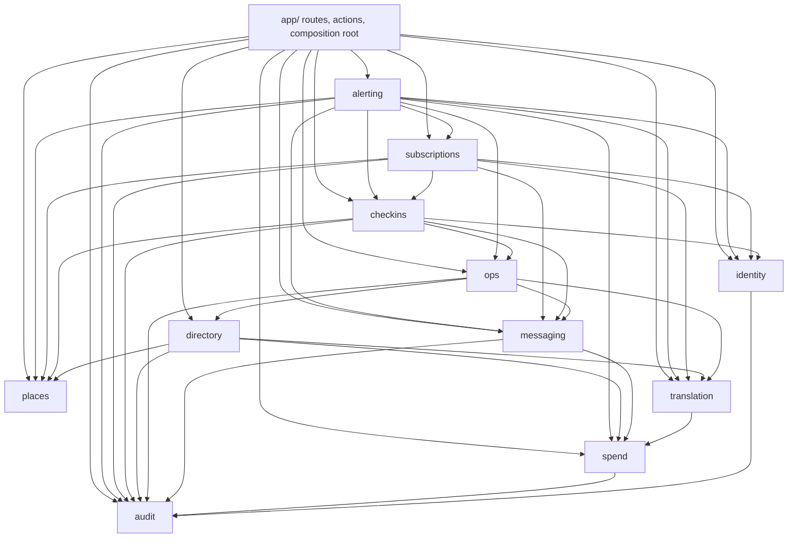
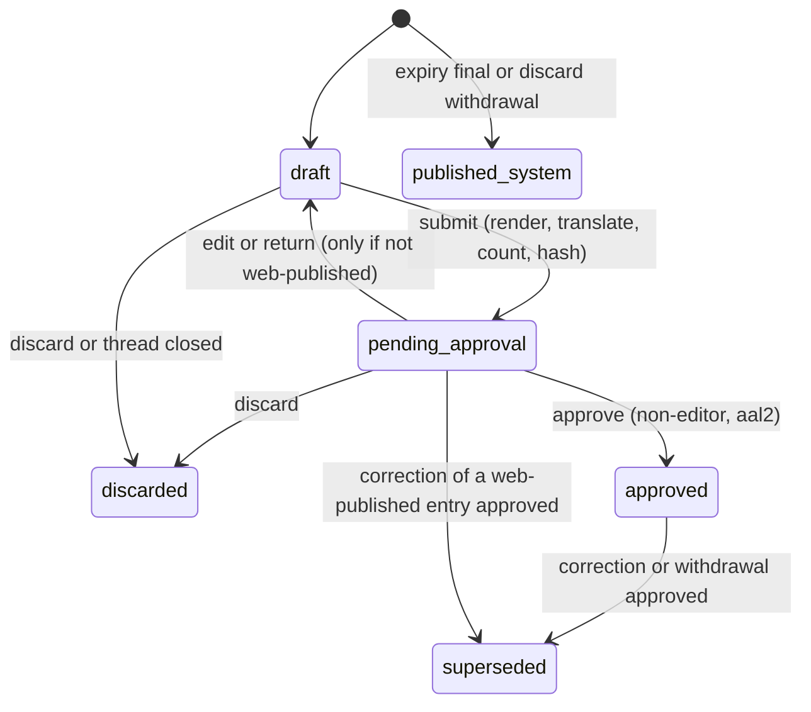
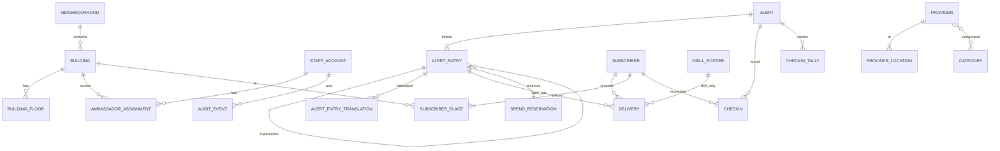
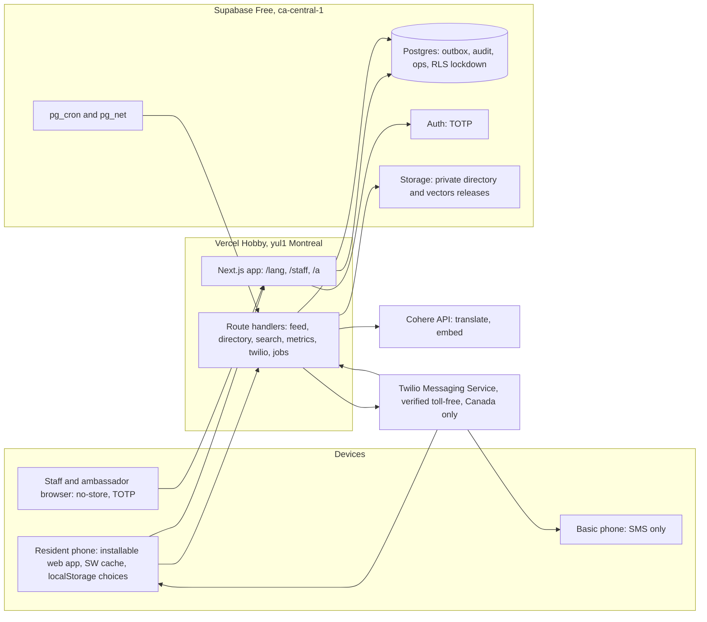

# Architecture Spine — CVH Pilot

## Design Paradigm

**Modular monolith, hexagonal per module, one Next.js app on Vercel.** Each module owns its tables and exposes one import surface; vendors (Supabase, Twilio, Cohere) sit behind ports.

| Layer | Lives in | May import |
| --- | --- | --- |
| Routes, server actions, route handlers, composition root | `src/app/` | module `index.ts` files, `src/contracts`, `src/platform`, `src/ui`, `src/i18n` |
| Wire contracts (zod schemas, code lists, the pure audience matcher) | `src/contracts/` | nothing but zod; safe to import in client code |
| Domain (pure rules, state machines) | `src/modules/<m>/domain/` | own `domain/`, `src/contracts`, `src/i18n` catalogs; no I/O, no clock |
| Application (use cases, port interfaces) | `src/modules/<m>/application/` | own `domain/`, other modules' `index.ts` per the graph |
| Adapters (Drizzle repos, Twilio, Cohere, Storage) | `src/modules/<m>/adapters/` | own `application/` ports |
| Platform (config, db, logger, clock, ids, http) | `src/platform/` | nothing in `src/modules` |

Every module may import `src/platform`, `src/contracts` and `src/i18n`; the diagram shows only module-to-module edges.



## Invariants & Rules

### AD-1 — One app, two surfaces, one origin

- **Binds:** all screens; N3; R-3
- **Prevents:** check-in phone numbers cached on an ambassador's phone; resident and staff code drifting on tokens, strings and auth.
- **Rule:** resident surface at `/[lang]/…` (public, service-worker cached); staff and ambassador surface at `/staff/…` (authenticated, `Cache-Control: no-store`). The service worker caches only `/[lang]/**`, `/api/feed`, the immutable `/api/directory/{v}/**` files, static assets; viewed map tiles (the only cross-origin resident fetch) are kept by the map page itself, up to 200 (S02.07); `/api/directory/manifest` is network-first with the last copy as offline fallback; every `/staff/**` and `/api/staff/**` response, and every subscription edit page and API (`/[lang]/subscription/**`, `/api/subscription/**`), is network-only and `no-store`. The one exception is the open check-in round page: once loaded, its data lives only in that page's memory (never the service worker, `localStorage`, IndexedDB or any other storage API, asserted by a test), marks made without signal queue in memory and send when signal returns, and the page clears its data when closed or after 10 minutes in the background. Apart from map tiles, residents fetch everything from the app's own origin (directory files are proxied, AD-11).

- **As built (S02.12):** the worker is `src/app/sw.ts`, built by Serwist (`@serwist/turbopack`, route `src/app/serwist/[path]`) and served at `/serwist/sw.js` with scope `/`; it is registered by the resident layout (`@/ui/offline`), in a production build only. Its rules are plain functions in `src/app/offline/rules.ts` and `worker.ts`, unit-tested. Serwist precaches the scripts and styles the resident pages load (read from the build's client-reference manifests of `/` and `/{lang}/**` by `src/app/offline/precache.ts`, applied as a manifest transform in the route) and the icons; the Hub's chunks (`/staff/**`) are left out, and the map page's are kept (a map page kept before a deploy is fetched again at install and must find its scripts offline), which took the list of a production build from 74 files (2.26 MiB) to 48 (1.61 MiB) with the map's chunks left out, and, with them kept (and the chunks they load by `import()`, which no manifest lists, followed in their text) on the build of this branch with main, from 68 files (2.09 MiB) to 47 (1.67 MiB); a build with no manifest to read (development) keeps every file. Resident pages (`/{lang}/**`, documents only: Next's RSC data requests are never kept) are network first with a 6 s timeout, the copy kept in `cvh-pages-{build}` with when it was stored; without signal the kept copy is served, else the language's offline page (`/{lang}/offline`: the numbers link, the Hub's number, the pages kept on the phone, the 911 block), else the browser's own page. An alert page (`/{lang}/alerts/**`, open or closed; S04.08, S05.03) must show what the feed shows within 15 seconds, so it is the server's answer whenever there is signal and its kept copy is shown only without signal or after the 6 s, always with the offline note and when it was last loaded (e2e/resident/offline-alerts.spec.ts). Any kept page the worker hands out instead of the network's answer, with or without signal (a timeout, a server error), has `<meta name="cvh-kept-at">` written into its document with when it was stored, which the page reads on its first render for the note (the worker's in-memory answer to `cvh:served` is only a second source, as a stopped worker or an older Safari loses it); a 404 or 410 from the server removes the copy kept for that address; the home feed's alerts are the same, shown as last loaded. A page reached by a Next link is fetched and kept as a document too (the page posts `cvh:keep-page`). `/api/feed` and `/api/directory/manifest` are network first and kept in `cvh-data-v1`; a kept copy is served only without signal (after 6 s for the manifest; after 15 s for the feed, `FEED_WORKER_TIMEOUT_MS` = the page's 20 s `FEED_TIMEOUT_MS` less 5 s: S02.11's page owns the limit, so a feed that takes 7 to 15 s is shown as the server's answer and current, where a 6 s worker limit would have shown the kept copy as last loaded until the next ask 60 s later; a feed that hangs gets the kept copy at 15 s, marked, before the page gives up at 20 s and would otherwise show nothing on a fresh open; an answer that arrives after the worker's limit is kept if the browser has not cancelled the request) and is marked `x-cvh-fallback: 1` with `x-cvh-cached-at`, so the phone never takes it as current (the feed shows it as last loaded; the directory never calls that release current); a feed older than the newest kept is not stored. Release files are cache first; storing a complete file of release `v` removes older releases' files. Every other request is left to the network unanswered: `/staff/**`, `/api/staff/**`, subscription pages and API, search, the building list, non-GET requests and every other origin, so map tiles stay with the map page alone; every cache write also passes `mayStore`, which refuses those. The install stores home, the numbers page and the offline page of every language in use (open windows and the previous build's pages) and fails, keeping the previous worker, if any of them cannot be stored; it then refetches up to 20 previously kept pages. The new worker takes over at once (`skipWaiting`, `clientsClaim`; a deliberate deviation from S02.12's "on the next navigation", so open pages read without signal at once) and deletes the previous build's `cvh-pages-*` and `cvh-static-*` caches, never `cvh-map-tiles-v1` or `cvh-data-v1`. The page asks once for `navigator.storage.persist()`; R-34 says "This phone may not keep pages for offline use" when there is no service worker or cache, localStorage keeps nothing, the store is over 90% full, or a running worker's numbers page is gone. Each language has a web app manifest at `/{lang}/manifest.webmanifest` (start URL `/{lang}`, scope `/`, icons from the Hub's symbol, colours from the tokens). How a deploy reaches phones is in `docs/config.md`.

### AD-2 — Modules own their tables; dependencies point one way

- **Binds:** all modules
- **Prevents:** two modules writing one table; cycles; tables created with no owner.
- **Rule:** a table is written only by its owning module (Structural Seed ownership table); others call that module's `index.ts`. Imports follow the dependency diagram only. The dependency-cruiser config is generated from that diagram; a cycle, an undeclared edge or a deep import fails CI, and changing either needs a spine update. A migration that creates a table missing from the ownership table fails CI. Downstream modules return values; there is no event bus. The only writes that cross module tables are declared foreign-key actions (`ON DELETE CASCADE` / `SET NULL`). Ports whose implementations live in other modules (for example `messaging`'s `ContactResolver`) are wired in the app's composition root.

### AD-3 — Residents have no identity; personalisation is on the device

- **Binds:** P3, P4, P5, P10, A1, A12, A13, N3
- **Prevents:** the server learning a non-subscriber's building, floor or groups.
- **Rule:** resident choices (language, buildings, floors, groups, muted topics, basic mode) live only in `localStorage`. Resident routes set no cookies: next-intl runs with `localeCookie: false`, Supabase middleware matches only `/staff/**` and `/api/staff/**`, and an end-to-end test asserts no `Set-Cookie` on `/[lang]/**`, `/api/feed`, `/api/buildings`, `/api/search`, `/api/directory/**`, `/api/metrics`, `/api/twilio/status` (S06.04) and `/a/**`. Resident requests never carry building, floor or groups, except the SMS sign-up and edit-link POSTs. The server serves whole-neighbourhood data; the device orders and highlights with the same matcher as SMS targeting (AD-7). Language is a URL segment. Usage counts come only from `/api/metrics`, which accepts `{evt, lang, nbhd?}`, stores daily counts and nothing else (no IP, no identifier).

### AD-4 — Staff identity, roles and authority

- **Binds:** G1, G2, C3, D-2, E2, N5
- **Prevents:** a leaked anon key exposing data; authorization split between SQL and TypeScript; removed staff keeping access; two readings of who may author or approve.
- **Rule:** Supabase Auth, invite-only, with no email sent in the pilot: an Admin creates each account with a unique username and the staff member's email recorded as a contact detail (no mail is sent; the sign-in identity is confirmed at creation). The starting password is `rvh-firstname-lastname`, valid once: `staff_account.must_change_password` blocks every `/staff` action except choosing a new password until it is cleared, and an account whose starting password is unused after 24 hours is locked until an Admin re-issues it. After that, only an Admin resets a password or a second factor (both audited). The first Admin is created once by an audited CLI script. There are always at least two usable Admins (active, not locked, own password, enrolled authenticator): a suspension, removal or demotion that would leave fewer is refused, under a lock on the Admin rows and a database trigger; only recovery (an Admin-issued password or authenticator reset) and the automatic locks may leave fewer, audited with `admin_shortfall` and shown to every Admin until two are usable again. TOTP (`aal2`) is required for every Admin and Coordinator session; their approve, correct, withdraw, drill, publish, cap, pause and account actions therefore run at `aal2`. Ambassadors and Directors sign in at `aal1`. Sessions end after 30 minutes idle for Ambassadors and after 12 hours for Coordinators, Directors and Admins. Every staff request loads `staff_account` and rejects unless `status = 'active'`; suspension also signs out globally. Authority is one table-driven function `identity/domain/policy.ts#can(role, action, context)`, evaluated at submit and again at approve against the author's current status and assignments:

| Action | Ambassador | Coordinator | Director | Admin |
| --- | --- | --- | --- | --- |
| Author ack, update, final for any floor of an assigned building | yes | yes | no | yes |
| Author neighbourhood scope, or heat, smoke, winter | no | yes | no | yes |
| Author correction or withdrawal | own pending entries only | yes | no | yes |
| Approve (never an editor of that entry, AD-5) | no | yes | no | yes |
| Drills, publish directory, accounts, cap, pause | no | no | no | yes |
| See open check-in rows | assigned floors, open alerts | no | no | yes |
| See counts and coverage | no | yes | yes (read-only) | yes |
| See spend | no | no | yes (read-only) | yes |

  Every table has RLS enabled with no anon or authenticated policies; the app reaches Postgres only server-side through Drizzle. `supabase-js` is used for Auth and Storage only.

### AD-5 — Alert threads and entries

- **Binds:** A4, A5, A7, A15, A16, D-1, E2
- **Prevents:** sending what nobody approved; self-approval through editing; quiet replacement of anything residents saw; two ways to close a thread.
- **Rule:** an `alert` is a thread (`open → closed{resolved|expired|withdrawn}`); an `alert_entry` (`ack|update|correction|withdrawal|final`) is anything published. Entry transitions exist only in `alerting/domain/lifecycle.ts`, and a trigger rejects any other. Dispatch progress is not an entry state (AD-8).
  - **Approval:** binds to `content_hash` (AD-21). `alert_entry.editor_ids` holds the author and every account that edited it; approval requires `approver_id <> ALL(editor_ids)` (also a trigger).
  - **Return to draft (S04.03):** `pending_approval → draft` carries `returned_for` (`edit`: anyone who may author the entry pulls it back; `return`: an approver sends it back; `retranslate`: "Try translation again"). `edit` and `retranslate` add the actor to `editor_ids`, `return` does not. The return clears the approval binding (`content_hash`, `sms_bodies`, `submitted_at`) and deletes the entry's translations; `version` only ever goes up, by one at each submit. Approval stores the `approved_version` and `approved_hash` it was shown, which the trigger requires to equal the entry's. Every human entry change names its actor in the session variable `cvh.actor_id` (E05's expire job extends the trigger for the system actor, `cvh.system_actor`). Only an editor submits and only an editor adds a translation (trigger). A closed thread's entry is discarded only while the session variable `cvh.closing` is `on`.
  - **Web publication:** an entry is web-published when `web_published_at` is set: at submit if D-1-eligible, else at approval. A web-published entry never returns to `draft`; changing it means a `correction` that supersedes it. Discarding a web-published entry creates a system `withdrawal` entry that supersedes it in the same transaction.
  - **D-1 eligibility:** decided only by `alerting/domain/d1.ts#isD1Eligible`: author role Ambassador, not a drill, kind `ack|update|correction`, and every type in `entry.types` has `disruption_type.direct = true` (null counts as false).
  - **Supersession:** a correction or withdrawal may target an entry that is `approved` (including mid-dispatch) or `pending_approval` and web-published. Its approval moves the target to `superseded` and cancels the target's queued deliveries in the same transaction; a superseded pending entry stays visible until its correction is published.
  - **Closing:** only `alerting.closeAlert(alertId, reason)` closes a thread, called from: approval of a `final` (`resolved`); approval of a withdrawal, or a discard or duplicate merge, that leaves no published, non-superseded substantive entry (`ack|update|correction|final`; withdrawal notices never count) (`withdrawn`); the expire job (`expired`, never shown as resolved). An ambassador's "mark resolved" submits a `final`. Closing a thread for its approved `final`, or for the withdrawal that leaves no substantive entry, cancels the queued deliveries of every other entry but never that closing entry's own, which stay sendable after the close. A `final` reaches every recipient of the thread on every channel used.
  - **System entries:** the only transition without a human author is `[*] → published_system`, for an expiry `final` or a discard `withdrawal`; it is web-only, creates no deliveries, and the trigger allows it only when the session variable `cvh.system_actor` is set by the expire job or the discard use case.
  - **Duplicates:** a new thread overlapping an open non-drill thread in audience and type shows the approver a "possible duplicate" link; in the pilot a duplicate is withdrawn with reason "duplicate" (merging threads is deferred to the MVP).
- **As built (S04.05):** `alerting.logDisruption` makes a thread and its first draft in one transaction: the author is the first editor, the time of the first report (typed in Toronto time) may not be in the future, and the thread's `slug` is made here (eight characters of a 27-character alphabet with no vowels, so no word), never changes (the trigger refuses it) and is the `/a/{slug}` of every text. Submit is three short steps around work outside any lock (AD-18): `beginSubmit` (under the thread's lock: returns the key's first result when there is one, refuses with `SUBMIT_IN_PROGRESS` while another attempt runs, records the attempt `running`, works out the possible duplicate; a submit that names the fingerprint of the draft the author saved and saw, which saving answers with, is refused with `DRAFT_CHANGED` when someone else saved in between), the preparer (translate, render, count, hash: AD-10, AD-21) and `completeSubmit` (under the lock again: this attempt is still the one and the draft is unchanged since Submit was pressed, else `DRAFT_CHANGED`; it freezes the next version and ends the attempt `committed`). `alert_submit_attempt` holds one row per press, keyed by the browser's idempotency key (`crypto.randomUUID()`: 16 to 64 letters, digits, `-` and `_`): `running`, then `committed` or `failed`, with each language's result as it settled and the budget. A partial unique index lets one attempt run per entry; the same key returns the first attempt's result and never makes a second pending version; a new key is accepted after a failure, and the browser makes one only when the outcome of its last press is known: a press whose answer was lost keeps its key (in the tab's session storage too), waits the whole `ATTEMPT_STALE_MS` for a sign of it in the state, says the request could not be confirmed only after that, and sends the SAME key on the next press, first asking the state what became of it; a `running` attempt older than 90 s (`ATTEMPT_STALE_MS`, above the function's 60 s `maxDuration`, kept in order by `test/submitBudget.test.ts`) reads as `failed` with `SUBMIT_ABANDONED`, and nothing was frozen. The budget, the longest route deadline plus 5 s, is counted from the press: the translation's stop lands at the longest route deadline plus 3 s after it (what the transaction that began the attempt used comes off the time the models get) and the wait for the progress writes is cut to what the budget has left (`test/submitBudget.test.ts` runs a whole submit under slow transactions and a hanging store). A freezing transaction that throws after its COMMIT was sent is reported as what the stored attempt says, without a refusal audited or a failure raised for it (the attempt is ended, and audited, only by the call that ended it). A browser that did not see the answer (the connection dropped, the tab closed, the server errored) fetches `GET /api/staff/alerts/entries/state`, which reads the entry, its latest attempt and its frozen translations in one repeatable-read snapshot, and goes by that; an expected outcome (refused, failed, running, committed) is a 200 body with a `state` and a code, never text (`src/contracts/alertSubmit.ts`, AD-20). `possible_duplicate_of` is frozen with the entry, for a thread's first entry only (an update on a running thread is not a new thread) and only against older threads: the newest open, non-drill thread that overlaps by the matcher's own rules (`alerting/domain/duplicates.ts`: the places overlap, floors do not narrow it, the groups share one or one side names none, and the types share one); advisory, not hashed. The entry's channels are frozen as `["sms","web"]` and hashed (E06 sends the texts). The valid-until is typed in Toronto time (`platform/clock`): a time the clocks skip is refused, a time they repeat asks "before or after the clock change", it must be in the future and at most 7 Toronto calendar days ahead (`addTorontoDays`, not 168 hours across a clock change), and "until resolved" is 24 elapsed hours from the press, renewed by each save: `alert_entry.valid_until_mode` (`at` or `resolved`) keeps the author's choice so the composer opens on it, and a stored time in the repeated hour carries its before-or-after answer. The only ways to freeze an entry are `beginSubmit` then `completeSubmit` (or `failSubmit`) through the submitter; S04.03's one-call `submitEntry` and `retryTranslation` were removed so that none can skip the attempt table, the duplicate check or the route refusals. The pages, actions and routes are the policy action `alert.author_wide` (Coordinator, Admin); an Ambassador's own screens, which author for assigned buildings under `alert.author`, are E08's (S08.02 removed `beginSubmit`'s refusal of an Ambassador: see its note below).


- **As built (S04.07), the approval transaction:** `alerting.approveEntry(actor, ref, shown)` binds the approval to what the approver saw: `shown` is the entry's version, its content hash and the reviewed recipient count (`ApprovalRequest`; a missing reviewed count means "nobody was reviewed", so a request that never carried one fails closed against any real count). It runs in one transaction that starts with the thread's lock (AD-18) and refuses, changing nothing, unless: the session is `aal2`, the role may approve (`alert.approve`), the approver is neither the author nor an editor (`checkApproval`, and the trigger), the author may still author the entry now (active, assignments still cover the buildings: `AUTHOR_NOT_ALLOWED`), the places it names still exist, the entry is still the one that was shown (`checkShownBinding`: a pull-back to a draft, a return, a new submit or a re-translation between the view and the press is `ENTRY_CHANGED`, "This alert changed. Review it again."; an entry another approver approved or discarded first is `ENTRY_NOT_PENDING`), and the valid-until is ahead (`VALID_UNTIL_PAST`: the author must return it to draft and set a new time). Then, in this order: the entry becomes `approved` (the entry trigger sets `approved_at` and `web_published_at` to the database's `now()`); `feed_version` goes up by one (not for a drill: a drill changes nothing the web shows, so it raises nothing and the caller revalidates nothing); the outbox's marker runs (`markApproval(tx, entryId)`, which `createAlerting` wires to messaging's `createDeliveryQueue().markApprovalTransaction`); the people to text are captured through `captureRecipients(entry, tx)` (subscriptions' port: who, and in which language; before E07: texting is not open, nobody) and their alert deliveries are written through messaging's `enqueueAlertDeliveries(tx, entryId, texts)` (see the next note); the number of texts that returns is compared with the reviewed count, the total and every language, and a difference throws `RECIPIENT_COUNT_CHANGED` carrying that count, which rolls back the whole transaction, the deliveries with it; else `entry.approved` is audited with `version`, `content_hash` and `recipient_count`. The order is AD-18's lock order (alert, alert_entry, feed_version, then the recipient rows `captureRecipients` locks and the delivery rows). After the commit the caller (`src/app/staff/alerts/approval/afterApproval.ts`) runs `revalidateTag(FEED_TAG, { expire: 0 })` only when a feed version was raised, and kicks the dispatcher (S06.02's `kickDispatcher()`); neither can turn an approval that is done into a failure (a failure is logged). The page that hosts the approval's actions exports `maxDuration = 60`, which the dispatcher's run (after the response) shares. Every refusal is recorded (`entry.approved`, outcome `refused`, with `reason` the coarse group and `refusal` the code; the count refusal adds `recipient_count` and `reviewed_count`) in its own transaction after the rollback; a form that does not carry what was shown (no version, a hash that is not one, no reviewed count) is refused before any use case runs and recorded the same way by `alerting.refuseInvalidForm` (`reason: validation`, `refusal: INVALID_FORM`). The approval view (`/staff/alerts/approve`, O-05 an alert, O-07 an ambassador's post: Approve, Return to author, Discard, never "edit and approve") reads the entry, its frozen texts and the reviewed count in one repeatable-read snapshot (`alerting.review`), shows the audience in words, the channels (web only before E07), the text recipient count (0 and "Text sign-up is not open yet" before E07), the estimated cost (the frozen segments × recipients × `SMS_PRICE_PER_SEGMENT_CENTS`, labelled an estimate), the fallback languages and the possible-duplicate link above the fold on a phone, and every language's web text and text message in a closed disclosure. A count that changed is answered with the new count per language and its cost and a checkbox that must be ticked before the same button, now naming the new count, approves; the tick belongs to that answer (`countConfirmation.ts`), so a count that changes again asks for a new confirmation. A frozen text is shown with its line breaks and spaces kept (`white-space: pre-wrap`), as it is sent. A drill lists no resident channel. **Seam for E08:** the view is O-05 or O-07 by the author's role now (`EntryReview.authorRole`), while the attribution residents read is frozen into the text messages at submit (this epic only ever froze the Hub's: `beginSubmit` refused an Ambassador until S08.02). When E08's S08.02 attributes an ambassador's post to its building at submit, it must also persist that attribution with the freeze (cleared by a return, like the other frozen fields) and the view must read it, so that a role that changes between submit and approval can never show O-05 over a post the texts attribute to an ambassador, or the other way round. (Done in S08.02: `alert_entry.attributed_rsn` and `EntryReview.attribution`, see its note.)
- **As built (S04.07), return, discard and the incidents list:** "Return to author" needs a note (`alert_entry.returned_note`, at most 500 characters, control characters removed): `returned_for = 'return'` and a note go together (a CHECK, added NOT VALID, and the entry trigger: an approver's return needs a non-blank note, an edit or a re-translation carries none, a new entry has none, and a discard changes nothing else, the note included; the next submit clears it). The note is the author's to read (the Hub home's "Your alerts" list and the composer) and is never copied into the audit record, which holds only `with_note: true`, so audit meta stays free of free text. Discard is audited as `entry.discarded`. Both take the version and hash the approver was shown (`ENTRY_CHANGED` for an entry that went back to a draft or has another version or hash since, `ENTRY_NOT_PENDING` for one approved or discarded since). An entry an approver had sent back before notes existed (S04.03's use case, no screen) becomes a plain draft in the migration, because a NOT VALID check still binds every update of an existing row. The Hub home lists what waits for the person (for a Coordinator or an Admin: the entries waiting for their approval that they never edited, longest wait first) and their own alerts, drills in a section of their own (`alerting.incidents`; S04.10 builds the screen out). The FR-M2 measures are the views `alert_approval_timing` (per approved entry: the first save to approval, and, for a thread's first approved acknowledgement only, `reported_at` to approval) and `alert_approval_timing_summary` (medians, `is_drill` kept apart), readable by `cvh_app` only.
- **As built (S05.01), updates to a running alert:** `alerting.addUpdate(actor, {alertId}, {entryId, text, phase, validUntil, validUntilMode})` makes a draft `update` entry on an open thread. "Add an update" (O-14) and "Promote to full alert" (O-13, the first update to an acknowledgement) are this one use case: the page that is not the thread's sends the person to the one that is (`ackOnly`). It runs under the thread's lock like every lifecycle change: `ALERT_CLOSED` when the thread is closed; `ENTRY_ID_INVALID` unless the page's own uuidv7 is given as the entry's id (the page mints it, so a repeated press, or two at once, gives back the one draft: the author's own update with that id is returned, never a second); `NO_PUBLISHED_ENTRY` when nothing residents can read exists yet (the covering entry, `alerting/domain/thread.ts#coveringEntry`: the latest web-published, non-superseded acknowledgement, update, correction or final entry). From the covering entry the update carries over the audience, the types and the valid-until mode (`updateStart`; "until resolved" is renewed to 24 hours from now, a chosen time is carried as it was); the author must be allowed to write for that audience; the phase (`problem` or `in_progress`) is required and never carried over, so a new update has none ticked (`PHASE_INVALID` for none); the text and the valid-until are judged as for any draft. `entry.created` is audited (`entry_id`, `kind`, `types`; the refusals with `refusal`). The types are the thread's for follow-up updates: a save that changes them is refused (`TYPES_CHANGED`; other types are a new alert). The audience may change: the update stores its own, and the approval view shows who it adds or drops ("Now also for: ...", "No longer for: ..." from `src/contracts/audienceChange.ts`: a neighbourhood covers its buildings, a whole building its floors, groups narrow and none means no narrowing, with "the rest of {neighbourhood}" and "outside the groups" as cases) against `EntryReview.threadAudience`, the covering entry's audience read in the review's snapshot (draft and pending entries only). The draft is then written, translated, frozen, approved and published by S04.05's composer and submitter and S04.07's approval unchanged (nothing is forked; the approval and every later step bind the version and hash as for any entry); an update supersedes nothing (`supersedes_id` stays null), the acknowledgement it follows is exactly as it was, and `cancelQueued` is not called for it (only a correction or a withdrawal would). `ALERT_CLOSED` is also the refusal for a save, a return, a submit and an approval of an update whose thread closed meanwhile (the approval page says "This alert is closed" and offers no Approve), and a closed thread offers no "Add an update": the pages have no form and the Hub home does not list it. The Hub home's "Running alerts" (Coordinator, Admin; `alerting.runningThreads`) lists the open threads with a published entry, each with its next step: Promote to full alert for an acknowledgement alone, Add an update otherwise. Ambassadors' updates are E08's.
- **As built (S05.02), corrections and withdrawals:** `alert_entry.supersedes_id` (the one entry a `correction` or `withdrawal` replaces) and `alert_entry.withdrawal_reason` (`wrong_place|wrong_information|duplicate|other`, a withdrawal only) are set when the entry is made and never change (NOT VALID checks: a correction or withdrawal has a target, no other entry has one, only a withdrawal has a reason). `alerting.correctEntry(actor, {alertId, targetId}, {entryId, text, phase, validUntil, validUntilMode})` and `alerting.withdrawEntry(actor, {alertId, targetId}, {entryId, reason, text})` make the draft under the thread's lock (the entry id is the page's, as for an update): the role policy `alert.correct`/`alert.withdraw` first (a Director never; an Ambassador's own pending entries are E08's, so an Ambassador is refused with `OUT_OF_SCOPE` whatever the entry), then the target, a **valid target** (`domain/corrections.ts#targetRefusal`: `approved`, or `pending_approval` and web-published, not superseded, not a withdrawal notice; `TARGET_SUPERSEDED`, `TARGET_NOT_PUBLISHED` for a draft, a discarded entry or a pending one with nothing published, `TARGET_NOT_VALID` for another thread's entry or a notice, `ALERT_CLOSED` for a closed thread). A correction starts from the covering entry as an update does (audience, types, valid-until choice; the phase is required); a withdrawal is the target's in everything but its notice (its audience, types and phase; valid-until 24 hours from creation; its words are the catalog's for the reason, `staff.correct.reasonText.*`, with the Hub's own after them, or for "other" the Hub's alone; a save changes the text only). Submit re-judges the target (`TARGET_*`, before anything is translated), the entry is hashed with `supersedes_id`, and a withdrawal does not need the places its audience names to still exist. **Approval** (`approveEntry`, the S04.07 transaction) locks the target after the entry, judges it again (two corrections of one entry: the second is refused `TARGET_SUPERSEDED`), approves the entry, sets the target `superseded` and audits `entry.superseded` (subject: the target; `by`, `by_kind`, `withdrawal_reason`), raises `feed_version` (not for a drill), calls `cancelQueued([targetId], tx)` (after `feed_version`, the lock order of AD-18), then the outbox marker and `captureRecipients` with `supersedesId` set (E07: the target's recipients ∪ the entry's own audience), all in the one transaction. The entry trigger accepts `approved -> superseded` and `pending_approval -> superseded` (web-published only) solely beside an approved correction or withdrawal that names the entry and was approved in the same transaction (`approved_at = now()`), refuses approving a correction or withdrawal whose target is no longer a valid target (`TARGET_NOT_VALID`), and keeps `superseded` final, so a direct `update ... set status = 'superseded'` with the app's credentials is refused. **`cancelQueued(entryIds, tx)`** is messaging's `createDeliveryQueue().cancelQueued` (`DeliveryStore.cancelForEntries`): one UPDATE of the alert rows of those entries that are `queued`, or `claimed` and not handed off, to `cancelled`, in the caller's transaction (it waits for a row the dispatcher holds and re-checks that it was not handed off: a text handed over is in flight and counted, not stopped); `createAlerting` wires it as `AlertLifecycleDeps.cancelQueued`. **`closeAlert(tx, actor, {alertId, reason, keepEntryId?})`** (`application/closeAlert.ts`, `createCloseAlert`) is the one close path, run inside the deciding use case's transaction under the thread's lock: it discards every draft and pending entry residents have not read (audited `entry.discarded` with `by_close`), calls `cancelQueued` for every entry but `keepEntryId`, closes the thread and audits `alert.closed` (`closed_as`, `discarded`, `kept_entry_id`). A withdrawal's approval calls it with `'withdrawn'` and `keepEntryId` = the withdrawal when no published, non-superseded substantive entry remains (`domain/corrections.ts#substantiveRemains`; the withdrawal notice never counts), so its own texts are kept and sent; S05.03 and S05.04 call it for `resolved` and `expired`. **What residents read:** a new resident view `nondrill_alert_entry_v2` (S04.08's `nondrill_alert_entry` stays unchanged for the previous release; a later release drops it) carries `supersedes_id` and the resident reads move to it; the feed's entries carry it (no field was added to `FeedV1`: phones in the field parse it strictly, `feedCompat.test.ts`; a withdrawal's reason is its own translated text, not a code). R-07 (`ui/alert/alert-view.ts`) shows a correction above the entry it replaces, which stays readable and is marked `R07.corrected` ("Corrected {t}"); a withdrawn entry is marked `R07.withdrawn` and shows the withdrawal's text in its place; the withdrawal notice is not a card of its own; `current` (the home card, the alert's words, its verification) and the share preview (`AlertView.preview`, used by the page's metadata) are the latest entry that was neither corrected nor withdrawn, so the feed, the alert and the preview agree. A thread a withdrawal closed leaves the feed (open threads only; the archive is S05.07). **The Hub:** `/staff/alerts/correct` and `/staff/alerts/withdraw` (O-15; guard actions `alert.correct`/`alert.withdraw`, privileged: `aal2`) list the entries that can be corrected or withdrawn and, once one is chosen, the form (a correction's words, phase and valid-until; a withdrawal's reason from the catalog and words); saving makes the draft, which goes on to the same composer, submit and second-person approval as any entry. The Hub home's "Running alerts" link to both. The approval view shows the entry being replaced, what residents will see instead, the reason, that it "goes to everyone who got the original, and to everyone in the audience above", whether approving closes the alert, and that it cannot be approved when the target was replaced since.
- **As built (S05.03), closing with a final:** `alerting.startFinal(actor, {alertId}, {entryId, text})` ("Mark resolved", O-16) makes a draft `final` under the thread's lock, in an open thread that has something residents can read (`NO_PUBLISHED_ENTRY`): who it is for, the types and where things stood are carried over from the covering entry (the audience changes through the pickers, as an update's does, and the approver is shown "Now also for"), its words are the author's, and its valid-until is "until resolved", 24 elapsed hours from each save and from the submit (a final is never read as the thread's valid-until). The role policy is an update's (`alert.author_wide`, or `alert.author` for an Ambassador's assigned buildings: their own "Mark resolved" is S08.04's; since S08.02 `beginSubmit` accepts an Ambassador and attributes the texts to their building). It goes on through the composer (`/staff/alerts/resolve`), submit and a second person's approval like any entry. **Approval** (`approveEntry`) of a `final` locks every entry of the thread right after the thread and the entry (the lock order of AD-18: alert, alert_entry, feed_version, then delivery rows), approves it, raises `feed_version` (not for a drill), then calls `closeAlert(tx, actor, {alertId, reason: 'resolved', keepEntryId: the final, feedRaised: true})`, and only then marks the approval, captures the final's recipients (`captureRecipients` with `kind: 'final'` and no target: the thread union of epic E05, "Final recipients", which E07 implements; before E07 nobody) and writes its deliveries, all in the one transaction; a recipient count that changed since the approver reviewed it rolls the close back with the approval. **`closeAlert`** now keeps the entry it is told to keep only if it is an entry of this thread of the kind and status the reason needs (`resolved`: an approved `final`; `withdrawn`: an approved withdrawal; `expired`: a `published_system` final, S05.04), and requires one for `resolved` and `withdrawn` (a caller's mistake rolls everything back); it locks the thread and every entry before it raises `feed_version` (once: `feedRaised` says the caller did) and before `cancelQueued` locks delivery rows, and records the kept entry as `alert.closing_entry_id` together with the close. **The database refuses any other close** (`db/migrations/20261004050000_alert_close.sql`, `alert_guard`): with the app's credentials (`cvh_app_login`) a thread goes from open to closed only beside the entry that closes it, made in the same transaction (`resolved` beside an approved `final` whose `approved_at = now()`, `withdrawn` beside an approved withdrawal, `expired` beside a `published_system` final), `closed_at` is the database's clock (never before the latest approval of the thread) whatever was sent, `closing_entry_id` exists only on a closed thread, and the migration owner and fixtures are not held to the evidence; a partial unique index lets at most one `final` per thread be approved or published, so two finals cannot both close it; the entry guard accepts a `final` as a draft. The sender reads `closing_entry_id` first to tell the closing entry from the others of a closed thread (`isClosingEntry`), and keeps the old equality of `approved_at` and `closed_at` for threads closed before the column existed. Every later submit, approval, correction, withdrawal, update or final in a closed thread is refused with `ALERT_CLOSED` and recorded. **What residents read:** `alertView` shows a closed thread with its reason in words and an icon of its own (`R07.resolvedTitle` with a check, `R07.expiredTitle` with a clock, `R07.withdrawn` with an information mark, and the sentences `R07.endedResolved`, `R07.endedExpired`, `R07.endedWithdrawn` with the withdrawal's reason), the final message as what stands (for a thread closed withdrawn, the reason), every earlier entry, and no valid-until; the thread is not in the feed (open threads only) and opens at `/{lang}/alerts/{slug}` through `readClosedThread` on the same resident views (a drill's is never found), read for each request and not kept by the feed's cache. **The Hub:** the home lists each running alert with "Mark resolved" (not for a Director) and, once something closed in the last 7 days, "Recently closed" with how and when each closed and its final words and no action; the approval view of a final says that approving closes the alert as resolved and that it goes to everyone who got any entry of it on the channels they got it on, and its confirmation says the alert is resolved. The prototype's check-in record deletion at this step is not built: check-in rounds do not exist yet.
- **As built (S05.04), expiry:** `/api/jobs/expire` (pg_cron every minute, the job secret, `maxDuration` 60; `src/app/expire.ts` composes it) runs alerting's `createAlertExpiry(...).run()`. It lists open threads whose covering entry (`domain/thread.ts#coveringEntry`: the latest published, non-superseded substantive entry) has a valid-until at or before now (at most 100 a run), then for each, in its own transaction: sets `cvh.system_actor = 'expire'` (transaction-local), locks the thread and every entry (AD-18), judges again from what it read under the locks (`domain/expiry.ts#expiryOf`: two UTC instants compared, never a wall-clock time; "until resolved" is the stored instant 24 elapsed hours from the entry's save), inserts the system `final` (`published_system`: the catalog's `staff.expire.finalText` in English, the covering entry's audience, types, phase and valid-until, authored as the thread's creator because the column names an account, no `cvh.actor_id`, published at the database's `now()`, no hash, bodies or approval, so no delivery is ever queued for it) and calls `closeAlert(tx, {staffId: null}, {alertId, reason: 'expired', keepEntryId: the final})` (audited with no actor). A run that overlaps another waits for the lock and finds the thread closed (`skipped`); one that fails rolls back (no final, thread still open), records `ops_event` `alert.expire_failed` (a failure class) and leaves it to the next run; a thread closed more than 5 minutes late records `alert.expire_late`. `db/migrations/20261004070000_alert_expiry.sql` replaces the entry guard to widen it as far as needed and no further: a `published_system` entry can be INSERTED only with `cvh.system_actor = 'expire'`, only as a `final`, only in an open thread whose covering entry is past its valid-until by the database's clock, with nothing frozen, approved or replaced (without the variable the status is refused as any new entry that is not a draft), and with that variable and no acting account an unread entry can be discarded (the close discards them); nothing else changes without an account and no transition leads to or from `published_system`. The close trigger already required `expired` beside a `published_system` final made in the same transaction (S05.03). The discard use case (a system withdrawal) is later work and widens the same rule with its own value of `cvh.system_actor`. Residents read an expired thread as before (S05.03: "Expired {t}" with the clock, the system final as what stands, never resolved; the feed lists open threads only and S05.06's derived status gives `none` for an expired thread). The system final is English-only until its translations are supplied (readers fall back to English behind the machine-translation notice).
- **As built (S08.02), an ambassador's post and why an entry was discarded:** `alerting.postFromAmbassador(actor, {into, alertId, entryId, place, types, phase, validUntil, validUntilMode, text})` makes the draft of A-02 ("Post a building update") under the thread's lock: a new thread's first entry (an `update`, audited `alert.created`) or, with `into`, an `update` to an open thread (a practice post in a drill, or an update about an alert about their building; audited `entry.created`), which keeps the thread's types from the covering entry and must be about the building the post is for (the covering entry's audience names it, or its neighbourhood: `OUT_OF_SCOPE` otherwise, so a request naming another thread's id cannot put a post in an alert about somewhere else; the page offers only those threads, the server holds to it). It is for exactly one building, one the person is assigned to now (`alert.author`, `assigned_building`), its floors the whole building, a list or a range (the place picker's `BuildingChoice`, resolved in the transaction), no groups; only an Ambassador posts here (`NOT_ALLOWED` for any other role: the Hub writes on its own screens), and heat, smoke and winter storm are `NOT_ALLOWED` (wide content). The ids are the page's: the same post sent again changes nothing once submitted, and a draft (its submit failed) takes what was sent now; the same new post sent twice at once races on the thread's primary key, and the loser runs again and finds the other's. `POST /api/staff/ambassador/posts` (guard `alert.author` on the building the body names) makes the draft and then runs E04's submitter unchanged with the page's key and the fingerprint of the draft it wrote, and answers with the submit's own body (`SubmitResultSchema`). **Attribution:** `beginSubmit` no longer refuses an Ambassador: it works out who the texts say the entry is from (`domain/ambassadorPost.ts#attributionFor`: an Ambassador's post is "Building ambassador, {building}" of its one building, read through places' `addressesOf`, `ONE_BUILDING_ONLY` for any other audience; everyone else's is the Hub's) and freezes it into the SMS bodies (so the content hash covers it) with "Verified by the Hub" (its texts go out after approval only); `completeSubmit` works it out again under the lock and refuses with `DRAFT_CHANGED` when it is no longer what the texts were prepared with (the person's role changed between the two transactions), then stores the building as `alert_entry.attributed_rsn` with the freeze; a return to draft clears it (the use case does; the database check that a draft holds none is the follow-up migration's, below). The approval view is O-07 when the frozen attribution is an ambassador's (`EntryReview.attribution`), whatever the author's role is now (the author's role only for a draft). Residents read it through `nondrill_alert_entry_v3` (v2 plus `attributed_rsn`; v2 stays for the previous release) as `attribution: {role: "ambassador", rsn}` in the feed (no field added to `FeedV1`). The policy is checked again at approval as before (`AUTHOR_NOT_ALLOWED` once the assignment is gone). **Discard reasons (the decision S08.01 handed over):** `alert_entry.discard_reason` (`by_author` | `declined` | `by_close`) is set in the same UPDATE that discards: `discardEntry` writes `by_author` when the actor is the entry's author and `declined` for anyone else (an approver's Discard; also the Hub discarding a post it had edited), `closeAlert` writes `by_close` for every unread entry it discards (a final's or a withdrawal's approval, the expire job); `entry.discarded` is audited with `discard_reason` (beside `by_close`). This release's migration checks only the value set (`alert_entry_discard_reason_valid`, NOT VALID; null passes): the release before it discards without a reason and keeps running while the migration is applied, so the checks that couple the columns to the status (`alert_entry_discard_reason_status`: discarded exactly when a reason is given; `alert_entry_attributed_rsn_frozen`: a draft holds no building) are the later migration `20261005230000_alert_entry_discard_checks.sql` (both NOT VALID), merged and applied only once this release was live in production; no trigger was added or replaced. **Entries discarded before the column carry no reason** and keep none (a discarded entry never changes again): an ambassador's post among them is not listed on their home at all, since it cannot be told whether the Hub declined it (`postState` is null for a discarded entry with no reason; `test/db/ambassadorHome.db.test.ts`). Before S08.02 an Ambassador could not submit (`beginSubmit` refused them), and a draft nobody submitted is never listed, so no post a person saw goes missing. An ambassador's post reads "Not sent by the Hub" (`declined`) only for `declined`, "Not sent: the alert ended before the Hub checked it" (`ended`) for `by_close`, and is not listed when its author took it back. **The page:** `/staff/ambassador/post` (guard `alert.author` on the person's assigned buildings; `?alert=` for an update) is one phone column: the building (when there are several), the types an Ambassador posts (Other puts the 911 block first and needs its line), the floors, where things stand, until when (until fixed, or a Toronto date and time; a time the clocks skip or repeat is refused with `VALID_UNTIL_SKIPPED` and another is asked for), the English text, and "This will appear as: Building ambassador, {building}" before the button. A press is delivered by `postSender.ts`: without signal it is an unsent post held only in the page's memory ("Not sent yet. Keep this page open; it sends when you have signal") and sent with the same body and key on the `online` event or a 20 s retry; a request with no answer after 20 s (weak signal) is aborted and treated the same, never left on "Sending..."; a lost answer keeps the key, a known outcome retires it; no storage API is used (unit and e2e tests). In a drill the page and its result carry the exercise marker; the drill's texts go to the roster only (S06.05) and no resident view lists it. The home (A-01) links to the page, offers "Post an update about this" on each alert of the types an Ambassador posts, says "From a building ambassador" for an alert whose covering entry is one, and lists the open drills about their buildings apart, newest reported first (ties by id), with "Post a practice update" only on a drill of the types an Ambassador posts (none on a heat, smoke or winter storm drill). A practice post's approval captures the drill roster only (S06.05's `recipientsPort`) and needs no on-call number; a real post's approval is refused `ONCALL_REQUIRED` while texting is live and nobody is on call, as any alert's is (S06.07).
- **As built (S08.03), D-1 posts on the web at once:** `alerting/domain/d1.ts#isD1Eligible({authorRole, isDrill, kind, types, direct})` is the only decision (table-driven tests: each type, mixed types, null and unknown `direct`, drill, each kind, each author role). `completeSubmit` asks it under the thread's lock, with `places.directOf` (`disruption_type.direct` read through places' `directnessOfTypes`; left out, nothing is direct, so nothing is published) and only when the author is the one who submits and the texts say "Building ambassador, {building}"; when it is true the same update that freezes the entry (`draft` to `pending_approval`) sets `web_published_at = now()` and the transaction raises `feed_version` (after the thread's and the entry's locks, AD-18), audits `entry.submitted` with `web_published: true`, and the submit's report carries `webPublished: true` so the route expires the feed's tag after the commit (`src/app/staff/alerts/afterWebChange.ts`, `expire: 0`). Its texts are still made by the approval alone (nothing is queued or captured at submit), and a post that is not D-1 (fire alarm or evacuation, "Other", any mixed type, a drill, a Hub author) is read nowhere until its approval. `db/migrations/20261006000000_d1_web_first.sql` replaces the entry guard: a publication at submit is accepted only when the database's own facts say D-1 (author an Ambassador and the one submitting, thread not a drill, kind `ack|update|correction`, every type `direct is true`) and is timed by `now()`; an approval keeps the time of an entry published at submit (`coalesce(old.web_published_at, approved_at)`), so approving never moves a post in the order of a thread; a draft is never web-published (NOT VALID check). **The discard of a web-published pending post** is not a discard and never a return to draft (WEB_PUBLISHED, both in `requestTransition` and the trigger): `discardEntry` (the same authority as for any pending entry: its editor, or an approver who is not an editor, bound to the version and hash shown) locks every entry of the thread, sets `cvh.system_actor = 'discard'` (transaction-local), inserts a `published_system` `withdrawal` naming the entry (reason `other`, the catalog's `staff.discard.withdrawnText`, the entry's types, audience and phase, "until resolved", the entry's author standing in as the column's author, web-only, never approved, so no text), supersedes the entry in the same transaction (the trigger accepts `pending_approval` to `superseded` beside exactly that withdrawal made at `now()`), raises `feed_version`, audits `entry.discarded` (with `withdrawn_by`) and `entry.superseded` (`system: true`), and, when no published, non-superseded substantive entry is left, closes the thread `withdrawn` with the withdrawal as its closing entry (`closeAlert` and the thread guard accept a `published_system` withdrawal for `withdrawn`). Residents read "Withdrawn" in its place; the ambassador's own home reads the post as withdrawn. A correction of a pending web-published post is a valid target as before (S05.02); its approval supersedes the original, the correction shows above it, and until then the original stays as residents read it. A thread that closes while a D-1 post is pending leaves it pending (residents read it, so it is never discarded; `closeAlert` skips web-published entries), and it stays in the archive as they saw it. The approval view (O-07) tells the approver that residents already read the post, offers Approve and Discard only (no "Return to author"), and says a discard withdraws it. **No round is made by a publication:** `checkins.ensureRound` (S08.05) is called from an approval alone (`approveEntry`), never from `completeSubmit` or `discardEntry`; `test/db/d1WebFirst.db.test.ts` asserts that a published post leaves the round tables, the queue and the recipient capture empty.
- **As built (S08.04), an ambassador follows their post:** the policy's `own_pending_entry` is now asked. `lockedTarget` (the entry a correction or a withdrawal names, locked under the thread's lock) no longer refuses an Ambassador outright: the role policy is asked of the locked entry, so another person's entry, a missing one, an id that is not one, an entry of the Hub's, their own that is a draft, approved or superseded, and one outside the thread all read as `OUT_OF_SCOPE` and nothing of the thread is learned; their own pending entry then meets E05's rules unchanged (`TARGET_NOT_PUBLISHED` while residents do not read it yet, `ALERT_CLOSED`, the building still assigned at the draft and at approval). An Ambassador's correction keeps the post's own types and audience (a wider entry of the Hub's covering the thread does not widen it) and is attributed like the post (D-1 eligible: live at its submit as "Not yet verified"); a withdrawal is not D-1 and waits for the approval, so residents keep reading the post until a second person approves it, which also closes the thread `withdrawn` when nothing else stands. "Mark resolved" is `startFinal` unchanged (`alert.author` on the covering entry's buildings), submitted for a second person's approval; nothing closes the thread but that approval, and since a final is attributed to one building an ambassador writes one only for an alert about exactly one building they are assigned to (`ONE_BUILDING_ONLY` at the submit otherwise; the reads `AmbassadorAlert.canResolve` and `resolvable` say which). **Reads:** `createAmbassadorHome(db).status(scope, entryId)` (A-03) returns the person's own entry in a non-drill thread for buildings they are all still assigned to (anything else is null, and nothing says which) with its state (`postState`), the Hub's return note, what replaced it (the approved correction or withdrawal and its words), what waits for the Hub (a correction or withdrawal of it, a final of the thread) and `can: {replace, resolve}`; once approved the page asks messaging's `sendingProgress` for the entry's counts (waiting, on their way, delivered, not delivered = failed + undelivered + unknown; counts only, never a number). **Wire:** `POST /api/staff/ambassador/follow` (`src/contracts/ambassadorFollow.ts`: `correct`, `withdraw`, `resolve`; guard `alert.author` on the buildings of the entry or of what covers the thread, read from the database by `followBuildings` and never from the request, so another building's entry or alert is a 403 audited `out_of_scope`) makes the draft and runs E04's submitter unchanged with the page's key, exactly as `POST /api/staff/ambassador/posts` does; only an Ambassador follows up there (`NOT_ALLOWED` for any other role, changing nothing: the Hub corrects, withdraws and resolves on its own screens). The unsent-request rule of S08.02 applies unchanged (`postSender.ts` is generic over the request). `EntryStateSchema.entry.web_published` (optional, absent in older bodies) tells the page a committed post is live, so A-02 says "Live. Not yet verified" for it and "Waiting for the Hub" for the rest. **Pages:** `/staff/ambassador/status?entry=` (A-03, `hub.open`, the person's own post only, every other role reads "not found") and `/staff/ambassador/resolve?alert=` (`alert.author` on the person's assigned buildings); the home links each post to its status and each alert about one assigned building to "Mark resolved". Everything is no-store and out of the service worker's reach like the rest of the staff surface.
- **As built (S04.07), the guard:** `staffPage` takes an optional `context(session, props)` for a rule that depends on the entry (the approval page reads who edited it from the database, never from the request); a throw there is `bad_request`, and an entry that does not exist is judged with a neutral entry that no one edited, so a role that may approve gets the page's "not found" and any other role the refusal.

### AD-6 — Drills are isolated by data

- **Binds:** A17, R-2
- **Prevents:** a drill reaching a resident, a real check-in round, or a resident-facing page; a drill turning into a real alert.
- **Rule:** `alert.is_drill` is set at creation and immutable. A drill entry can create `delivery` rows only to `drill_roster` recipients (trigger). Inserting a `checkin` row for a drill alert is rejected (trigger). Every resident-reachable read (feed, archive, status, share landing, building page) goes through `alerting`'s resident queries, which select from the `nondrill_alert` view only; a lint rule forbids other alert relations in those query files, and an integration test hits every resident route and API with a drill present. `/a/{slug}` of a drill returns 404. Staff lists show drills in a separate labelled section. Every drill SMS and screen carries the exercise marker. Metrics partition by `is_drill`.
- **As built (S04.08), the resident views:** a resident reads the alerts through three views and nothing else: `nondrill_alert` (the thread, S04.03's view as it was: widening a view the previous release may read is a contract change for `db:check-destructive`), `nondrill_alert_entry` (the entries of those threads that are web-published and not draft or discarded, with the thread's `slug`; `verified` is whether the entry was approved, `superseded` whether a correction or withdrawal replaced it) and `nondrill_alert_entry_translation` (their frozen web texts). Each is `security_invoker`, granted to `cvh_app` only, and selects named columns, so a resident query cannot see an author, editor, approver, hash, SMS body, version or draft state (`db/migrations/20261003510000_resident_alert_views.sql`; declared `existing()` in `alerting/adapters/resident/views.ts`). Every resident query lives in `alerting/adapters/resident/` (`readThreads.ts`): the dependency rule `resident-queries-read-nondrill-only` forbids that folder the Drizzle tables, and the ESLint rule of the same name forbids any string there that names `alert` or an `alert_` table (the column `alert_id` apart), so a drill, a draft or an unpublished entry can be read there only by a mistake both checks catch (`test/dependency-rules.test.ts`, `test/resident-queries-lint.test.ts`). The two sibling views extend the rule's "`nondrill_alert` only": an entry is read through its thread, and both select from it. `test/db/residentAlerts.db.test.ts` inserts a drill directly, with an approved, published, translated entry, and finds it in no view and not in the feed; `e2e/staff/resident-drill.spec.ts` does the same against the production build and requests every resident route and API, enumerated from `src/app` (the pages under `[lang]`, `/a` and the root, and every API but the staff, job and Twilio ones), finding the drill's words, slug and ids in no body or header, with a real alert beside it as the control.
- **As built (S06.05), the drill roster and the drill rule:** `subscriptions.drill_roster` holds a label (at most 40 characters), a Canadian +1 number in E.164 and a language per staff phone a drill is texted on (at most 20, one row per number); an Admin at `aal2` adds, edits and removes entries on `/staff/drills/roster` (the policy action `drill.run`, the same as starting a drill; the page lists each number masked to its last four digits). The number has the on-call roster's protection (AD-23 as built): read only by the sender's `ContactResolver` source (`drillNumberSource`, which answers only for an `alert` text) and by the roster screen (masked), never in a `delivery` row, log line, audit record or error, and never in the repository or CI (it is entered in the running system). `drill_roster.added`, `.edited` and `.removed` are audited with the roster's size afterwards and the roster row as the subject, and nothing else (no number, label or language). The delivery trigger `delivery_insert_guard()` (a replaced function body, S06.01's and S06.02's; no new trigger on `delivery`) refuses an `alert` text of a drill entry unless its recipient is a `roster` row of `drill_roster` (an id that is not there, or of a removed member, is refused), and an `alert` text of an entry that is not a drill for any `roster` recipient, whoever asks. `captureRecipients` (subscriptions' `recipients.ts`) returns, for a drill, every roster member with their own language, locked `FOR SHARE` in the approval's transaction, and `countRecipients` counts them under the language of the text each gets (the frozen text in their language, else English), with texting open; for a real entry it is unchanged (nobody before E07). The approval writes the texts through `enqueueAlertDeliveries`, each in the entry's frozen `sms_bodies[lang]` (the renderer puts the exercise marker first). A drill is started only by an Admin at `aal2`: `createAlert` and `logDisruption` refuse `isDrill` to anyone else (`NOT_ALLOWED`, `AAL2_REQUIRED`), the one place a thread becomes a drill, and `/staff/drills/start` is its screen. The drill's counts are the view `drill_delivery_result` (messaging; drill threads only, per entry, roster member and language: waiting, handed off, delivered, undelivered, failed, unknown, never sent), read by `/staff/drills` with the members' labels from subscriptions; no real alert's count reads it. Staff screens of a drill (the composers, the audience pages, the approval and its confirmation, the drill pages) carry the exercise marker (X-10) in the prototype's words.

### AD-7 — One audience type and one matcher

- **Binds:** A1, A9, A13, A16, C7
- **Prevents:** web, SMS and check-in rounds disagreeing on who an alert is for; recipients or languages shifting after approval.
- **Rule:** `Audience` (in `src/contracts/audience.ts`) is `{scope:'neighbourhood', neighbourhood_ids} | {scope:'buildings', buildings:[{rsn, floors: string[] | null}]}` plus `groups` and `types`; floors are floor ids (`building_floor.id`, never a label or number), a sorted, deduplicated list (a range such as floors 4 to 6 is expanded at input by the building's `sort_order`, and a reversed range is refused), `null` means the whole building. Floor ids rather than floor numbers are pending owner decision 28. This exact value is stored in `alert_entry.audience`, hashed, sent in the feed and taken by the matcher. `src/contracts/audience.ts#matches(audience, profile)` (pure, used by the server and the device) is the only matching rule (neighbourhood → everyone there; building → that building and, when floors are given, those floors or no floor recorded; no building recorded → neighbourhood alerts only, of every neighbourhood, because a device's neighbourhoods come from its saved buildings (default decided in S04.04, owner to confirm); groups → intersection; several places match once). Topic opt-outs and the fire and evacuation override are applied inside `matches`, never by callers: a muted topic suppresses only when every type of the alert is muted, and fire never. The SQL query in `subscriptions` must equal it (property test). At approval the recipient set, each recipient's language and SMS body are written into `delivery` rows. Correction and withdrawal recipients = the target's recipients (opt-outs never remove them) ∪ the entry's own audience, deduplicated. A final has no target: its recipients = the union of the recipients of every entry in the thread on the channels each used ∪ the final's own audience, deduplicated by recipient and channel. Language is each recipient's current language.

### AD-8 — One outbox for every outbound message

- **Binds:** A2, A15, A16, G6, N4, N9, D-7
- **Prevents:** double sends; sends that skip approval, spend accounting or masking; transactional texts with no sanctioned path.
- **Rule:** every outbound SMS is a `delivery` row with `kind`:
  - `alert`: created only by an approval.
  - `transactional`: confirmation, welcome, prompts, replies, approver and Hub notifications, ops alerts; created by `alerting`, `subscriptions`, `checkins` and `ops` use cases.
  - `campaign`: D-7 re-consent; needs an Admin with `aal2`.

  `recipient_kind` is `subscriber|pending_signup|roster|staff|oncall|inbound_reply` (`inbound_reply`: a number with no subscription, held at most 30 minutes and deleted in the hand-off transaction); staff on-duty and on-call numbers live in `ops.oncall_roster`. `idempotency_key` is unique (`entry_id:recipient:channel` for alerts, `kind:subject:purpose:nonce` otherwise). The dispatcher resolves phone numbers at the hand-off point through a `ContactResolver` port, wired to `subscriptions`, `identity` and `ops` in the composition root. Delivery states: `queued → claimed → submitted → delivered|failed|undelivered|unknown`, plus `cancelled`, `skipped`, `skipped_env`. A dispatcher (run right after approval and every minute by pg_cron) commits `claimed` with `claimed_at` in its own short transaction before calling the provider, commits `submitted` with the provider id right after each call, and claims only `queued` rows, in one fixed order: fire and evacuation alert entries first, then on-call and other `transactional` texts, then building-level before neighbourhood-level alerts, then oldest first; `alerting` cancels queued rows whenever an entry is superseded or discarded, or its thread closes, except the rows of the closing entry (the approved `final`, or the withdrawal that left no substantive entry), which stay sendable after the close (AD-5, AD-18). A row claimed but not handed off for 5 minutes returns to `queued`; one handed off with no recorded outcome for 5 minutes, or `submitted` with no final status after 24 hours, becomes `unknown` and is never re-sent automatically. Retries (at most 3) apply only when the provider clearly did not accept the text (HTTP 429, or a connection that failed before sending); a 5xx, timeout or dropped connection after sending makes the row `unknown`. Only one dispatcher sends at a time (a lease row with an ownership token checked at every claim and hand-off), at a shared pace. The hand-off transaction locks the delivery row, checks the lease token, re-reads the pause, entry, thread and recipient, and commits `handed_off_at` only if the row is still sendable. Every change that must stop a send writes the delivery rows itself, in its own transaction: corrections, withdrawals, discards and closes cancel the affected entries' `queued` and claimed-but-not-handed-off rows (the closing entry's rows excepted); a recipient deletion sets that recipient's rows `skipped` before the recipient is deleted. So cancellation wins whenever it commits before the hand-off; a pause committed during an open hand-off lets that one text go, shown as in flight (disclosed allowance). Status callbacks carry an opaque delivery reference in their signed URL. The guarantee is no automatic duplicate submission, not exactly-once delivery. Before each claim and at the hand-off the dispatcher checks the pause on `messaging_control`, which only an Admin sets (audited); on-call texts are still sent during a pause. Sends go through one Twilio Messaging Service on a verified toll-free number; status comes from signed webhooks. Nothing else calls the SMS adapter. **Spend:** a text's estimate is counted once, when the provider accepts it or its outcome becomes `unknown`; actual SMS cost comes from reconciliations, each with an exact UTC interval and a stable id (`month:{YYYY-MM}` for a Toronto calendar month). A reconciliation lists the interval's outbound messages from the Twilio Messages API to the last page and records each message's price once by `MessageSid` (unique across all reconciliations), only when the listing is complete and every message is priced. An actual retires the delivery estimate whose provider id equals its `MessageSid`, whatever interval or timestamp either falls in, including an estimate found after the actual was imported; repeating an import changes nothing. Estimates with no matching actual stay counted as "unresolved estimates", and actuals with no matching delivery are counted as "unmatched actuals", both shown separately; an interval whose reconciliation is incomplete is labelled "pending reconciliation" with its estimates still counted, never zero. **Spend cap:** when month-to-date plus the entry's estimate (calendar month in `America/Toronto`) exceeds the cap, the approval view shows the shortfall, approval records `cap_overrun` in the audit and notifies Admins; it never refuses. There are no spend reservations in the pilot.

  **The outbox table (S06.01).** `delivery` holds, per text: `kind`, `recipient_kind`, `recipient_id` (the id in the table `recipient_kind` names, so not a foreign key; null once the recipient is deleted), `entry_id` (alerts), `campaign_id` (campaigns), the creating module and `purpose` (transactional and campaign), the language of the frozen `body`, `segments`, the cost estimate in cents, the unique `idempotency_key`, the `callback_ref` (an opaque random UUID the database makes), `state`, `attempts`, `due_at`, `send_by`, the claim (`claimed_at`, `claimed_by`, `claim_token`), `handed_off_at`, `submitted_at`, the provider's id and error code, and the times; there is no column for a number. Triggers refuse, whoever asks: any change of state not in the transition table of the E06 definitions (`messaging/domain/deliveryState.ts` is the same table; a test checks every pair of states against both) and any change at all to a terminal row; a change to what was frozen at creation; a cancel or skip of a row already handed off; a second automatic submission (a handed-off row returns to `queued` only with `attempts` raised, at most 3; a claimed row gets an outcome only after its hand-off; a `queued` row holds no provider id); an `alert` row outside the approval transaction of its entry (the approval use case sets the transaction-local setting `cvh.approval_entry_id`, `messaging`'s `markApprovalTransaction`; the entry must be `pending_approval` or approved by that same transaction, `approved_at = now()`, and the row's body and segments must be the entry's frozen SMS body for its language); a `transactional` row whose purpose is not on its creating module's allow-list (`delivery_purpose_rule()`, mirrored by `messaging/domain/deliveryRules.ts`), whose recipient kind that purpose never texts, or with no `send_by` within the purpose's window, or whose key holds a phone number; and a `campaign` row unless its campaign was started by an Admin at `aal2` (`delivery_campaign_started_by_admin()`, which answers false for every campaign until S09.07 creates the `campaign` table, so every campaign row is refused until then; a campaign text goes to a subscriber). An insert whose key exists returns the existing row without error (`ON CONFLICT DO NOTHING`, then a read). The recipient's table (any module) carries `delivery_forget_recipient('<recipient_kind>')` as its `AFTER DELETE` trigger, the declared `ON DELETE SET NULL` of this polymorphic link (AD-2; created with the recipient's table), and its deletion use case first calls `messaging`'s `skipRecipientDeliveries`. The `ContactResolver` port (`messaging/application/deliveryPorts.ts`) asks a `RecipientNumberSource` per recipient kind, given by the module that owns the kind (`subscriptions`, `identity`, `ops`) and wired in `src/app/messaging.ts`; it runs inside the hand-off transaction, keeps the number in memory only, takes an `inbound_reply` number by deleting its row in that transaction, and logs a number only as its last two digits.
- **As built (S04.07 with E06), the approval's outbox, kick and pause notice:** (1) *The outbox.* Inside the approval's transaction, after the entry is approved and `feed_version` is raised, `createAlerting`'s `markApproval` calls `createDeliveryQueue().markApprovalTransaction(tx, entryId)` (messaging's public index; alerting may import messaging) before anyone is captured or anything is written. `captureRecipients(entry, tx)` (subscriptions, `src/modules/subscriptions/application/recipients.ts`) answers who gets a text, as `{ kind: 'subscriber' | 'roster', id, lang }` for each person, and writes nothing; the approval turns them into texts (`alerting/application/approvalTexts.ts`: the entry's frozen `smsBodies[lang]` body and segments for each person's language, the English one for a language with none, one text per person, ids in lowercase, each text's cost estimate its segments times `SMS_PRICE_PER_SEGMENT_CENTS` rounded up to the cent) and writes them only through `enqueueAlertDeliveries(tx, entryId, texts)` (`createAlerting`'s `queueAlertTexts`; the database refuses an alert delivery otherwise). The recipient count the approval audits and compares with the reviewed one is the number of texts that call returns, in all and by the language of the body, so it cannot be miscounted. An outbox refusal of what a correct approval never asks is a bug: the approval fails with it and its transaction rolls back. Before E07 `captureRecipients` returns no one: no delivery is written, the count is 0 and an approval is what it was before the outbox. E07's S07.07 (subscribers, locked `FOR SHARE`) and S06.05 (the drill roster) replace the two bodies in `recipients.ts` (same signatures, `capture` answering the recipients and not writing deliveries); nothing in `alerting` or `messaging` changes for them. (2) *The kick.* After the commit, never inside it, `afterApproval` calls S06.02's `kickDispatcher()` once with no argument (imported when needed, as the pause page does), for every approval that committed, a drill included, and never for a refusal, a failed form or a rollback; the page that hosts the approval's actions, `src/app/staff/alerts/approve/page.tsx`, exports `maxDuration = 60` as a literal (`approvalKick.test.ts` reads it statically and checks that no other page hosts the actions). (3) *The pause notice.* `loadApproval` reads S06.06's `pauseNoticeForApprover()` and the view shows the sentence (the catalog's `staff.texts.paused.approver`) on the approval view (O-05, O-07) and on the confirmation, the screen of an approved entry, and nothing when it answers null; a notice that cannot be read is logged and the view loads without it. The pause never refuses or changes an approval: the approval does not read the switch, the texts are queued as usual and the sender is still kicked.

  **The sender (S06.02).** One use case, `messaging`'s `createDispatcher(...).run()`, is the only code that hands a text to the SMS provider; `/api/jobs/dispatch` (pg_cron every minute, with the job secret) and `kickDispatcher()` (called once the approving transaction has committed) are its two ways in (`src/app/dispatch.ts` is its composition root); the kick's run lives inside the approving request's function after the response, so it is shorter (20 s, sending for 10 s) and the approving route sets `maxDuration = 60`, while the job route's run has the full 60 s. A run takes the **sender lease** (`dispatcher_lease`, one row that holds a random ownership token and an expiry 60 s ahead, taken by a conditional update only when the previous lease has expired, renewed every 20 s, given up at the end of the run, after which a holder whose queue ran dry looks once more and takes the lease again if a text is due, so a kick that found the lease held on its last, empty claim is not left waiting for pg_cron) or exits without claiming; every renewal, claim and hand-off compares `token = mine and expires_at > now()` (the database's `now()`; a test moves it with a skew, so no app clock decides), and a worker that finds its token changed stops without calling the provider. A new holder returns the rows its predecessor claimed and never handed off to `queued` (a handed-off row is left for its callback or the sweep) and sweeps (`claimed` for 5 minutes with no hand-off returns to `queued`; handed off with no outcome for 5 minutes, or `submitted` for 24 hours, becomes `unknown` with an `ops_event` `delivery.unknown` written in the same transaction; none is ever sent again). Each `unknown` is settled in a transaction of its own (at most 200 rows per run): a row whose event cannot be written stays as it was and is tried again at the next run, the spend hook runs in a savepoint so a failing hook never keeps a row from becoming `unknown`, and a failure of the whole upkeep is logged and never stops the run from claiming and sending. **Claim order** is one number, `delivery.claim_rank`, set by the insert trigger from the entry's frozen types and audience (`delivery_claim_rank()`, which `messaging/domain/dispatchRules.ts#claimRank` repeats; a test compares them): 0 fire alert entries (the one type that ranks first is `fire`, "Fire alarm or evacuation", the audience rules' `SAFETY_OVERRIDE_TYPES`), 1 on-call texts, 2 other transactional texts, 3 building-level alerts, 4 neighbourhood-level alerts, 5 campaign texts, then oldest first. A run claims a few rows at a time (`FOR UPDATE SKIP LOCKED`, `claimed` with its worker and lease token in its own short transaction), never more than it can send at the **shared pace** (at most `SMS_SEGMENTS_PER_SECOND`, default 3, in any one second, a sliding window kept across runs through `dispatcher_lease.paced_until`) before its time limit less a 10 s margin (which covers the adapter's 8 s wait for the provider and the outcome's write), so a fire alert approved during a burst is claimed at the next batch. The **hand-off** is one transaction: lock the delivery row `FOR UPDATE` (the row a cancellation, a skip or a requeue also writes, so whichever commits first wins), check the lease token, then the pause, `send_by`, the entry and thread (`AlertStandingReader`, implemented by `alerting`) or the campaign (`CampaignStandingReader`, S09.07), then the recipient and its number (the ContactResolver, with the delivery's kind and purpose), and commit `handed_off_at`; a row that is not sendable becomes `cancelled` (what was withdrawn) or `skipped` (too late, or no recipient), a paused one returns to `queued`, and under `SMS_MODE=log` every sendable row becomes `skipped_env` with no number asked for and no credential read. Only after that commit is the Messaging Service called, once (`SmartEncoded=false` on every request, the frozen body byte for byte, the status callback `PUBLIC_BASE_URL/api/twilio/status?ref={callback_ref}` with Twilio's retry fragment, see S06.04 below), and the outcome written only while the row is still `claimed` by this token (a callback's state is never overwritten; a missing provider id is filled): `submitted`; not accepted (HTTP 429 with an error body, or a connection that failed before any of the request was sent, classified by the adapter) back to `queued` with 30 s, 2 min and 10 min backoff and the attempt counted, then `failed`; a provider 4xx other than 429 `failed`; anything else `unknown`. A 401 answer stops the run at once, and so do three 403 answers in a row (wrong credentials would fail the whole queue). `messaging_control` (one row, the pause, which S06.06 sets, below) is only read here, and `afterOutcome` is the seam S06.08 uses to write the spend estimate in the outcome's own transaction. Messaging may not import `ops`, so `OpsRecorder` is a port wired in the composition root. The daily `/api/jobs/messaging-config` reads the Messaging Service's Smart Encoding setting and records `messaging.smart_encoding_on` (the health job's on-call alert, S06.07).

  **The status callbacks (S06.04).** A text's delivery status comes only from Twilio's signed status callbacks, `POST /api/twilio/status?ref={callback_ref}` (`messaging`'s `createStatusCallbacks(...).handle`, composed in `src/app/statusCallback.ts`; the route sets no cookie, is never cached and never logs a number, a text, a signature or a reference). **The signature comes first, before any other work:** `X-Twilio-Signature` must be the base64 HMAC-SHA1, keyed by the Twilio account's Auth Token (`TWILIO_AUTH_TOKEN`), of the URL `PUBLIC_BASE_URL` + `/api/twilio/status` + the query string as received (so the `ref` is signed, and the request's host header, which a proxy can change, is never used) followed by the form body's parameters sorted by name, each as name and value (Twilio's documented algorithm, `domain/twilioSignature.ts`, tested with vectors computed by hand and against the official library's helper). The comparison is constant-time; a missing or wrong signature answers 403, does nothing else, and records `webhook.signature_invalid` in `ops_event` (a code only; capped at 50 such events in 10 minutes because anyone can send the request, which is far above the alert's threshold of more than 5 in 10 minutes, S06.07). With no Twilio account configured (every environment but production) nothing can be validated: 503, nothing touched. **Retries.** By default Twilio retries a webhook once, and only when the connection fails, so a 5xx would lose the status for good; the `StatusCallback` the dispatcher gives it is therefore `PUBLIC_BASE_URL/api/twilio/status?ref={callback_ref}#rc=3&rp=ct,5xx` (`providerStatusCallbackUrl`): up to three retries, on a connection failure or a 5xx (the route answers 500 with no detail when the database fails, and the transaction has rolled back), never on a 4xx. The fragment is never sent and Twilio leaves it out of the signature, so the signed URL is unchanged and every callback is idempotent; Twilio's total time of 15 seconds covers the retries, so a database that stays down longer leaves the text to the sweep (`unknown` after 5 minutes if still `claimed`, after 24 hours if `submitted`), visible and never sent again. **A signed callback** with no `ref`, a `ref` that matches no delivery, or no usable `MessageSid` and `MessageStatus` changes nothing, answers 200 and is counted (`delivery.callback_ignored`: `no_ref`, `unknown_ref`, `invalid_payload`). Otherwise one transaction locks the delivery row `FOR UPDATE` (the row the dispatcher's outcome write, the sweep and a cancellation also lock, so whichever commits first wins and the others find the row as it then is) and applies the status by the transition table (`domain/statusCallback.ts#decideCallback`, stricter than the `delivery_guard` trigger, which still refuses anything else): `queued`, `sending`, `sent`, `accepted` and `scheduled` mean `submitted` (for a `claimed` or `unknown` row only); `delivered`, `undelivered` and `failed` are final (from `claimed`, `submitted` or `unknown`, with Twilio's `ErrorCode` kept for the last two); a row with no provider id takes the callback's `MessageSid`, and one that has a different id is left alone and recorded (`delivery.provider_id_mismatch`); a terminal state never changes, so a repeat, a late non-terminal status and any status after a final one change nothing and are not counted; a callback for a row the provider cannot have a text for (`queued`, `claimed` and never handed off, or finished without ever having an id) changes nothing and is counted (`delivery.callback_ignored`, `not_in_flight`); a row that was `unknown` and moves on is marked resolved in the same transaction (`delivery.unknown_resolved`), so the health job (S06.07) can record the recovery; an `unknown` row that was once `submitted` (the sweep gave up on it after 24 hours with no final status) moves only on a final status, because a non-terminal one would put it back in `submitted` with its first `submitted_at` and the next sweep would make it `unknown` again, so every replay would change the row and write a false recovery: such a status changes nothing. A callback that arrives before the dispatcher has recorded Twilio's response ends the row at the callback's status with the provider id, and the dispatcher's late write (conditional on `claimed` and its claim token) changes nothing; the other order gives the same row. The callback that moves a `claimed` row is the first record that the provider accepted the text, so it is where the spend estimate is counted for that text (`afterOutcome`, S06.08, in a savepoint: a failing hook never undoes a status).

  **The pause (S06.06).** One switch stops every text the pause applies to that has not been handed to the provider: the row `messaging_control`, written only by `messaging`'s `createMessagingPause(...)` (`pause`, `resume`, `status`), for an Admin at `aal2` (the policy action `sending.pause`; the staff guard's rule, with the actor id taken from the session, never from the request). Each use case is one transaction: lock the row `FOR UPDATE`, a conditional update, and the `sending.paused` or `sending.resumed` audit record in the same transaction (a pause that cannot be audited is not made, and the Admin is told), so two Admins pressing at once make one pause and one audit record, and a repeated press changes nothing and is audited as a refusal (`conflict`). A pause records who (`paused_by`), when (the database's `now()`), why (`reason`, one cleaned line of 1 to 500 characters) and `handed_off_at_pause`: counted in the pause's own transaction, the texts already handed to the provider (`handed_off_at` set) among those of the alerts and campaigns that still have a text waiting that the pause holds (`queued`, or `claimed` and not handed off; never an on-call text), which the pause screen reports as "{n} texts were already handed to the provider and cannot be recalled" and the sending progress view (S06.09) repeats. The audit meta holds counts only (`waiting`, `handed_off`): the reason is free text, which the audit trail never holds, so it lives on the row while the pause lasts and the resume clears it. A pause writes no delivery row and takes no lock on one, so the sender's rules stand as the E06 definitions give them: nothing the pause applies to is claimed, a claimed text returns to `queued` at its hand-off point, a pause committed during an open hand-off lets that one text go (in flight, not in the count), on-call texts are still sent, and texts approved or created during the pause queue normally. A resume clears the pause, starts a dispatcher run once it has committed (`kickDispatcher`), and the dispatcher continues in claim order, checking each text again at its hand-off (a superseded or discarded entry, a valid-until that has passed, a closed thread: cancelled or skipped; a closing entry's texts are sent). Every Hub screen shows the banner "Texts are paused" with who, when and why (`src/app/staff/layout.tsx`, read on each request, never allowed to hold a screen back for more than 2 s), and an approver is told "Texts are paused; this will send when resumed" (`pauseNoticeForApprover()`, which an acceptance criterion of S04.07 requires the approval to show; S06.09's progress view repeats "{n} texts were already handed to the provider" with `handedOffLine()` by an acceptance criterion of its own). A switch with no row is read as paused by the sender, so the banner then says "Texts are not going out" and the approver's notice is the paused sentence. The first-text spike (S01.15) is stopped by the pause too: it refuses a press as `paused` before it claims anything. There is no trigger on `messaging_control` (a trigger on an existing table needs a contract note): the shape of a pause is the table's checks (`messaging_control_pause_stated`, `_reason_length`, `_handed_off_valid`) and the app's grant is exactly `update (paused, paused_by, paused_at, reason, handed_off_at_pause, updated_at)`.

  **Cost and timing (S06.08).** *The estimate.* `createSmsSpend` (`messaging`, composed once in `src/app/smsSpend.ts` and given to both `appDispatcher` and `appStatusCallbacks`) is the `afterOutcome` and `afterProviderId` of the sender and of the callbacks. It writes the text's estimate to `spend_event` in the transaction that records the outcome (`kind` `sms`, `purpose` the delivery's kind, `model` `twilio`, with `delivery_id`, `lang`, `entry_id` for an alert, `is_drill`, `segments` and `cost_estimate_cents`), once: a unique index on `delivery_id` and `ON CONFLICT DO NOTHING` make a replay count nothing twice. Only the estimate rides in the outcome's transaction: the matching that follows it runs in a savepoint (`spend.match_failed`), so a failure of the matching never rolls back the provider's outcome. The estimate is segments × `SMS_PRICE_PER_SEGMENT_CENTS` rounded up to whole cents per text (`estimateSmsCost`, so a one-segment text at 1.5 cents is estimated at 2: an estimate may overstate by less than a cent a text and never understates, and an actual replaces it). `is_drill` is "the recipient is on the drill roster": the hand-off already sends a drill entry to `roster` recipients only and a real one never to one, so for a text that reached the provider the two are the same. A text that goes back to the queue (429, a connection that failed before sending) has no `submitted` or `unknown` outcome and writes nothing, so a retried text is counted when it is finally accepted and one that never is, never; a handed-off text the sweep makes `unknown` after 5 minutes is counted then (it may have been charged), and one that was `submitted` and ages into `unknown` after 24 hours is not counted again. The dispatcher's `fillProviderId` (a slow response onto a row the sweep made `unknown`) has its own seam, `afterProviderId`, in a savepoint (`dispatch.spend_hook_failed`). `spend_event` stays insert-only for the app: nothing about an estimate is ever updated, and the migration is expand-only (nullable columns, a NOT VALID constraint, no trigger on the existing table).

  *Reconciliation.* A reconciliation has a stable id, `month:{YYYY-MM}`, and an exact interval: the first instant of that Toronto calendar month to the first instant of the next, converted to UTC (`spend/domain/reconciliation.ts`; `sms_reconciliation`'s check recomputes it from the id in SQL, so no row can hold another; it is the interval `inCalendarMonth` counts the month by). It lists the interval's messages from the Twilio Messages API through the `SmsMessageLister` port (`spend`; the real adapter, `twilioMessageLister`, is in `messaging/adapters`, built by `src/app/reconcile.ts` only where `SMS_MODE=live`, and called by nothing but the job in production; every test gives it a fake), following `next_page_uri` as each page gives it until it is empty (a `next_page_uri` is followed only if it is the account's own `/2010-04-01/Accounts/{sid}/Messages.json` path, because the credentials travel in every request). Only outbound messages count; a message sent outside the exact interval (the provider's date filters are Twilio's documented GMT dates, `YYYY-MM-DD`, asked for a day more on each side because a date cannot say where in its day an instant is) is left to the reconciliation whose interval holds it. Each message's price is recorded once in `sms_actual` by its `MessageSid` (the key, so unique across every reconciliation: a message another reconciliation imported is skipped), as the provider reported it, converted to CAD at `SMS_USD_TO_CAD_RATE` (integer arithmetic, to thousandths of a cent) and labelled with the rate and currency it was converted at. *Complete or pending.* The listing is applied, in one transaction that holds the reconciliation's advisory lock, only when it ended by itself and every outbound message has an id, a send time and a price that converts; then the reconciliation is `complete`, which never changes again (a trigger refuses it, and a complete one is not listed again: re-running it changes nothing). Otherwise it is `pending` with a reason (`listing_failed`, `cut_short` at 200 pages a month or 45 seconds for the whole run, shared by the months of a run: each page is asked for no longer than the time left, and a month whose turn comes after the time is spent waits for the next run, `message_without_price`, `price_unusable`, `message_malformed`), **nothing is recorded from it**, the interval is shown as "pending reconciliation" with its estimates still counted, and the next run (the job asks for the month before, every pending month and every ended month with estimates and no complete reconciliation) tries again from the start. A month that has not ended is not reconciled (a complete reconciliation could never take the messages still to be sent in it). *The matching rule.* An estimate is retired by the imported actual whose `MessageSid` is its delivery's provider id, whatever interval or timestamp either falls in: `sms_estimate_retirement` holds the pair (the estimate's id is its key and the `MessageSid` is unique, so an estimate is retired at most once and an actual retires at most one estimate; the table is insert-only). It runs when an estimate is written (an actual may already be imported), when a provider id is recorded later (`afterProviderId`, from a callback or the dispatcher's late response), when actuals are imported, and at the start of every reconciliation and of every run of the job (once, even when every month is complete) over all unretired estimates, so an actual imported earlier retires an estimate found later, and a late provider id whose own matching failed is recovered by the next daily run (the provider ids are read from `delivery` through the `DeliveryProviderIds` port that `messaging` implements and the composition root wires: `spend` never reads `delivery`). A retired estimate is no longer counted. *The report* (`smsMonthReport`, per Toronto month): for a complete month, the actual total, the estimates its actuals retired and the difference, the unmatched actuals (messages no estimate answers for, counted at their actual price) and the unresolved estimates (made in the month, no actual has retired them: delivery without a provider id, or a `MessageSid` no complete reconciliation has imported) labelled "unresolved estimate" and shown beside the unmatched actuals, because an ambiguous send with no recorded provider id may be in both; for any other month, "pending reconciliation" with the estimates counted, never zero.

  *Timing and reach (FR-M2, FR-M4).* The outbox already records every instant the measures need, so S06.08 adds no column: `handed_off_at` (the database's `now()` at the hand-off), `completed_at` (the callback's `now()` when the row became `delivered`) and, from `alerting`, the entry's `approved_at`, which the caller gives. `messaging`'s `createDeliveryMeasures()` computes, per entry and language over the rows handed off (a row with `handed_off_at`, excluding `cancelled`, `skipped` and `skipped_env`), the time from approval to the first hand-off and to the moment delivered rows reach 90% of that denominator, or "not reached" with the final delivered share; and a correction's reach: attempted reach is the original's recipients (every recipient the original entry had a text for, whatever became of it) and, of them, the recipients the correction was handed off to; confirmed reach is those whose correction text is `delivered`. Drills are reported apart (`drill` on every result, `splitDrills`).

  *Triggering and configuration.* The reconciliation is `POST /api/jobs/reconcile-spend` (the job secret, like the dispatcher's; optional `{"month":"YYYY-MM"}`), not a script, because the Twilio credentials exist only in production's environment; outside production it answers `not_live` and reads nothing. `SMS_USD_TO_CAD_RATE` (default 1.4, provisional: Twilio bills in US dollars) is the exchange rate; both are recorded as owner decisions in `docs/config.md`.

- **As built (S07.08): spend view and monthly cap.** `spend_cap` is one row (`id` 1, made by `20261006100000_spend_cap.sql`; the app can read it and update `monthly_cents`, `set_by` and `set_at`, not insert, delete or re-number it; `monthly_cents` is null until an Admin sets a cap, then 1 to 10,000,000 cents). `createSpendCap` (`spend`) sets it in one transaction with its `spend.cap_set` audit record (`cap_cents`, `previous_cents`); the policy action is `spend.cap` (Admin, `aal2`). `/staff/spend` (`spend.view`: Admin, and a Director read-only) shows `readSpendOverview`: this month (Toronto calendar month) and the pilot to date against `SPEND_PILOT_BUDGET_CENTS` (CAD 1,000), text messages as S06.08's report counts them (actual, unmatched actuals, unresolved estimates and each month pending reconciliation labelled apart, never zero) and Cohere at a known price, "price unknown" with its calls and tokens, or a labelled estimate when `SPEND_TOKEN_ESTIMATE_CAD_PER_MILLION` is set. **The cap warns and never blocks.** Inside `approveEntry`, after the entry's texts are queued and the reviewed count is confirmed, `deps.spendCap` (wired in `createAlerting` to spend's `assessApproval` over messaging's `queuedCostCents`) locks the `spend_cap` row (last in AD-18's order) and asks whether the month's counted spending, plus the estimate of the texts still waiting to be sent (not yet counted: a text counts when the provider accepts it), plus this entry's own estimate (each text's cent-rounded estimate, as the outbox stores it) passes the cap; passing means more than the cap. If so, in the same transaction the `spend.cap_overrun` ops event (S09.01's health job texts the on-call Admins, a `transactional` text, once per overrun) and the `spend.cap_overrun` audit record are written, and the approval commits. The approval view says so before the decision (`capNoticeFor`, the same arithmetic on the same figures, informing only). Nothing in the sender, the on-call texts or the inbound router reads the cap.

### AD-9 — Inbound SMS, consent and the end of the pilot

- **Binds:** A2, A12, C4, C6, D-6, D-7
- **Prevents:** two handlers acting on one reply; unconfirmed numbers receiving alerts; basic-phone users unable to change choices.
- **Rule:** one router, `subscriptions/application/handleInbound`, uses a decision table keyed by (keyword, the number's state `none|pending|active`, open prompt). A number receives alerts only after replying YES to its confirmation; pending sign-ups expire after 48 hours. Twilio Advanced Opt-Out owns STOP, START and HELP and sends their replies (its configured START and HELP replies include the sign-up link); on an opt-out event the app deletes the subscription and sends nothing itself. Inbound messages are de-duplicated by `MessageSid` (hash kept 48 hours), and deletion requests are handled before rate limits. Numbered replies: 1 and 2 start an SMS menu (state in `sms_prompt`) that goes street → building on that street → floor, or language by list number; options are numbered 1 to 7 per page; 0 is Back, 8 is More and 9 is the Hub's number at every step; menu 1 replaces all saved buildings and warns first when more than one is saved; a menu idle for 10 minutes resets with a message saying so. Every menu message is a catalog string in the subscriber's language and must fit one segment in that language's encoding (AD-21). A single-use 30-minute web edit link is offered as an alternative; 3 withdraws the check-in request and deletes its open check-in rows; outside a menu, 0 asks for confirmation and a second 0 deletes. After deletion the app sends nothing to that number. YES resolves to the open prompt with the latest `sent_at`. Every app-sent reply is a catalog string in the subscriber's language; the STOP, START and HELP replies are Twilio's and are tested on the verified toll-free number before launch. Inbound bodies are not stored, only keyword counts. D-7: at pilot end an Admin sends a `campaign`; `subscriber.retention_state` moves `active → reconsent_pending`; YES sets `retained`; receiving subscribers are `active`, `reconsent_pending` before the deadline, or `retained`; the campaign text is a frozen catalog string reviewed before the pilot; one Admin at `aal2` starts it after a rehearsal on the drill roster, idempotently; starting it deletes pending sign-ups and closes sign-ups; the purge job deletes `reconsent_pending` subscribers after the deadline (30 days after the campaign), re-checking state under the row lock.
- **As built (S07.02), the web sign-up:** `subscriptions.createSignup` (`application/webSignup.ts`, composed in `src/app/signup.ts`, `POST /api/signup`, page `/{lang}/text-alerts`) writes one `pending_signup` (number in E.164, language, neighbourhood, places as `[{rsn, floors}]` checked against the building list, groups, topics, `consent_version`, `started_by`, `expires_at` = `created_at` + 48 hours by a CHECK; unique number; RLS, cvh_app may select, insert and delete only; `delivery_forget_recipient('pending_signup')`) and queues its `transactional` confirmation (purpose `confirmation`, `send_by` the purpose's 48 hours from the same transaction's `now()`, so equal to `expires_at`). The number is stored as typed into E.164, not hashed: the confirmation needs it and S07.04's router looks the pending sign-up up by it; like `oncall_roster` it is protected by the platform's encryption at rest, RLS and grants to cvh_app only, and is read only by `pendingSignupNumberSource` (at the hand-off, for a confirmation to an unexpired row) and the inbound router. A new number, one already pending and one already subscribed (`SubscriberLookup`: a stub answering false until S07.04 creates `subscriber`) run the same statements (the number's advisory lock, the subscriber lookup, the expired row's delete, a savepoint with the insert and the queue, released for a new number and rolled back otherwise) and get the same 202 bytes. A confirmation refused with Twilio 21610 deletes its pending sign-up through the sender's and the status callbacks' `afterFailure` seam (`forgetOptedOutSignup`). pg_cron `subscriptions-purge-pending-signup` deletes expired rows every 15 minutes. YES to an expired sign-up is S07.04's: its decision table must treat a row past its `expires_at` as no pending sign-up (the purge may not have run yet) and answer with the sign-up link through `inbound_reply`.

- **As built (S07.04), the inbound router, the subscriber and deletion:** `POST /api/twilio/inbound` (composed in `src/app/inbound.ts`) checks `X-Twilio-Signature` first with messaging's `isValidTwilioSignature` against `PUBLIC_BASE_URL` + `/api/twilio/inbound` and the form body (a refusal is `webhook.signature_invalid` with route `twilio_inbound`, counted with the status callbacks'; no Twilio account: 503 and nothing touched), then hands `{MessageSid, From, Body, OptOutType}` to `subscriptions.createInboundRouter` and answers an empty TwiML document: every reply goes through the outbox. The router runs one transaction: the sha256 of the MessageSid into `inbound_seen` (a retry stops here, changing nothing; purged after 48 hours), the number's advisory lock (the web sign-up's own), the state (a `subscriber` row is `active` with its unexpired `sms_prompt`; an unexpired `pending_signup` is `pending`; a row past `expires_at` is `none`, before the purge, as S07.02 asked), the keyword (`domain/inbound.ts#readKeyword`: `OptOutType` first, then the body normalised with NFKC, `toAsciiDigits`, edges trimmed and case-folded; YES, Y or the catalog's `smsKeywords.yes` words of the number's language; 0 to 3; Twilio's opt-out words as STOP), one count in `inbound_keyword_count` (day in Toronto; the body is then dropped), and the decision table (`decide`, one unit test per keyword, state and prompt). YES to a pending sign-up inserts the `subscriber` (number, language, neighbourhood, groups, `consent_version`, `started_by`, `retention_state` `active`), its `subscriber_place` rows (one per building and floor, a null floor for "no floor recorded"; buildings or floors removed meanwhile are dropped, a building whose floors all went is kept with no floor; a floor removed later sets its rows' floor to null) and `subscriber_topic_optout` rows, skips the confirmation if still waiting, deletes the pending row and queues the `welcome` (reply 0, STOP and the overnight notice; S07.05 adds replies 1, 2 and 3 to it); a repeated YES gets `alreadySignedUp` (`prompt_reply`). Reply 0 outside a menu opens a `delete_confirm` prompt for 10 minutes and sends `deletePrompt`; a second 0 within them deletes; any other reply clears the prompt. Replies 1, 2 and 3 go to the `MenuPort` (S07.05; until then nothing is answered and the welcome does not offer them). A number with no state gets `signupInfo` with `/{lang}/text-alerts` (the expired sign-up's language, else English) through a new `inbound_reply` row (`expires_at` = `created_at` + 30 minutes, the text's `send_by`; the queue checks it against the database's clock of that insert) at most once in 24 hours per number (a keyed hash in `rate_limit`, scope `signup_info`). STOP (or the confirmed 0) hard-deletes everything for the number in that transaction and keeps no record: per recipient (`subscriber`, `pending_signup`, each `inbound_reply`) its waiting texts are skipped first (`skipRecipientDeliveries`), the subscriber row is then locked `FOR UPDATE` (the app's role holds update on `retention_state` only, which Postgres requires for a row lock), skipped again, `checkins.deleteForSubscriber` (E08's port; a no-op now) is called, and the rows are deleted (places, muted topics and prompt by cascade; the `delivery_forget_recipient` triggers detach past texts). The ContactResolver now has `subscriberNumberSource` (a receiving subscriber's number) and `inboundReplyNumberSource` (the row deleted with `DELETE … RETURNING` in the hand-off transaction; an expired row gives none), and the web sign-up's `SubscriberLookup` is `subscriberLookup()`, one select on `subscriber` whatever the answer. pg_cron `subscriptions-purge-inbound` (every 15 minutes) deletes old `inbound_seen` hashes, expired `inbound_reply` rows and run-out prompts. Log lines carry the keyword, state and action only. Launch readiness: the Messaging Service's Advanced Opt-Out must not list YES as an opt-in (START) keyword, or a YES would arrive as `OptOutType=START` and be left to Twilio. Handoffs: S07.05 adds menu kinds to `sms_prompt` (its `kind` is a code, not a fixed list) and the menus behind `MenuPort`; S07.06 must delete edit links with the subscriber (`ON DELETE CASCADE` on `subscription_edit_token`); E08 wires `deleteForSubscriber` (and, if a round's `alert` rows must be locked first, does so before the deletion's delivery skip); S07.09 adds inbound rate limits after the deletion step; E09 uses `retention_state`.
- **As built (S07.07), the subscriber fan-out:** a real entry's recipients are `recipientStore` in `subscriptions` (`adapters/recipientStore.ts`), the SQL of `matches` over the subscriber tables (the profile as `AudienceProfile` documents it for SMS: the one `neighbourhood_id`, a place per distinct `rsn` with its non-null floors, `groups`, the muted topics), restricted to receiving subscribers (`active`, `reconsent_pending`, `retained`); `test/db/recipientQuery.db.test.ts` holds it equal to `matches` on thousands of seeded generated audiences and profiles. `countRecipients(entry, executor)` (the reviewed count, `open: true`, per language of the text each gets) and `captureRecipients(entry, tx)` read it; the capture takes three statements so that a concurrent change is wholly seen or not at all: the candidates, their rows locked `FOR SHARE` in id order (AD-18), then the rule applied again to the locked rows. A use case that edits a subscriber must lock the subscriber row `FOR UPDATE` first (as a delete does), and then waits for an open approval. A correction or a withdrawal adds the recipients of the entry it replaces (`supersedesId`), a final those of every other entry of its thread (`RecipientEntry.priorEntryIds`, read by `alerting` under the thread's lock): the subscribers still there that the outbox queued an alert text to for those entries, whatever became of the text (`messaging.subscribersQueuedFor`, ids of `delivery` rows, no number), so a topic opt-out or a move since never removes them, a deleted subscriber is simply absent, and each person is one text. The language is each subscriber's current one and the text is the entry's frozen body for it. `translation.unavailable` is kept in that frozen body: `render` writes it, in the recipient's language, into every language whose translation fell back, so the approval sends the body byte for byte and the approver's per-language count is the number it concerns. Drills still go only to the drill roster.

### AD-10 — Translation is routed, checked, cached and labelled

- **Binds:** A3, D-4, D-5, D7, D2, N1
- **Prevents:** wrong-language text reaching residents; model choices scattered in code; vendor language codes leaking into data.
- **Rule:** all translation goes through `translation`'s `Translator` port using Cohere models only. `translation_route` (config, not code) holds per language: the ordered models and the check, which is either an `eld` code (for example `prs → fa`) plus the script check, or, for languages `eld` does not support (`ps`), the script and marker-letter check alone (Pashto letters ټ ډ ړ ږ ښ ګ ڼ ې ۍ; Urdu letters ٹ ڈ ڑ ں ے ھ ہ must be absent from Pashto and Dari). Languages run in parallel. Every attempt has its own timeout per route position (language, model), set from that model's measured p99 for the language (provisional, re-measured during the pilot), and each language has a route deadline (the sum of its attempt timeouts, at most 30 s) after which the attempt in flight is cancelled; a timeout counts as a failure. On failure the next model runs; if all fail, the result is `fallback_en`. Alert entries are translated once at submit into every launch language, and frozen; approval never re-translates. (Clarification: web readers may use any launch language, so for the web every language is present in the audience, as FR-A3 requires.) A recipient whose language has no frozen text gets the English text with `translation.unavailable`, and the approver sees how many. The app never translates directory listings: they come pre-translated by the offline scripts from `data/catalogue/` (AD-11). They are not all reviewed by a person: under the product owner's pilot decisions of 2026-10-03 (decision 39: unreviewed machine translations of ordinary provider descriptions may ship, labelled "Machine-translated; not reviewed by a person"; decision 42: not for safety-critical providers), the rest still ships only when reviewed (AD-11). Guides are translated once at seed time by the same offline scripts and reviewed like the catalogue. `zh-Hant` is produced from approved `zh` by OpenCC conversion (`script_converted`). Cache key `(source_hash, lang, model_id, prompt_version, check_version)`, plus the OpenCC version and configuration for `zh-Hant`; only passing results are cached. Each call records its usage in `spend`. Vendor codes live only in adapters; everything else uses `LangCode` (AD-20).
- **As built (S04.02):** `translation_route` has one row per route position, `(lang, position)`: the model, that position's attempt timeout in milliseconds (a whole number of seconds, 1 to 20), the language's check (`eld_code`, `script`, `marker_letters` of which one must be present, `excluded_letters` of which none may be, the same on every row of a language) and `source` (`provisional` or `measured`). A language's route deadline is not stored: it is the sum of its attempt timeouts, and a deferred constraint trigger refuses a language over 30 s or whose rows disagree about its check. English (the source) and `zh-Hant` (converted) have no route. The migration seeds the addendum's routing table in the order of the offline catalogue script, with every language at a provisional 20 s route deadline (one model 20 s, two models 10 s each). **These attempt timeouts and deadlines are provisional (`source = 'provisional'`): they were chosen before any latency was measured. S04.01 measures every model per language and replaces them by a later migration, setting `source = 'measured'`; S04.02 builds no measurement.** The app can read `translation_route` and cannot change it. `translation_cache` keeps a passing result under `(source_hash, lang, model_id, prompt_version, check_version, opencc_version, opencc_config)`; the OpenCC columns are empty except for `zh-Hant`, whose `model_id` is the model that wrote the zh text it was converted from and whose row also names the sha256 of that zh text, which must equal the current zh text for the row to be used. The table accepts only the statuses `ok` and `script_converted`, so a failure or the English fallback cannot be cached whatever the code does. The app's update right on the table reaches only a zh-Hant conversion's body and source hash (a column grant, and an update policy that sees only `script_converted` rows of zh-Hant before and after the change), so a model's text is written once and the app cannot change it. `prompt_version` is the Cohere adapter's `PROMPT_VERSION`, bumped with any change to the prompt or the language names in it (a test pins a fingerprint of both); `check_version` is made per language from the checks' own version (`CHECK_LOGIC_VERSION`), the `eld` version and that language's check row, so changing a row's check, the rules or `eld` gives a fresh translation of the language while other languages stay cached; a change of OpenCC's version or configuration converts `zh-Hant` again and leaves the zh text cached. `translation`'s `createAlertTranslator` runs the languages in parallel; each position has its own timeout and the language its deadline; an attempt that reaches either is aborted, and an answer that arrives later is never read; an error, a timeout, an empty answer and a failed check each count as a failed attempt and the next model runs; when all fail the text is the English with status `fallback_en` (not machine text, no model). Digits are Western in every language (design note D-13): the digits of any script in a model's output are mapped to 0-9 before the output is checked, cached or returned, and `CHECK_LOGIC_VERSION` is 2 for that, so nothing cached before is reused. A cached model text is checked again as it is read, and one that fails is not used (the model is asked; the key holds the check's version, so a failing hit was changed outside the app). No store is waited for without limit: a cache read ends at the language's route deadline or the caller's cancel and, when it does not answer within `STORE_GRACE_MS` (1 s) or fails, is a miss; a cache write and a spend write are given up after the same grace and the language does not wait for them, so a language ends by its route deadline whatever the stores do, and a translation resolves within the longest route deadline plus a few graces, inside the submit budget's 5 s. If `translation_route` cannot be read the translation rejects (what the read threw, or `AlertRoutesUnavailableError` when it did not answer within the grace) rather than wait or guess; a caller that cancels meanwhile gets every language as `fallback_en`. Failed and late reads and writes are counted (`cacheFailures`, `spendFailures`) and never fail a language. `zh-Hant` waits for zh, is converted with OpenCC (version and configuration from directory's converter, which the composition root passes in because translation may not import directory) and is `script_converted`, with `source_hash` equal to zh's and `conversion {from: 'zh', from_text_hash, opencc_version, config}`; if zh fell back, so does zh-Hant. The checks add two refusals to those above: Dari output may also not contain a Pashto marker letter (asked for Dari, North Small Translate can answer in Pashto, and `eld` reads Pashto as Persian), and the English handed back is refused in every language; an `eld`-known language passes only if `eld`'s best language is its code. Each call to a model records a `spend_event` of kind `translate` and purpose `alert`, without text: the billed input and output tokens, an estimate for a call aborted before it answered (it may still be billed), 0 tokens for a vendor error, and its time in milliseconds, which is what S04.01's re-measurement from production call times reads; a result taken from the cache records nothing. The `Translated` contract is `src/contracts/translated.ts`.
- **As built (S04.05):** `alerting` is the one place that maps `translation`'s `Translated` to the `FrozenTranslation` it freezes and hashes (`alerting/domain/translations.ts#freezeTranslations`): `ok` becomes `translated`; `fallback_en` and `script_converted` keep their names; `source` is refused (`TranslationSetError`: it is the English, not a translation). A set is exactly the 15 texts an entry is translated into, the 14 launch languages besides English and `zh-Hant` (the text messages are the 15 launch codes with English, and there is no zh-Hant text message), and `freezeContent` refuses a set whose `source_hash` is not the draft's (`TRANSLATION_STALE`). The `zh-Hant` conversion record (`{from, from_text_hash, opencc_version, config}`) is kept beside its text in `alert_entry_translation.conversion` (jsonb, present exactly for `script_converted`) and is not part of the content hash. `translation`'s `createSubmitTranslator` (composed in `src/app/staff/alertTranslation.ts`) reads `translation_route` once per press, reports the budget (the longest route deadline plus 5 s: at most 35 s) before any model is asked, reports each language as it settles so the attempt row shows progress, and stops the translation 3 s after the longest route deadline, inside the budget: whatever has not answered is `fallback_en`. A `translation_route` that cannot be read in time (`AlertRoutesUnavailableError`) and one that holds a row that is not a route (`RouteConfigError`) are refusals at submit with their own messages (`ROUTES_UNAVAILABLE`, `ROUTES_INVALID`) and an `alert.submit_failed` ops event: nothing is translated by guessing and nothing is frozen, and the entry stays a draft; any other thrown error is `PREPARATION_FAILED`. A committed submit in which a language fell back records one `alert.translation_fallback` ops event with the count (not where no model is configured, since every language then falls back by design: the approver sees it). `CVH_FAKE_TRANSLATOR=sample` translates with a fake that calls no model; like the other fakes it is for local development and the end-to-end tests, and start-up fails on Vercel.

### AD-11 — Directory publishes versioned files; search runs in memory

- **Binds:** D2, D2-Q, D3, D7, G4, N7
- **Prevents:** directory edits tied to deploys; search ids that don't match the listings on the device; queries embedded with a different model than the release.
- **Rule:** `data/catalogue/` in the repository is the single source of truth for directory content in all 15 languages: `providers.json` (English source, 99 providers, stable `id`) and `translations/{lang}.json`, produced and reviewed by the offline scripts in `scripts/` (translate, review, back-translation check, apply corrections, build), which re-translate only changed text. The app never translates or edits listing text. A text change means updating the seed CSV, re-running the scripts and committing the result; staff screens may only publish or unpublish a provider and set its last-confirmed date. Loading the catalogue and publishing it are two steps. IT runs `npm run seed:providers` from the deployed commit: it loads the committed catalogue into Postgres and, in the same transaction and under the advisory lock a publish takes, records the sha256 of `data/catalogue/` in `catalogue_load`. The Admin's Publish builds a release from the providers as Postgres holds them. Publish is a resumable job: it refuses (`catalogue_not_loaded`) unless the latest `catalogue_load` is the hash of the catalogue this deployment carries, takes one snapshot of the published providers under row locks, writes one listing file per language (the launch languages, English and zh-Hant) to a private Storage bucket as `releases/{number}/{lang}.json`, and marks the release current. A release is one numbered row of `directory_release`; it is `building` until every file is stored, then `complete`, and exactly one complete release is current (a unique partial index; the pointer moves in one transaction together with the `directory.published` audit record). A complete release is never changed (a trigger refuses it); a change is a new release with a new number, built from one snapshot, so a publish is safe against concurrent provider changes, against the seed and (under an advisory lock and a lease) against concurrent publishes. The job works under the function time limit: it stops retrying after 40 s of the function's 60 s and lets go of its lease, and a stopped job resumes from the last stored file; after three failed passes the release is closed `failed`, the previous release stays current, and the failure goes to `ops_event`. A translation ships only if S02.09's `evaluateTranslation` accepts it: current and complete, and reviewed by a person, except an ordinary provider description, which may ship as a labelled, unreviewed machine translation under the pilot change below (decisions 39 and 42); the seed leaves one that is not accepted out of the provider's texts and notes it in `provider.withheld`, and a stale one is listed in the release report by provider and language. Languages whose catalogue entry is null, or whose translation is withheld, show the English text with `translation.unavailable`. zh-Hant is converted from the zh text with OpenCC (`script_converted`): from reviewed zh, or, for a description under the pilot change below, from the labelled machine zh, and then labelled the same way. Each release records `catalogue_hash` (the sha256 of the committed `data/catalogue/` files) and the commit the build was made from. E03 adds to the same job the embedding of each provider's English text, a vectors file and the embedding model: the job refuses to make a release current if its search data's `catalogue_hash` or release number differs from its listings. The client reads `/api/directory/manifest` (no-store), then same-origin `/api/directory/{v}/{lang}.json` (immutable). `/api/search` takes `{q, lang, v}` (`lang` is the page language), detects the language the question was written in, holds the current vectors in memory, embeds the question with the release's model (usage recorded in `spend`), adds an English translation of the question for `ps`, `prs`, native-script `ur` (owner decision 40, 2026-10-03), romanized or mixed (except one or two plainly English words), and ambiguous Arabic-script input and merges rankings (RRF) (S03.05: the translated-question leg goes through `translation`'s `Translator` port with the model `search_question_route` names per kind of question, set as `SEARCH_QUESTION_ROUTE` like the other search settings rather than in the `translation_route` table, which E04 seeds for alerts; the translation must pass an English check (`eld` plus "no letters of another script") and must not be far longer than the question, starts with the request and runs in parallel with both the snapshot read and the direct leg (only its embedding waits for the snapshot), is cancelled at 2.2 s like any leg, is never cached, and its usage is recorded in `spend_event` as kind `translate`, tokens being the request's and the answer's together; a vendor failure of either leg that the other leg covered is an `ops_event` `search.leg_failed`, once a minute per reason and model; when the routed model is past a vendor limit (HTTP 429) the leg retries once with the model `SEARCH_QUESTION_FALLBACK` names for that kind of question (owner decision 45, 2026-10-03) within the same deadline, and ops hears `translate_quota` and `translate_fallback_used`, and `translate_quota_near` when `SEARCH_TRANSLATE_MONTHLY_CALLS` gives a model a limit and its month reaches 80% of it), and returns `SearchV1` (AD-20). Results are shown in the language the question was written in: `query_lang` is that language when detection is confident and it is a launch language, otherwise the page language (romanized or mixed questions use the page language); the client loads that language's listing file if it doesn't have it. If the release is newer than the client's `v`, the client refreshes the manifest first. Below the similarity threshold the status is `no_clear_match` and the client shows categories and the Hub's number; `emergency_first` (set by the server) puts 911 first. It is set when any result is a provider of an emergency category, and also, as a fail-safe (owner decision 41, 2026-10-03), when such a provider is among the top 3 of either completed leg with a similarity of at least `SEARCH_EMERGENCY_THRESHOLD` (default 0.25, no greater than `SEARCH_THRESHOLD`), even when the status is `no_clear_match`: the results then stay empty and only the flag is set, and the rule never turns the flag off. No answer text is generated. Unconfirmed providers are loaded but not published. The map groups nearby pins with `leaflet.markercluster`; cooling spaces, water fountains and public washrooms are categories in the listing files, shown with distinct markers.
- **Pilot change (product owner, 2026-10-03; decision 39, with decision 42 for safety-critical providers):** listings are no longer reviewed-only. For the pilot, one kind of text may ship without a person's review. Boundaries:
  - **What:** a provider's ordinary directory description (`services`) may ship in every translated language, Pashto included (and zh-Hant converted from it), while no person has reviewed it, labelled **"Machine-translated; not reviewed by a person"** (`x04.unreviewed`) with the English original one tap away (the directory's existing "Read it in English" toggle). In the listing file it is `machine: true`, `status: "ok"` (or `script_converted`), `review_status: "none"`, `reviewed_on: null`; `DirectoryListingV1` is unchanged, so releases before and after the change parse with the same contract.
  - **Source-version checks stay:** a translation whose `source` is not the current English is stale and shows the English with `translation.unavailable`.
  - **Authoritative facts:** phone numbers, addresses, web addresses, emails and opening hours come only from the catalogue's own fields. In addition, an unreviewed description is refused (English shown, reason `facts_changed`) unless its facts match the English exactly (`lostFacts` in `src/contracts/translationFacts.ts`, applied by the seed and again by the release): the same groups of digits in the same order and number, the same times in order with the same a.m./p.m. (or an unambiguous 24-hour form), the same weekdays in order (English names and each language's own), every phone number, postal code, email and web address of the English and none it does not have, and no bidirectional control character. When a fact cannot be checked reliably the text is refused.
  - **Emergency instructions and safety-critical guidance keep human review:** emergency roles (`emergencyRole`), category and subcategory names, and the guides and essential numbers (S02.09/S02.10) still ship only when `reviewed`.
  - **Safety-critical providers keep human review (decision 42):** the description of a provider that has an emergency role, or is in the category "Support & Emergency Services", or whose English description names a crisis or emergency line, is shown in English with `translation.unavailable` until its translation is `reviewed` (reason `safety_critical`; `safetyCriteria` in `src/modules/directory/domain/safetyCritical.ts`, decided on the English and the catalogue's fields, applied by the seed and again by the release, counted apart in both). The crisis-line detector (`safetyCriticalTerms`) matches 911, 988, crisis (not a housing, affordability, climate or cost-of-living crisis), distress, suicide, helpline, hotline, Kids Help Phone, rape, overdose, poison control/centre, emergency department/room/line/number, and non-emergency; "emergency" alone ("Emergency Energy Fund", "emergency food", "emergency shelter"), "urgent", "mental health" and "violence" counselling are deliberately not matched. In the current catalogue 40 providers are safety-critical (all 40 have an emergency role; 8 are in the category; 6 name a non-emergency line).
  - **Machine checks are recorded apart from human review:** the seed and release never write `reviewer`, `reviewedOn` or `status: "reviewed"` for these texts; their provenance says `status: "machine"`. A translation record may list `machineChecks` (`automated`, `line_review`, `back_translation`, `claude_correction`); they are not evidence of accuracy, are not a review, and nothing loads because of them.
  - **Human review remains the target:** a reviewed translation ships as before, with no "not reviewed" label. The seed report and the `seed.run` audit count reviewed, machine-labelled (`translations_machine`) and not-loaded texts (with why) separately, and the release counts the labelled ones (`machine`).

### AD-12 — Check-in rounds live only while needed

- **Binds:** C1, C3, C6, C7, E1, E3, E5
- **Prevents:** rounds that never start for heat; duplicate rows; phone numbers outliving a withdrawal, an unsubscribe or the disruption; unresolved help requests deleted mid follow-up.
- **Rule:** a check-in request is `subscriber.checkin_method` (`call|text|null`). Turning it on shows, in the resident's language, that an ambassador on her floor will see her phone number and floor, and records `subscriber.consent_version`. `disruption_type.checkin` marks round types (pilot: heat, power; Hub-editable). One round per thread: approving a non-drill `ack|update|correction` in an open thread with a round type calls `checkins.ensureRound(alertId, rows)` with the matched requesters (a neighbourhood audience covers every building), inserting `UNIQUE(alert_id, subscriber_id)` rows with `ON CONFLICT DO NOTHING`; a covered request activated while a matching round is open joins it at once (`checkins.joinActiveRounds`); changing the "where I live" building or floor withdraws the request (the resident asks again with fresh consent); D-1 publication never creates a round. `checkin` stores `subscriber_id` (`ON DELETE CASCADE` as a backstop), `rsn`, `floor` and status, never a phone number; unsubscribing and withdrawing both call `checkins.removeRequester` first, which tallies the rows and turns them into closed stubs; the round screen composes contacts in the app layer from `subscriptions` and keeps them in page memory only (AD-1). `ambassador_assignment(staff_id, rsn, floors | null)` limits round visibility; posting is building-level. `identity.coversFloor(rsn, floor)` is the only coverage test, used by the sign-up warning (C6), the round filter and the coverage view (E5). Each row has a stable, opaque random `round_ref`, used by the round page and marks. A removed row becomes a closed stub `(round_ref, alert, building, floor, closed_at)` with no resident data, deleted 2 hours later; a late mark is accepted only against an unexpired stub, from a signed-in, active Ambassador who covers that floor (or an Admin), with one escalation per `round_ref` and status; after expiry it is refused and the Ambassador is told to call the Hub. Marking "not reached" or "needs help" adds one escalation to the Hub list at once and sends a `transactional` SMS (exempt from the pause) to the on-duty Admin with a link, never a resident's number. Closing a thread tallies every row and turns `pending` and `done` rows into stubs; `needs_help` and `not_reached` rows keep their subscriber link until an Admin marks them handled or 24 hours after close. `checkin_tally` is keyed `(alert_id, rsn, floor, status)` with statuses `requested|done|not_reached|needs_help|withdrawn|unmarked`; `requested` is cumulative and the outcomes are mutually exclusive, one per row, recorded when the row leaves the round.

### AD-13 — Personal data is confined and deletable

- **Binds:** P4, P9, C4, D-7, N5
- **Prevents:** phone numbers or resident text spreading into logs, audit, search records or delivery history.
- **Rule:** personal data exists only in `subscriber`, `subscriber_place`, `subscriber_topic_optout`, `pending_signup`, `sms_prompt`, `subscription_edit_token`, `checkin`, `staff_account`, `drill_roster`, `oncall_roster`, `inbound_reply` (a number with no subscription awaiting one reply, at most 30 minutes) `rate_limit` (salted hash, 24 hours) and `sign_in_failure`, `sign_in_lock` (keyed hashes of the username and the client's IP, 24 hours). `inbound_seen` holds only hashed message ids for 48 hours. `delivery` never stores a phone number: the dispatcher resolves it at the hand-off point, and `delivery.recipient_id` becomes null (and the row's key forgets the recipient) when the recipient is deleted, by the trigger each recipient table carries (AD-8). Unsubscribe is a hard delete. Access and deletion on a resident's behalf require verified control of the number; in the pilot this is a call-back to the number and a read-only script (the access-request screen is deferred to the MVP). `audit_event` and `ops_event` hold no phone numbers, resident message bodies or subscriber ids. `search_log` holds `{at, lang, query_lang, release_v, ms, result_count, status, top_score, translated_leg}` and never the question; the logger rejects a `q` field and masks phone numbers to the last two digits. The pilot's Supabase Free project has no backups, so a deletion is final (backups, restore and the deletion ledger are deferred to the MVP). The terms name one privacy contact. A resident's access or correction request is handled by Hub staff, who look up the phone number, read back or correct what is held, and record the request in the audit trail. Sign-up states a minimum age of 16, or younger with a parent's or guardian's help, and records `subscriber.consent_version` (the terms version accepted).

### AD-14 — Audit is append-only and transactional

- **Binds:** G5, Section 9 measures
- **Prevents:** an action without a record, or a record rewritten.
- **Rule:** every send, approval, correction, withdrawal, discard, close, drill, publish, cap, pause and account change writes an `audit_event` in the same transaction. UPDATE and DELETE on `audit_event` are blocked. Section 9 timings are SQL views over `audit_event`, `delivery` and `alert.reported_at` (set by the author).

### AD-15 — Environments cannot reach residents by accident

- **Binds:** N4, N5, N6, R-2
- **Prevents:** a preview build sending real SMS or running production jobs.
- **Rule:**
  - **Regions:** production is Vercel `yul1` with Supabase `ca-central-1`. The pilot has one Supabase project (Free plan), shared by production and previews; a separate staging project is deferred to the MVP.
  - **Separate accounts:** only production has a Twilio subaccount and a (verified) toll-free number; previews have none. There is one Cohere key, production only, with a spend limit; previews and local runs have none (the env schema rejects a `COHERE_` variable outside production). The pg_cron target URL and job secret in the project's Vault point at production only.
  - **SMS mode:** `SMS_MODE` is `live` only in production and `log` everywhere else (records each would-be send as `skipped_env`). Drills are rehearsed in production against the drill roster, relying on AD-6. The env schema (zod, checked at boot) rejects any other combination and requires `PUBLIC_BASE_URL`, which webhook signature checks use.
  - **Previews:** run no cron and apply no migrations; they use the shared Supabase project, including its live data (accepted pilot risk).
  - **Deploys:** `main` deploys to production through Vercel after CI passes (lint, dependency rules, tests, migrations applied to production first). Migrations stay backward-compatible for one release so app rollback is safe.
  - **Secrets:** live in Vercel env and Supabase Vault, and are rotated at pilot start, on departure of anyone who held them, and at pilot end. Twilio rotation uses the secondary token, and job routes accept the current and previous secret during rotation (`JOB_SECRET` and `JOB_SECRET_PREVIOUS`, sent as `Authorization: Bearer`; a route answers 401 for any other request and 503 while no secret is set, so it never runs unauthenticated; the environment schema keeps them out of `NEXT_PUBLIC_` variables, `docs/config.md`).

### AD-16 — Interface strings and look come from the prototype

- **Binds:** N1, N2, P1, P5
- **Prevents:** re-authored strings and tokens drifting from the approved prototype; RTL layouts breaking.
- **Rule:** UI strings are generated from `design/prototype/cvh/strings.*.js` into `next-intl` catalogs by a script; missing keys show the visible "[EN]" fallback and CI reports missing counts per language. Directions come from `design/prototype/cvh/data.js` (`ur`, `ps`, `prs` are RTL). Styling uses logical CSS properties only. Design tokens are generated from `design/prototype/ds/cvrh/tokens.json` in an early foundation story (S01.16), so the Hub and resident surfaces share them. `tokens.json` is first reconciled with the approved prototype: one spacing scale taken from the prototype's values, each rare value kept as a named step where an approved screen needs it or changed by a recorded design decision (done 2026-10-02: `tokens.json` version 3, decisions G1–G10). The slide and document spacing in `tokens.json` is not generated for the app. The Hub has one viewport breakpoint for its shell (700 px) and a separate container query for two-column pages (800 px of content width); resident pages have none. The generator fails rather than default a missing token. Spacing in `src/` comes only from tokens, enforced proportionately: literal values in padding, margin and gap fail unless they carry a reviewed `spacing-exception` comment, while borders, icon sizes, positioning and line height are not checked. Layout primitives and spacing rules are specified in `docs/design-framework/spacing-container/`. Helpers ported from `design/prototype/cvh/lib.js` keep the prototype's outputs as test fixtures. Basic mode is a device choice that switches to the prototype's basic layouts. One catalog 911 block (when to call, what the CVH is not) appears on every alert, guide, essential-numbers page and check-in screen, and as its short inline form on home, directly under the "Every day" destinations (find help, map, be ready) and above the link to what the resident has told the CVH (owner decisions 36 and 37).

### AD-17 — Residents get alerts from a versioned public feed

- **Binds:** A1, A7, A11, D6, N3, N4
- **Prevents:** per-resident server queries; withdrawn or expired alerts lingering on screens; share previews in the wrong language.
- **Rule:** `/api/feed?lang=` returns `FeedV1` (AD-20): threads that are open and have a web-published entry, plus derived statuses (AD-19); `/api/feed/archive?lang=` returns closed threads. Every transaction that changes web-visible state increments `alerting.feed_version` and calls `revalidateTag(FEED_TAG, { expire: 0 })` after commit (`expire: 0`, as `staff/buildings/actions.ts` does: in Next 16 a bare `revalidateTag` only marks the entry stale, and a stale entry is still served once, so residents could read "No current alerts" after a publish); the feed is edge-cached for 15 seconds. The client polls every 60 seconds while visible and, like the service worker, keeps the highest `feed_version` seen and discards lower ones; offline views show when they were last updated. Share URLs are `/a/{slug}?l={lang}`; the server-rendered preview uses `l` and the thread's current verification and correction state, cached at most 15 seconds; after load the client switches to the device's language if set.
- **As built (S04.07):** the approval raises `feed_version` and, after it commits, expires the feed's tag with `revalidateTag(FEED_TAG, { expire: 0 })` (`FEED_TAG` is `src/contracts/feed.ts`'s), for a non-drill entry only. S04.07 builds no `FeedAlerts`: the port (`createFeed({ alerts })`) is S04.08's, so until it lands an approved entry raises the version and the feed still lists no alert.
- **As built (S04.08):** `FeedAlerts` is `createResidentAlerts(db)` (`createFeed({ db, alertsEnabled })` wires it): one statement over the three resident views, assembled by the pure `alerting/domain/residentThreads.ts` into the open threads that have a web-published entry. An entry's text is `source` for English; `ok` (the table's `translated`) or `script_converted` as machine text with its model; or `fallback_en` (the English, `lang` the language asked for, not machine, no model) when its translation failed or the language has no frozen text, never another language's text. Attribution is `{role: 'hub'}` (a role and no person; E08's S08.02 persists an ambassador's and the view then carries it); `verified` is whether the entry was approved; `phase` is only on ack, update and correction; entries are oldest first; a thread's `types`, `audience` and `valid_until` are those of its covering entry (the latest published, non-superseded, substantive one); threads are newest activity first. The derived status of each place is S05.06's: until it lands every place is `none`. **FeedV1 did not change.** A phone that loaded the app at S02.11 parses the feed with strict objects, so one new field would blank its alerts; `alerting/domain/feedCompat.test.ts` keeps the schema as S02.11 shipped it and requires that what the server answers still parses with it (which is why the zh-Hant `conversion` record stays out of the feed). **The launch gate:** `RESIDENT_ALERTS_ENABLED` is `Env.residentAlertsEnabled` (`src/platform/config/env.ts`): off, the feed lists no thread and no alert page opens, whatever has been approved. Production runs with it off until E05 is released: unset is off there, `true` in production fails start-up while `RESIDENT_ALERTS_RELEASED` is false, previews and local development default to on, and anything but `true` or `false` fails start-up. `src/platform/config/residentAlerts.test.ts` pins the production configuration (the schema's refusals, the row of `docs/config.md`, and that no deploy file sets it); E05's last story flips the constant, sets the variable in the production deploy and changes that test. **The feed's cache** is `src/app/feedCache.ts`, shared by `/api/feed` and the alert pages: keyed by the language, the gate and the deployment's own address (Next's data cache outlives a deployment, is shared by every process on one build folder and serves a stale entry once, so an answer of a preview, of another deployment or of a page test's server must never be read as this one's), `revalidate` of `FEED_EDGE_MAX_AGE_SECONDS` (15) under the tag `feed`; the route's `s-maxage` is the same constant, and it sets no cookie. **The pages:** `/[lang]/alerts/[slug]` (R-07) and `/[lang]/alerts/[slug]/verified` (R-28) read the feed's own cached answer, so the feed and the alert detail are one state, and are a 404 for a slug the feed does not carry (a drill's, a closed thread's), for one that is not 6 to 16 lowercase letters and digits, and while the gate is off; home draws each thread as a card (`AlertCard`) that links to R-07. R-07 shows, in the prototype's order: the types (X-13, as the page's heading); the text in the resident's language with the machine-translation label and "Read it in English" (X-04, a native disclosure); the origin and verification marker (X-02: the Hub's whole sentence `R04.fromHub` and "Verified by the Hub", which links to R-28); when it was posted and how long it is valid, measured against the feed's `server_now` and never the phone's clock; the 911 block (X-01, the one catalog component, once, in full); and, for each type that has one, its guide opened at `#during`. An English text standing in for a failed translation is set left to right in English with `x04.unavailable` in the resident's language, and an alert past its valid-until that nothing has closed yet says so (`R07.expiredNote`). The 75-second budget (`FEED_VISIBILITY_BUDGET_MS`: the edge's 15 seconds plus the phone's 60) is kept by `test/feedVisibility.test.ts` (a sweep over every phase of the poll) and measured by `e2e/staff/feed-visibility.spec.ts`: a real approval, the real route and page, the resident's clock controlled with `page.clock`, and a stand-in for the edge that keeps an answer for exactly the `s-maxage` the route sends; in the worst case (the edge refreshed just before the approval) the alert is on the screen 73 seconds after it.

- **As built (S05.01), a running alert's entries in the feed:** a `FeedThread`'s `entries` keep every earlier entry, each with `published_at` and `phase`, and the feed contract does not refuse an order (an ordering slip must never fail `FeedV1.parse` and take the whole feed from residents while an alert runs). S04.08's `FeedAlerts` builds the list oldest first (`residentThreads.ts`), as built; a reader that shows it newest first calls `entriesNewestFirst` (`contracts/feed.ts`). The Hub's read model, `alerting.threadSummary(alertId)` and `alerting.runningThreads()` (`application/threads.ts`), is newest first by `newestFirst`. The thread's `valid_until` is the valid-until of the covering entry (`threadValidUntil`: the latest published, non-superseded acknowledgement, update, correction or final entry; an update that renews "until resolved" moves it, and an entry's own `valid_until` is never the thread's once a later one covers it). **What R-07 must render (S04.08):** the thread's entries turned newest first with `entriesNewestFirst`, under the heading `R07.thread` ("Updates, newest first"), every earlier entry still readable (`R07.earlier`: none hidden or collapsed away); for each entry its kind in words (`R07.kinds.ack`, `R07.kinds.update`, ...), its time from `published_at` (relative to `server_now`) and its `phase` in words (`problem` is `status.active`, "Active problem"; `in_progress` is `status.progress`, "Work in progress"; never colour alone); and the thread's own `valid_until` once (`R07.validLine`), not an entry's. The approval of an update is bound to the entry that covered the thread when the approver read "Now also for" (`ApprovalRequest.covering`): another entry covering it by the press is `ENTRY_CHANGED`.
- **As built (S05.08), sharing:** the shared link is `/a/{slug}?l={lang}` and `src/proxy.ts` answers it with a rewrite, not a redirect, to `/{l}/a/{slug}` (`src/app/[lang]/a/[slug]/page.tsx`; `l` missing, empty or not ours is `en`, `zh-Hant` is `zh`), so the address a recipient sees is the one that was shared, the page sits in the resident shell and fonts of its language, and no cookie is set (the no-cookie tests cover `/a/**`). The page and R-07 are one function (`src/app/[lang]/alerts/alertPage.tsx`): the thread is found through the feed's own cached read (`loadAlert`), so a drill, an unknown slug and a thread with no web-published entry are the same 404 with no detail, a closed thread opens with its closed state, and the Open Graph title and description are never more than the feed's 15 seconds behind (the approving transaction expires the feed tag, so a change shows at once). The preview (`alertView(...).preview`) is the types (and, for a closed thread, how it ended with its clock time) as the title, and as the description the verification, the place and the time in Toronto clock time, a dash, then the words of the entry that stands (a correction's, a withdrawal's reason), the facts never cut. The place is the audience in words (`ui/alert/place.ts`: neighbourhood names, or the first three building addresses read as the building page reads them and "and n more"; none when nothing can be named). After load `FollowDeviceLanguage` moves a phone whose saved language differs to `/{saved}/alerts/{slug}` (replace). Share (R-29, `/{lang}/alerts/{slug}/share`) shows the message `ui/alert/share-message.ts` composes from the alert view and the page language alone (so it is always the standard version; it takes no input about the sharer): what, who and whether the Hub checked it ("Not yet verified" when not), where, when as clock times, the 911 line and `PUBLIC_BASE_URL/a/{slug}?l={lang}`. The client control (`share-actions.tsx`) calls `navigator.share({text})`, and where the phone has no share sheet or refuses it offers Copy and `https://wa.me/?text=`; it makes no request, so sharing is never recorded (a test watches the network).
- **As built (S05.07), currency and the archive:** the phone's rule for `feed_version` is one pure function, `ui/home/feed-state.ts#judgeAnswer` (the server's answer with a lower version than the highest seen is `discarded` and asked for again within seconds; a copy the service worker kept with a lower version is a failure, never a stand-in; the reducer refuses to go back too), and the worker's is `rules.ts#shouldKeepFeed` (it never replaces a kept feed with an older one, in any language). An alert read from a kept copy (the kept home feed, or a kept alert page, which says so in a `<meta name="cvh-kept-at">`) says `R07.mayHaveEnded` ("This alert may have ended. Check again when you have signal") once its valid-until has passed by the phone's clock plus the offset of the copy (`ui/alert/may-have-ended.ts`: `server_now` minus the phone's clock when the copy was received), so a wrong phone clock neither ends an alert early nor keeps it current; with signal and the server's own page the note never shows. `GET /api/feed/archive?lang=&page=` (`page` 1-based, default 1, at most `ARCHIVE_MAX_PAGE`; any other parameter is `query_invalid`) answers `ArchiveV1` (`src/contracts/feed.ts`): the non-drill threads that closed and have a published entry, newest closed first (`coalesce(closed_at, created_at)`, ties by id), `ARCHIVE_PAGE_SIZE` (20) to a page, each the feed's `FeedThread` with `close_reason` and `closed_at` (so every entry, correction and withdrawal is as when live), `has_more`, `server_now`; edge-cached for at most 60 seconds (`ARCHIVE_EDGE_MAX_AGE_SECONDS`), kept in the data cache under `FEED_TAG` (an approval that closes a thread expires it with the feed), no cookie, read from the resident views only (`readArchivePage`, so a drill never appears: `resident-drill.spec.ts` asks for it in every language and on the screen). The worker leaves it to the network and never stores it. The archive screen (R-08) is `/{lang}/archive`: the first page comes with the page (so a kept copy has the alerts in it), "Show older alerts" asks for the next. FeedV1 gained nothing: a place whose status is `resolved` is traced to its closed thread on the phone, which asks the archive's first page only when some place the feed lists is `resolved` (the same for every phone, so it says nothing of this phone's choices) and applies the server's own rule (closed `resolved` less than `RESOLVED_WINDOW_MS`, now in the contract, before the archive's `server_now`, the thread's audience covering the place); home and the building page then link the status to the closed thread (R-07).

### AD-18 — Lifecycle changes are serialized per thread

- **Binds:** A7, A15, A16, C7, G6
- **Prevents:** approval, dispatch, correction, expiry and close interleaving into deliveries on closed threads, recreated check-in rows or deadlocks.
- **Rule:** every use case that changes a thread (submit, approve, discard, return, correct, withdraw, close, expire, round create, tally) runs in one transaction that starts with `SELECT … FROM alert WHERE id = $1 FOR UPDATE`, then locks rows in the order `alert → alert_entry → feed_version → delivery → recipient row → checkin → checkin_tally → spend_cap` (the dispatcher's hand-off locks only its delivery row, and an `inbound_reply` row after it), re-reads the thread state and refuses with `ALERT_CLOSED` when closed. Closing moves every `draft` and `pending_approval` entry to `discarded` and cancels every `queued` and claimed-but-not-handed-off delivery (except the closing entry's) in the same transaction.

### AD-19 — Building and neighbourhood status are derived, never stored

- **Binds:** D6, D4-P, E2
- **Prevents:** two sources of "building status" disagreeing.
- **Rule:** status is computed only by `alerting/domain/status.ts#statusOf(place, threads)` over non-drill threads that are open or were closed `resolved` within the last 12 hours, whose covering entry (the latest published, non-superseded substantive entry) has an audience covering the place (a neighbourhood audience covers each building in it). Each `ack|update|correction` carries a required `phase` (`problem|in_progress`). `active` = an open thread whose latest published entry has phase `problem`; `in_progress` = latest phase `in_progress`; `resolved` = closed `resolved` within 12 hours; otherwise `none`. Precedence: active > in_progress > resolved > none. `verified` is true when at least one thread giving the winning status has a verified covering entry, and false only when all of them rest on unverified (D-1) entries. The `building` table holds facts only.

### AD-20 — Wire contracts are shared, versioned schemas

- **Binds:** all resident and staff JSON; A3, A7, A16, D2, D2-Q
- **Prevents:** client and server disagreeing on the shape of the feed, directory, search, translations, audience or language codes.
- **Rule:** every JSON body crossing the client–server boundary is a zod schema in `src/contracts/` with a `v` field, imported by both sides and contract-tested. The core types are below. Expected outcomes the resident must see (`no_clear_match`, sign-up already pending, edit link expired) are success bodies with `status`; `{error:{code, message_key}}` is only for failures.

| Contract | Shape |
| --- | --- |
| `LangCode` | The 15 `data.js` codes plus `zh-Hant`; the only language codes in the database, URLs, `localStorage` and payloads |
| `Translated` | `{lang, body, machine, model, status: source\|ok\|fallback_en\|script_converted, source_hash}` (`src/contracts/translated.ts`). For `fallback_en` the client and SMS renderer add the catalog string `translation.unavailable` in the target language; `lang` is then the language the reader asked for and `body` is the English. A `script_converted` text (zh-Hant) also carries `conversion: {from: 'zh', from_text_hash, opencc_version, config}` and names OpenCC as its `model` (S04.02) |
| `FeedV1` | `{v, feed_version, server_now, threads[], places: {buildings: [{rsn, status, verified}], neighbourhoods: [{id, status, verified}]}}` |
| `Thread` | `{id, slug, types, audience, state, close_reason?, valid_until, entries[]}` |
| `Entry` | `{id, kind, supersedes_id?, phase?, verified, attribution: {role, rsn?}, published_at, text: Translated, original: {lang: 'en', body}}` |
| `DirectoryManifestV1` | `{v, release_v, published_at, catalogue_hash, search, files: {lang: path}}`, where `v` is the contract version and `release_v` the release number (the `{v}` of `/api/directory/{v}/{lang}.json`). `search` is `{status: "unavailable"}` for a release without search data (every release until E03) or `{status: "available", embed_model, vectors_path}`; it replaces the earlier `embed_model` field (AD-20 change, S02.05). `files` has a same-origin path for every `LangCode`. |
| `DirectoryListingV1` | `{v, release_v, lang, catalogue_hash, categories[], providers[]}`: one language's listing file of one release. Each translatable text is a `Translated` plus its traceability: `{lang, body, machine, model, status, source_hash, original: {lang: 'en', body}, review_status, reviewed_on, conversion?, notice?}`; `status` is `fallback_en` with `notice: "translation.unavailable"` when English stands in for a missing, withheld (not reviewed where review is required, safety-critical, facts changed) or stale translation; a text is not necessarily reviewed: `review_status` is `reviewed` for a person's review and `none` for an unreviewed machine translation of a provider description (AD-11 pilot change, decisions 39 and 42), which the client labels "Machine-translated; not reviewed by a person"; and `status` is `script_converted` (with `conversion: {from: 'zh', from_text_hash, opencc_version, config}`) for zh-Hant. |
| `SearchV1` | `{v, release_v, query_lang, status: ok\|no_clear_match\|unavailable, emergency_first, results: [{provider_id, score}]}`. `unavailable` is the expected outcome when the current release has no search data or the deployment has no embedding key (S03.04); a search whose legs all fail is the error `{error:{code: "search_unavailable", message_key}}` |

### AD-21 — One renderer for every outbound text, frozen at submit

- **Binds:** A2, A3, A5, A11, A15, A17, E2, G6
- **Prevents:** the approver approving different text than residents receive; segment counts and costs that miss the footer; inconsistent markers across SMS, feed and share.
- **Rule:** `messaging/domain/smsBody.ts#render(entry, lang, isDrill, slug, baseUrl)` is the only SMS body builder (`baseUrl` is the public origin: domain code reads no environment, so the composition root passes `PUBLIC_BASE_URL` in). It fixes order and wording from catalog strings, leaving out parts that do not apply: exercise marker, correction marker, the 911 line (here only for fire, evacuation and "Other"), verification marker ("Verified by the Hub" / "Not yet verified"), role-and-building attribution, the text, the machine-translation label, the 911 line (here for every other type), the `/a/{slug}` link, and "Reply STOP". Every alert body has exactly one 911 line. Every SMS the app sends (alerts, menus, prompts, replies, notifications) is built by this module; menu and prompt messages must render to one segment per language, enforced by a CI fixture per language that counts the frozen body with the real encoder. The renderer applies its own fixed character normalisation before freezing (Unicode NFC, typographic quotes, dashes, the ellipsis and odd spaces to their plain forms, no stray control characters; letters and accents are never changed) and counts the frozen body itself: GSM-7 when every character is in the default alphabet or its extension table (an extension character such as `{`, `[`, `~` or `€` counts as two septets), otherwise UCS-2, with 160/153 or 70/67 per segment. **Twilio Smart Encoding must be off on the Messaging Service**, because it rewrites characters after the approver has seen the body and would change the segment count that was shown and costed: the provider must send the frozen body byte for byte. Every send request therefore sets `SmartEncoded=false`, and E06 reads the service's Smart Encoding setting before sending and raises an on-call alert if it is on (S06.02). Only `messaging` may import an SMS adapter (the dependency rule `sms-adapter-outside-messaging`), so no other code can build or send a body. A fallback language's body is the English text with `translation.unavailable` in that language in the machine-translation label's place, and a language with no frozen text is a fallback. For alerts the renderer runs at submit (outside any lock): its outputs are stored on the entry as `sms_bodies`, counted for segments, costed, shown to the approver and sent byte-for-byte. The estimated cost is segments × recipients × the configured price per segment (whole cents CAD, rounded up), always labelled an estimate: at submit it uses the preview count, at approval the snapshot count. The 911 line comes first for the `fire` type ("Fire alarm or evacuation", the same type that ignores topic opt-outs) and for `other`, after any exercise or correction marker. Staff screens are phone-first: the approval view shows the English text, audience, recipient count, estimated cost and any fallback languages above the fold, every other language one tap away, and Approve within thumb reach. `content_hash` = sha256 of the RFC 8785 canonical JSON of `{kind, alert_id, supersedes_id, types, phase, audience, channels, is_drill, valid_until, sms_bodies, web_texts}` with lists sorted by language, computed only in `alerting/domain/hash.ts`.
- **As built (S04.06):** the renderer is `messaging/domain/smsBody.ts` (`render`, `renderAll`), its character rules and segment counter `messaging/domain/smsEncoding.ts` (NFC runs before and after the table and control-character removals, so the normalisation is idempotent), the cost estimate `messaging/domain/smsCost.ts` (integer thousandths of a cent, rounded up; the result carries `estimate: true` and a `preview` or `snapshot` basis, and the visible "estimate" label is S04.07's), and the content hash `alerting/domain/hash.ts` (RFC 8785 through `canonicalize`). `alerting/application/freezeContent.ts` runs them at submit, outside any lock: it stores each language's `{body, encoding, segments}` as `alert_entry.sms_bodies` (no new column) and refuses to freeze, naming only a language, when a body is over Twilio's 1600 characters (`SMS_BODY_TOO_LONG`) or a translation's `sourceHash` is not the SHA-256 of the draft's text (`TRANSLATION_STALE`, a set translated from earlier English). `src/app/staff/freezeEntry.ts` is the one place `PUBLIC_BASE_URL` is read, through `src/platform/config/env.ts`. Every word comes from the catalog through `src/i18n/smsStrings.ts`: the fallback label is `x04.unavailable` (`translation.unavailable`), and a Hub post's attribution is the whole sentence `R04.fromHub`, the first sentence of `R04.levelCommunity`, never `x02.community` filled with `x02.hub` (that joined a preposition to an article: "de le Hub", "de el Hub", "od Hub"). The price is `SMS_PRICE_PER_SEGMENT_CENTS` (cents CAD, a positive number of at most three decimals and at most 100), PROVISIONAL at 1.5 until IT records Twilio's price for Canadian toll-free numbers. The dependency rules `sms-adapter-outside-messaging` (every file in `messaging/adapters`) and `sms-strings-only-from-the-renderer` keep the senders and the words of a text message inside `messaging`. The S01.15 Twilio adapter already sends `SmartEncoded=false`; E06's sender (S06.02) keeps it and adds the check of the service's setting. **As built (S04.05):** `EntryPreparer.prepare(content, context, hooks?)` takes the context `freezeContent` needs (`alertId`, `entryId`, `isDrill`, `kind`, `supersedesId`, `channels`, `slug`, `verified`, `attribution`; `verified: true` and the Hub's attribution for the texts the Hub approves) and the hooks the submit reports progress through (`signal`, `onLanguage`, `onBudget`), and returns the `FreezeResult`, so that `SMS_BODY_TOO_LONG` and `TRANSLATION_STALE` reach the author as a refusal to submit rather than as a thrown error. The composer's text message preview (`alerting/application/previewSms.ts`) calls the same renderer through `messaging`, with the saved draft.

### AD-22 — Public endpoints are throttled

- **Binds:** A2, D2-Q, G6, N9
- **Prevents:** scripts using sign-up or search to send texts to arbitrary numbers or drain the budget.
- **Rule:** sign-up accepts only Canadian `+1` numbers. The Twilio Messaging Service is limited to Canada by geo-permissions, with SMS pumping protection on. There is at most one pending confirmation per number per 48 hours. Per-client limits on sign-up and search are kept in Postgres against a salted IP hash that is deleted after 24 hours. Staff-assisted sign-up (a staff screen used at launch events and the Hub desk) is limited per staff account, not per IP; the resident still confirms with YES herself (A2). Search questions are capped at 200 characters. A daily ceiling on `transactional` sends (menu and prompt traffic included) raises an ops alert (AD-23) when crossed; one number may run at most 5 menus a day.
- **As built (S07.09), the abuse limits:** the daily Messaging Service check (`/api/jobs/messaging-config`, S06.02) also reads the service's geo permissions (Canada only) and SMS pumping protection (on); when either is not right it records `messaging.service_settings_wrong` and the health job's eleventh condition `messaging_settings` (migration `20261006060000_abuse_limits.sql` adds its row) texts the on-call Admins once and shows on the Hub until a later check records `messaging.service_settings_ok`; the Twilio field names the adapter reads are an assumption IT confirms at the launch rehearsal (docs/config.md). The ceiling on `transactional` texts is S09.01's `transactional_ceiling` (default 300, `SMS_TRANSACTIONAL_DAILY_CEILING`), tested at 300 and 301. The inbound router counts each message that is not a deletion or an opt-out event in `rate_limit` (scope `inbound`, the number's keyed hash): the 21st in an hour gets no reply and changes nothing, the number is muted for the rest of the day (Toronto, scope `inbound_mute`), and only `inbound_limited_count` (messages and numbers per day) is kept. A pg_cron job (`subscriptions-purge-rate-limit`, hourly) deletes every `rate_limit` row after 24 hours. Nothing here keeps or logs a number.
- **As built (S07.10), the subscriber, correction-reach and cost measures:** `/api/jobs/subscriber-measures` (pg_cron once a day, 05:05 UTC, which is 00:05 or 01:05 in Toronto, the job secret, `docs/config.md`) runs subscriptions' `createSubscriberMeasuresJob().run()`, which stores in `subscriber_measure` (day, measure, language, neighbourhood, count: counts only, no identifier) for the Toronto day that has just ended by the database's clock: receiving subscribers by retention state, unexpired pending sign-ups, and that day's confirmations and deletions, for every launch language in every neighbourhood (zero stored as 0, so a second run on the same day replaces the day's figures, never adds a second set; the state figures are taken at the run, within the hour after midnight when it runs on time, and the page says so). Confirmations and deletions are counted in `subscriber_event_count` by an `after insert` and an `after delete` trigger on `subscriber` (security definer, keeping only language and neighbourhood), so every way a subscriber is made or removed is counted, including the staff-assisted sign-up and the edit link built elsewhere. The Hub reads the view `subscriber_measures`, which applies the small-number rule (a count of 1 to 4 is `n` null and 'fewer than 5'; when a total and the visible cells of a split would reveal one hidden cell the smallest visible cell of 5 or more is hidden too, never a zero). The views `correction_reach`, `alert_cost`, `cohere_alert_entry` and `cohere_alert_share` (migration `20261006110100`) read `alert_entry`, `delivery`, `spend_event`, `sms_actual` and `sms_estimate_retirement` without adding a table: reach is attempted and confirmed against the original's recipients with S06.08's definitions (for a final, the union of the other entries of its thread), cost per alert is the SMS cost by language counted at the provider's actual where reported and at the estimate otherwise (labelled `basis`), and the Cohere share is each alert entry's share of the month's billed tokens (the translation's `spend_event` rows carry the entry and its drill flag, migration `20261006110200`) and the month's, real alerts and drills apart, an unknown price shown as unknown. A cell hidden only to protect another reads 'not shown', never 'fewer than 5'. A bulk deletion of subscribers is a DELETE in a stable order, never a TRUNCATE (the counting trigger fires per row). Drills are separate lists everywhere. The page is `/staff/measures` (`coverage.view`: a Coordinator, a Director, an Admin); the cost section is read and drawn only where `spend.view` (a Director, an Admin).

### AD-23 — Failures are detected and recorded

- **Binds:** N4, N6, G6
- **Prevents:** a stuck outbox, failed job, rejected webhook, translation outage or failed publish going unnoticed.
- **Rule:** `/api/jobs/health` runs every minute. It writes an `ops_event` (no personal data) and sends a `transactional` SMS to the Admin on-call roster when:
  - a delivery is `queued` more than 5 minutes (outside a pause), or `unknown` (the sender records `delivery.unknown`, S06.02), or still handed off with no outcome after 10 minutes (the sweep makes it `unknown` after 5, so an older one is a row it could not settle), or the sender lease has not been renewed for 3 minutes while rows are due (`dispatcher_lease.renewed_at`);
  - Smart Encoding is found on in the Twilio Messaging Service (`messaging.smart_encoding_on`, from S06.02's daily check);
  - a pg_cron run failed;
  - webhook signature failures exceed 5 in 10 minutes (`ops_event` kind `webhook.signature_invalid`, S06.04; the app keeps at most 50 in any 10 minutes, so a count of 6 or more is always visible and a flood cannot grow the table);
  - a translation falls back for a whole language, or a publish fails;
  - the transactional ceiling is crossed;
  - a `cap_overrun` is recorded;
  - the Messaging Service's geo permissions allow more than Canada or SMS pumping protection is off (`messaging_settings`, from the daily check, S07.09).

  The weekly N4 review is a SQL view over `ops_event`, `delivery` and `audit_event`. Written procedures (N6) cover pause, resend of failed deliveries (an Admin action that creates new idempotency keys), cap overrun and incident ownership.

- **As built (S06.07), the on-call roster and the health job:**
  *The roster.* `ops.oncall_roster` holds a label (at most 40 characters) and a Canadian +1 number per Admin to be texted (at most 10, one row per number). An Admin at `aal2` adds and removes entries on `/staff/oncall` (the policy action `oncall.manage`, Admin only; the page lists each number masked to its last four digits). `oncall.added` and `oncall.removed` are audited with the roster's size afterwards and the roster row as the subject; the number and the label are in no audit record (the audit schema has nowhere to put them), `ops_event`, `delivery` row, log line or error message. The number is stored in the column `phone` as typed after normalisation to E.164; it is not encrypted by the application. Decision (recorded for the owner): the same as every other table of personal data in AD-13 (`subscriber`, `staff_account`, `drill_roster`): the Supabase project is encrypted at rest by the platform, the app's role is the only one that can read the table (RLS, grants to `cvh_app` only: select, insert and delete, no update), and the number is read in exactly two places, the ContactResolver's source (`oncallNumberSource`, in the sender's hand-off transaction, where it goes to the provider call and nowhere else; the log shows its last two digits) and the roster screen, which masks it before it leaves the use case. Application-level encryption would need a key in Vercel and Vault and gives the app the key beside the data; it is left for the MVP. A removed entry first has its waiting texts skipped (`skipRecipientDeliveries`), then is deleted; `oncall_roster_forget_deliveries` (S06.01's `delivery_forget_recipient('oncall')`) detaches the rows already handed off, so a delivery keeps no reference to the person (AR-12, AR-17). The table has no `role` column: the `on_duty` entry E09's check-in escalation wants is its story's to add (an expand-only column).
  *The approval rule.* A non-drill alert is approved only if the roster has at least one number, when texting is live: `approveEntry` asks `oncall.required()` and, if true, `hasNumber(tx)` in its own transaction and otherwise refuses with `ONCALL_REQUIRED` ("No on-call number is set, so this alert cannot be approved yet. An Admin adds one on the On-call numbers page. Nothing was approved."), changing nothing, recorded as a refusal with the reason `setup_incomplete`. A drill is never refused for it. **Staff engineer's decision: a correction, a withdrawal or a final is never refused for it** (staff must always be able to fix or withdraw wrong information residents are reading, and closing an alert residents are reading must never be blocked); it still applies to every other kind (ack, alert, update), and the target checks of a correction or withdrawal (`TARGET_SUPERSEDED` and the rest) are reported as themselves, never masked by `ONCALL_REQUIRED`. **Texting is live** (`src/app/textingLive.ts`) when `SMS_MODE=live` (production only) and Twilio's account SID, auth token and Messaging Service SID are all set, which is exactly when the dispatcher stops refusing to run (`SenderNotConfigured`). Decision (owner's context: one Admin for now, and Twilio is set up last): the rule does not apply outside production, and does not apply in production until the owner sets Twilio's variables in Vercel, so until then one Admin approves alerts with no roster; the day those variables are set, the roster must have a number before the next alert is approved. This is a reading of "required before any non-drill alert can be approved in production": the story's words are kept (production), with "production" meaning a production that can really send; the owner can make the rule unconditional in production by changing `textingIsLive` to `smsMode === "live"`, one line and its test. Nothing else, no Hub banner or setup check, tells the owner the roster is empty before Twilio is set up; the roster page says so.
  *The job.* `POST /api/jobs/health` (the job secret like the dispatcher's, `maxDuration` 60, pg_cron every minute: the statement is in `docs/config.md` and is not applied to production by the repository) judges five conditions, each in a transaction of its own under a lock on its `health_condition` row (a table of ops: whether the condition holds, since when, when the on-call Admins were last texted, the last `ops_event` id told): `queue_stuck` (a text queued and due more than 5 minutes, outside a pause: while paused only the on-call texts count, since they are the ones that still go), `delivery_unknown` (a delivery that became `unknown` within 24 hours and is still so, or a text handed off with no outcome for more than 10 minutes), `sender_stalled` (the lease not renewed for 3 minutes while a text is due that the pause does not hold), `smart_encoding_on` (the latest of the daily check's `messaging.smart_encoding_on` and the new `messaging.smart_encoding_off` is "on"; the check now records "off" so a recovery can be told) and `signature_failures` (more than 5 `webhook.signature_invalid` in 10 minutes). The rules are pure (`ops/domain/health.ts`): a level condition (queue, sender, signatures) texts when it begins and again every 30 minutes while it holds; an event condition (unknown, Smart Encoding) texts once for each new event, never again for the same ones, and a new event inside the interval waits for it. Both are limited to one text per number per condition per 30 minutes, counted from the last text about the condition (a condition that clears and returns inside the half hour waits). A text is an `ops` `oncall_alert` `transactional` delivery to the roster entry (`recipient_kind = 'oncall'`, the entry's id, key `transactional:{condition}:oncall_alert:{entry id}.{millisecond}`), in English, counts only, one segment, built by messaging's renderer (`renderOncallText`, `messaging/domain/oncallText.ts`: normalised and counted like every other text, and a test holds each wording to one segment), not by ops: claim rank 1 (after fire alerts, before every other text and alert) and exempt from the pause. Each text that is queued is audited by the event `health.condition_alerted` (condition, count, how many numbers were queued a text, whether the condition began with this run). A condition that begins again inside the 30-minute interval texts no one but is still recorded, as the same event with `notified` 0 and `rate_limited` true: the limit is on texts, not on the record. Each end by `health.condition_recovered`; no event or text holds a number, a name or a body. With an empty roster the event is still written (0 numbers) and the Hub shows the banner below. One condition's failure rolls back that condition only, is logged by name, and the next minute tries again; the route answers 500 only when every condition failed.
  *The banner.* While `queue_stuck` or `sender_stalled` holds (from what the last run remembered, one cheap read), every Hub screen shows "Sending is failing" with what is wrong, since when and "Tell IT now", above the pause banner. It is the record when the on-call text itself cannot go (a failing sender is the case it is for); the independent outside check is E09's. Known limits: the banner shows what the last run remembered and does not read `checked_at`, so a stopped cron leaves it as it was; an event condition tells new events by `ops_event` id, so an event that commits after a higher id was already told is shown by the banner and later events but not texted; the roster screen masks a number to its last four digits (the migration's header comment says two, wrongly; its SQL is unchanged).

- **As built (S09.01), every condition, the heartbeat and the outside check:**
  *Every condition.* The health job judges eleven conditions (`HEALTH_CONDITIONS`, the same codes as the eleven rows of `health_condition`, ten made by `20261004210000_health_every_condition.sql` and `messaging_settings` by S07.09's `20261006060000_abuse_limits.sql`): S06.07's five and `job_failed` (a level condition: a failed run in `cron.job_run_details` or a job's call in `net._http_response` that did not answer 2xx, timed out or could not connect, in the last 10 minutes; counted by `health_job_failures(ms)`, a `security definer` function, since the app's role cannot read the `cron` schema, whose commands name the Vault secrets), `translation_fallback` (an event condition over `alert.translation_fallback` in the last 24 hours), `publish_failed` (an event condition over `directory.publish_failed` recorded after directory's `lastPublishedAt`, so a publish that succeeds clears it; ops reads no directory table), `transactional_ceiling` (messaging's count of `transactional` texts created since midnight in Toronto, on-call texts not counted, above `SMS_TRANSACTIONAL_DAILY_CEILING`, default 300 provisional; texted once that day, cleared at midnight; this is S07.09's "on-call is alerted once that day") and `cap_overrun` (an event condition over a new `ops_event` kind `spend.cap_overrun`, which S07.08 records when an approval passes the cap; it holds until the month ends in Toronto). "Messaging Service settings wrong" is `smart_encoding_on` (S07.09 adds geo permissions and pumping protection to that daily check). Each has a database test that triggers it, its recovery and its one-segment on-call text.
  *The heartbeat.* `health_heartbeat` (one row) holds the time of the last run that judged every condition; a run in which any condition failed does not stamp it, so a job that keeps failing looks, from outside, like one that does not run. `GET /api/health/heartbeat` (and `HEAD`, public, no secret) answers 200 while that time is less than 3 minutes old by the database's clock, else 503 (never run, stale, the database failing or not answering in 5 seconds), with an empty body, `no-store` and no cookie (the proxy does not run on `/api`).
  *The outside check.* An uptime monitor outside Vercel, Supabase and Twilio, chosen and set up by IT before launch, requests the heartbeat every minute and emails the on-call Admins after 2 failures in a row (docs/config.md has the requirements and the launch rehearsal: stop `cvh-health`, confirm the email within 5 minutes, restart). **Chosen monitor: not yet chosen (IT records it here before launch).** The repository holds no address of the on-call Admins and no monitor configuration.
  *The banner.* Every Admin and Coordinator screen names each open condition in plain words (`src/app/staff/healthBannerModel.ts`, `HealthBanner.tsx`, English): "Sending is failing" when the sender itself is (as everyone else at the Hub still sees it, S06.07), else "Something is not working"; and, when the job ran once and has not completed for 3 minutes, a line saying the health check has stopped (so the banner's remembered conditions are not taken as current). Known limits: failures the CVH records but that are not AD-23 conditions do not reach the banner or a text (a search that answered `search_unavailable`, a search leg past the vendor's quota, `dispatch.provider_auth_failed`, `messaging.service_check_failed`, `alert.expire_failed`); a failed deployment (for example Vercel's deployment limit) leaves the previous release serving, which the heartbeat cannot see.
- **As built (S09.04), the weekly review:** `weekly_review` (`20261006030000_weekly_review.sql`) is a view, so it adds no table to the ownership table; it reads `ops_event`, `delivery` and `audit_event` (and `alert_entry_translation`, `alert_entry`, `alert` for a fallback's language, an entry's approval and its drill flag), is granted to `cvh_app` only and is read by `ops` (`readWeeklyReview`, `weeklyReviewExport`) and `scripts/export-weekly` (a CSV, default the last complete week in Toronto; the pilot has no screen for it). One row is one line of the review, tagged `section` (`health_condition`, `delivery_problem`, `resend`, `pause`, `cap_overrun`, `translation_fallback`, `publish_failure`, `entry_timing`, `slow_delivery`, `access_request_overdue`), `week_start` (the Toronto Monday; an episode belongs to the week it began in) and `is_drill`. The small-number rule is applied in the view (a count of 1 to 4 has `n` null and `n_shown` "fewer than 5"; a second cell is hidden when one hidden cell would be revealed by its total; a delivered share from a numerator or denominator of 1 to 4 is null; times and durations are not counts and always show). It reads no phone number, recipient id or message body. The notes of the meeting are files, `docs/procedures/weekly-notes/{week}.md`: there is no notes table and no write endpoint (tested). *Reads other stories write:* a resend is a `delivery` whose key is `resend:{root}:{n}` (S09.02); an access request is the audit actions `access_request.received` and `access_request.closed` with the request as the subject (S09.03); until they exist those sections are empty.
- **As built (S09.02), the resend:** `delivery` gains `resend_of` (the chain's root) and `resend_n` (1 or 2) in `20261006120000_resend.sql`; a resend is a new queued `alert` delivery copying the root, keyed `resend:{root}:{n}`, unique on `(resend_of, resend_n)`, and `delivery_insert_guard()` enforces it for whoever inserts (it locks the root `FOR UPDATE`, requires the next number, a chain whose latest text is `failed`, `undelivered` or `unknown`, a recipient who still exists and an approved entry; `delivery_guard()` keeps both columns frozen). messaging's `createResend` is the use case (an Admin at `aal2`, policy action `delivery.resend`): one transaction per press, the chain locked in the order of the roots' ids (delivery rows, then the resident's row `FOR SHARE` without waiting, then `spend_cap`, AD-18), `delivery.resent` audited with counts only, never resent to a deleted or opted-out resident, an unknown text only with the Admin's confirmation and never in "resend all", a refusal that names the new status if a late callback resolved the text. The sender treats the copy as any alert text (pause, cancellation, valid-until, eligibility at the hand-off point; S06.08 counts it in spend once), and it counts toward the monthly cap and is assessed like an approval (a warning, never a block). The screen is the list of the texts that did not arrive (S06.09). The details and the owner's decisions are in the story (epics.md, S09.02).

### AD-24 — Tests prove the rules where they are enforced

- **Note:** the build happens before the two-month pilot starts, so this AD applies in full.

- **Binds:** all ADs
- **Prevents:** database triggers and constraints that no test exercises; vendor calls in tests.
- **Rule:** domain rules have pure unit tests. Every trigger, constraint and lock rule has an integration test against a local Supabase started in CI. Twilio and Cohere are reached only through port fakes in tests. End-to-end tests run on previews with `SMS_MODE=log`. The audience property test (AD-7), the contract tests (AD-20) and the no-cookie test (AD-3) are required. The search test set (about 150 questions, 10 per language) runs in CI on any change to the embedding model, question route, threshold, emergency categories or catalogue, and manually before launch and at week 4; the translation checks run on any model or route change and before launch.

### AD-25 — Reference data is seeded idempotently

- **Binds:** G3, G4, D7, A17
- **Prevents:** environments with different buildings, providers or routes.
- **Rule:** buildings (from `data/seed/apartment_building_reg.geojson`, keyed by `rsn`; duplicate addresses fail unless listed in `data/seed/building-merge.csv`), providers and their translations (from `data/catalogue/`, keyed by provider `id`, unconfirmed ones unpublished), guides and essential numbers are loaded by idempotent upsert scripts run by an Admin through CI. Drill-roster and on-call phone numbers are entered by an Admin in the staff screens (audited), never stored in the repository or CI. `disruption_type` and `translation_route` are seeded by migration.

## Consistency Conventions

| Concern | Convention |
| --- | --- |
| IDs | `building.rsn` is the building's primary key everywhere (FKs, payloads, `localStorage`); other rows use UUIDv7; threads expose a short public slug |
| Time | `timestamptz` in UTC; every payload timestamp is ISO-8601 with `Z`; staff wall-clock input is interpreted as `America/Toronto` by `platform/clock#fromToronto`; date arithmetic is done in the Toronto zone (never by adding milliseconds, e.g. across the 1 November 2026 change); `valid_until` is required, "until resolved" means now + 24 hours renewed by an update; "ago" is computed from the feed's `server_now` |
| Phone numbers | E.164 in storage; display formatting from the prototype's `phone()` |
| Languages | `LangCode` only (AD-20); BCP-47 for `Intl` from the prototype's `bcp` map (`prs → fa-AF`, `zh-Hant → zh-Hant-TW`) |
| Errors | Domain returns `Result<T, DomainError{code}>`; failures map to `{error:{code, message_key}}`; expected outcomes use `status` (AD-20); thrown exceptions are bugs |
| Logging | Structured JSON to stdout: `{evt, module, alert_id?, entry_id?, ms}`; masking per AD-13; operational failures also go to `ops_event` (AD-23) |
| Naming | Tables `snake_case` singular; modules lowercase nouns; use cases `verbNoun`; route handlers under `app/api/<area>/` |
| Database | SQL migrations in `db/migrations/` are canonical, created with the Supabase CLI and applied by CI; the Drizzle schema is hand-maintained beside each module's adapters and a CI drift test compares it with a migrated database; Drizzle connects through the Supabase transaction pooler with `prepare: false`; pg_cron and pg_net are enabled by the first migration |
| Jobs | `/api/jobs/{dispatch,expire,purge,health,publish}`; called by pg_cron with the environment's secret; idempotent |
| Webhooks | Twilio webhooks validate `X-Twilio-Signature` against `PUBLIC_BASE_URL` before any work (`messaging`'s `isValidTwilioSignature`: HMAC-SHA1 keyed by the account's Auth Token over the URL as the app gave it to Twilio and the sorted form parameters, compared in constant time); a refused request answers 403, does nothing and is counted in `ops_event` (`webhook.signature_invalid`, AD-23); a webhook route sets no cookie and never logs the request's numbers, texts or signature |
| Money | Integer cents CAD; SMS cost from the renderer's segment count; translation cost from returned usage |
| Accessibility | Status never by colour alone; touch targets ≥ 44 px; WCAG 2.1 AA |

## Stack

| Name | Version |
| --- | --- |
| Next.js (App Router) | 16.3.8 |
| React | 19.3.0 |
| Serwist (`@serwist/turbopack`) | 9.5.12 |
| drizzle-orm | 0.45.3 |
| @supabase/supabase-js | 2.117.2 |
| @supabase/ssr | 0.12.7 |
| Supabase CLI | 2.119.0 |
| twilio (Node SDK) | 6.1.2 |
| cohere-ai (TypeScript SDK) | 8.1.0 |
| zod | 4.6.5 |
| next-intl | 4.14.8 |
| tailwindcss | 4.3.3 |
| leaflet | 1.9.4 |
| eld | 2.1.0 |
| leaflet.markercluster | 1.5.3 |
| opencc-js | 1.4.2 |
| canonicalize (RFC 8785) | 5.1.0 |
| postgres (driver) | 3.4.9 |
| drizzle-kit | 0.31.11 |
| dependency-cruiser | 18.5.0 |
| vitest | 5.0.3 |
| @playwright/test | 1.63.0 |
| axe-core (end-to-end accessibility checks, dev only) | 4.13.0 |
| Vercel | Hobby, region `yul1` |
| Supabase | Free (one project, shared by production and previews), region `ca-central-1` |

## Structural Seed

```text
src/
  app/
    [lang]/(resident)/     # resident screens (R-xx in pilot scope)
    staff/                 # Hub, Coordinator, Director and ambassador screens (O-xx, A-xx)
    a/[slug]/              # share landing (A11)
    api/                   # feed, directory, search, metrics, staff, twilio/{inbound,status}, jobs/*
  contracts/               # zod wire schemas and code lists (AD-20)
  modules/
    identity/ places/ alerting/ subscriptions/ messaging/
    checkins/ translation/ directory/ audit/ spend/ ops/
      domain/ application/ adapters/ index.ts
  platform/                # config, db, logger, clock, ids, http
  ui/                      # tokens and components
  i18n/                    # generated catalogs
db/migrations/             # SQL, incl. constraints and triggers
scripts/                   # seed loaders, string and token generators, search test-set runner, first-Admin script
```

| Module | Owns |
| --- | --- |
| identity | `staff_account`, `staff_bootstrap`, `staff_session`, `sign_in_failure`, `sign_in_lock`, `ambassador_assignment`, `ambassador_assignment_floor` |
| places | `neighbourhood`, `building`, `building_floor`, `disruption_type` |
| alerting | `alert`, `alert_entry`, `alert_entry_translation`, `alert_submit_attempt`, `feed_version` |
| subscriptions | `subscriber`, `subscriber_place`, `subscriber_topic_optout`, `pending_signup`, `sms_prompt`, `subscription_edit_token`, `inbound_keyword_count`, `inbound_limited_count`, `subscriber_event_count`, `subscriber_measure`, `inbound_seen`, `inbound_reply`, `drill_roster`, `rate_limit`, `campaign` |
| messaging | `delivery`, `messaging_control` (pause), `dispatcher_lease`, `sms_test_send` (S01.15's first-text spike ledger: no code uses it since S06.09; a later migration with a contract note drops it) |
| checkins | `checkin`, `checkin_tally` |
| translation | `translation_cache`, `translation_route` |
| directory | `provider`, `provider_location`, `category`, `provider_category`, `guide`, `essential_number`, `directory_release`, `catalogue_load`, `search_log`, `usage_count` |
| audit | `audit_event` |
| spend | `spend_cap`, `spend_event`, `sms_reconciliation`, `sms_actual`, `sms_estimate_retirement` |
| ops | `ops_event`, `oncall_roster`, `health_condition`, `health_heartbeat` |

Partial entity view (relationships only):





## Capability → Architecture Map

| Capability / Area | Lives in | Governed by |
| --- | --- | --- |
| A1, A9, A13 targeting and tailoring | `src/contracts` (matcher), `subscriptions` (SQL), device | AD-3, AD-7 |
| A2, D-6 SMS sign-up, keywords, dialogues | `subscriptions`, `messaging` | AD-8, AD-9, AD-22 |
| A3, D-4, D-5, N1 languages | `translation`, `i18n` | AD-10, AD-16, AD-20 |
| A4, A5, A7, A15, A16, D-1, E2 alerts | `alerting` | AD-5, AD-7, AD-8, AD-18, AD-21 |
| A10 official alert (stretch) | `alerting` entry attribution | AD-5, AD-21 |
| A11 share | `app/a/[slug]` | AD-6, AD-17, AD-21 |
| A17 drills | `alerting`, `messaging`, `checkins` | AD-6, AD-15 |
| C1, C3, C4, C6, C7, E1, E3 check-ins | `checkins`, `subscriptions`, `identity` | AD-4, AD-12, AD-13 |
| D2, D2-Q, D3, D7, G4 directory, search, map, guides, numbers | `directory` | AD-11, AD-20, AD-25 |
| D4-P, D6, G3 buildings, facts, status | `places`, `alerting` | AD-19, AD-25 |
| E5 coverage | `identity` | AD-12 |
| G1, G2 roles and accounts | `identity` | AD-4 |
| G5 audit, Section 9 measures | `audit`, `directory` (usage), `messaging` | AD-3, AD-14 |
| G6, N9 spend | `spend`, `messaging`, `translation` | AD-8, AD-10, AD-22 |
| D-7 end of pilot | `subscriptions`, `messaging` | AD-9 |
| N3 offline, N4 reliability, N6 procedures | service worker, outbox, `ops` | AD-1, AD-8, AD-17, AD-23 |
| N5 privacy | all | AD-3, AD-4, AD-12, AD-13 |
| Environments, deploys, secrets | platform, CI | AD-15, AD-24 |

## Deferred

| Item | Why it can wait |
| --- | --- |
| Web push | Browsers require a visible notification for every push, so device-side filtering is impossible; targeted push would store choices centrally (P3). MVP. |
| Persisted offline check-in rounds | The pilot keeps a loaded round in page memory only (AD-1); storing rounds on the device waits for MVP safeguarding and device controls. |
| Supabase Realtime for staff screens | Needs browser database access and RLS policies (AD-4); staff screens poll every 15 seconds. |
| pgvector, rerank, generated answers | About 100 providers fit in memory; generated answers are out of pilot scope. |
| Embedding model comparison | The pilot uses `embed-v4.0` (a config value under AD-11); the three-way comparison (embed-multilingual-v3, v4, v5 fast) runs before launch only if v4 misses the search launch bar. |
| Official alert feeds, partner space, moderation, resident submissions, confirm receipt, need-help, audio | MVP scope (pilot PRD Section 6.3). |
| Canadian processing for Twilio and Cohere | Pilot accepts disclosed processors (P9); Vercel may fail over to a US region during a regional outage. MVP enforces residency. |
| Point-in-time recovery, multi-region, SLOs | Pilot sets no reliability targets (N4). |
| Single Supabase project (2026-10-02) | Deferred to the MVP: a separate staging project, Supabase Pro and Vercel Pro, backups and restore (including the restore rehearsal, `scripts/restore-reconcile` and restore spend reconciliation), and the deletion ledger. The pilot runs one Supabase Free project shared by production and previews. |
| Pilot lean cut (2026-10-01) | Deferred to the MVP: merging duplicate alerts, the access-request screen with texted codes, spend reservations, the weekly-review and Director measures screens (SQL views and exports instead), the hourly Twilio price job (monthly reconciliation instead), signed check-in mark tickets with 24-hour validity (2-hour stubs instead), moving round rows on a location change, automated restore gating (reconciliation script instead), Lighthouse checks in CI, two-Admin campaign approval, and the official alert relay. The approved full spine is kept unchanged in `docs/planning/mvp/reference/architecture-spine-full.md`. |

## Pilot Risks Carried to the MVP

| Risk | Pilot stance |
| --- | --- |
| A fire, evacuation or "Other" post made when no second approver is awake reaches no one until someone approves it (AD-5, AD-8) | Accepted for the pilot; the welcome text says messages are checked by Hub staff and may not be sent overnight; MVP must define Hub hours, approval timeouts and an overnight path |
| SMS sending runs at the toll-free default of 3 segments per second; a neighbourhood alert in a non-Latin script to 400 subscribers takes about 11 minutes to finish | Accepted for the pilot; MVP decides on high-throughput sending |
| Every alert SMS carries the full footer (markers, attribution, machine-translation label, 911, link, STOP), adding about two segments in non-Latin scripts | Accepted for the pilot; cost estimate raised accordingly; MVP decides on a compact footer |
| Approvers cannot read most target languages; translations are machine output checked only for language, not meaning (AD-10) | Accepted: ambassadors are trusted to report bad translations, and residents can compare with the English original or their own translation tools |

## Open Questions

| Question | Owner | Needed by |
| --- | --- | --- |
| Toll-free verification: Hub business number, address and website submitted to Twilio (lead time days to weeks) | Hub | Week 1 |
| Cohere prices for Command A Translate, North Small Translate and Tiny Aya; organisation spend limit | Hub / IT | Before launch |
| Tiny Aya CC-BY-NC terms for the Hub's use | Hub | Before launch, if Tiny Aya is routed |
| Fire and evacuation alerts ignore topic opt-outs (safety default in AD-7; PRD A9 is silent) | Product owner | Before alert build |
| Who receives cap-overrun and ops alerts out of hours (Admin on-call roster) | Hub | Before launch |
| Translation timeout per language and total submit budget, from p99 latency tests against Cohere (AD-10). S04.02 seeds provisional values (every route deadline 20 s); S04.01 replaces them by a later migration | IT | Before launch |
| Keep unresolved "needs help" and "not reached" check-ins up to 24 hours after an alert closes, so the Hub can finish follow-up (AD-12; PRD C7 deletes at close). If approved, state it in the terms | Product owner | Before check-in build |

## Map Tile Provider (S02.07)

**Status: Confirmed by IT on 2026-10-02: CARTO Positron, key registered (set in Vercel production and preview as `MAP_TILE_URL`; not stored in the repo).** This closes the "Map tile provider" item that was deferred to build. Switching provider later is a configuration change (`MAP_TILE_*`, `docs/config.md`, `src/platform/config/mapTiles.ts`), not a code change.

Researched 2026-10-02. Assumed pilot volume: about 3,000 residents × 3 map sessions × about 40 tiles ≈ 360,000 tiles over 3 months, or about **120,000 tiles a month**. The phone's own cache of viewed tiles lowers this.

| Provider | Licence; allowed here? | Browser caching of viewed tiles | Attribution required | Free tier vs ~120k tiles/month | Residency and privacy | Neutral style |
| --- | --- | --- | --- | --- | --- | --- |
| **CARTO Positron** (confirmed) | Basemap terms define non-commercial use as "personal, educational, academic, research and non-profit use". This is free up to 5,000,000 tile requests/month (commercial use is free up to 1M). Since 2026-09-23 a free API key (`?key=`) is required. Keys registered before then keep keyless legacy access until 2026-11-30. Allowed. | Allowed: map content must not be cached "on an end user's device or in an end user's browser for longer than thirty (30) days". No server-side caching or proxying. | "© OpenStreetMap contributors © CARTO" (links to openstreetmap.org/copyright and carto.com/attributions), "prominent and conspicuous" | Free. About 2% of the non-commercial allowance. | CARTO sees the resident's IP, referrer (the app's origin) and user agent. IPs are truncated on ingestion and kept 30 days. CDN location unverified; not in Canada by default. | Yes: Positron (`light_all`) |
| Stadia Maps (Alidade Smooth) | The free plan is "non-commercial or evaluation" use. Its terms also require a paid plan for a site "in conjunction with any commercial purpose". A non-profit pilot is probably non-commercial, but this needs written confirmation. Production auth is by domain, so no key appears in the page. | Allowed: "standard client-side caching … not retained for longer than the HTTP caching headers, or 7 days" | "© Stadia Maps © OpenMapTiles © OpenStreetMap" | 200,000 credits/month free, at 1 credit per raster tile. That leaves about 40% headroom. Starter is US$20/month for 1M. | US company. Server logs (IP, referrer) are kept about 7–14 days. No cookies. Server location unverified. | Yes: Alidade Smooth |
| OpenStreetMap standard (tile.openstreetmap.org) | Usage policy: free with no key, but no SLA. The service "may block access, without notice". A valid Referer is required. Allowed for light use. | Tiles must be cached per HTTP headers ("or at least 7 days"). Prohibited: "pre-emptive fetching of tiles other than those a user is actively viewing", and "offline use is not permitted". A viewed-tile cache with no prefetch fits the policy, but offering the map offline is doubtful. | "© OpenStreetMap contributors" | Free; no published threshold | OSMF publishes aggregated tile logs. Tile-log retention unverified. | No (the standard style is busy) |
| MapTiler Cloud | The free plan is non-commercial and requires the MapTiler logo | A "temporary personal cache (browser cache)" for a single end user is allowed; no duration is given | "© MapTiler © OpenStreetMap" plus the logo | **Over**: the free plan is 100,000 requests/month. Flex is US$30/month. | Swiss company; processing location unverified | Yes (light styles) |
| Esri (ArcGIS Location Platform) | Needs an account and an API key; no non-commercial tier | Not verified (Product-Specific Terms E300) | "Powered by Esri" plus data credits | 2M tiles/month free, then US$0.15 per 1,000 | Hosting location unverified | Yes: Light Gray Canvas |
| Mapbox (Static Tiles) | Standard terms; needs an access token | Allowed for up to 30 days on the same device | Mapbox wordmark plus "© Mapbox © OpenStreetMap" | 200,000 requests/month free, then US$0.50 per 1,000 | US company; IPs kept 30 days in CDN logs | Yes |
| Protomaps PMTiles, self-hosted | ODbL data with no third-party terms | Unrestricted (our own origin) | "© OpenStreetMap" | Hosting egress only | **Best**: no third party sees residents, and it can be hosted in Canada | Yes. But these are vector tiles and need a renderer (protomaps-leaflet is in maintenance mode, or MapLibre), which is a larger change than this story. |

**Why CARTO.** It is the only free option whose terms name non-profit use explicitly. Its allowance is about 40 times the pilot's volume. It explicitly permits keeping viewed tiles in the browser (up to 30 days). The credit is one short line, and the style is neutral. Stadia is the fallback if IT prefers no key in the URL; it needs Stadia's written confirmation of non-commercial status, or US$20/month. If residency becomes a requirement, self-hosted PMTiles is the path for the MVP.

**Settings in Vercel (production and preview), set by IT on 2026-10-02:**

- `MAP_TILE_URL=https://basemaps.cartocdn.com/rastertiles/light_all/{z}/{x}/{y}.png?key=…` This is the keyed URL format: `/rastertiles/light_all/` on one host, with no `{s}`. The key is a public browser key that appears in every tile URL, but it is kept out of the repository.
- `MAP_TILE_SUBDOMAINS` empty, because the keyed URL has no `{s}`.
- `MAP_TILE_ATTRIBUTION=© OpenStreetMap contributors © CARTO`
- `MAP_TILE_ATTRIBUTION_URL=https://carto.com/attributions`
- `MAP_TILE_CACHEABLE=true` and `MAP_TILE_CACHE_DAYS=30`; the limit stays the default 200. These must be set explicitly: a set `MAP_TILE_URL` counts as a new provider, so without them nothing is kept.

The defaults in `mapTiles.ts` are the keyless URL `https://{s}.basemaps.cartocdn.com/light_all/{z}/{x}/{y}.png` (subdomains `abcd`, cacheable, 200 tiles, 30 days). They are only a fallback for local runs and tests: keyless legacy access ends 2026-11-30. If the provider changes, use `MAP_TILE_CACHE_DAYS=7` for Stadia, and consider `MAP_TILE_CACHEABLE=false` for OpenStreetMap, whose policy forbids offline use.

**How tiles are kept (AR-3).** The map page keeps tiles itself, not the service worker. With a provider that permits it, each tile the map draws is downloaded once with `fetch` (no cookies, `credentials: "omit"`) and kept in Cache Storage (`cvh-map-tiles-v1`). Its least-recently-used order is kept in `localStorage` (`cvh.map.tiles`). The phone keeps at most `min(MAP_TILE_CACHE_LIMIT, 200)` tiles, removes the least recently used tile first, and never uses a tile older than `MAP_TILE_CACHE_DAYS`. Only tiles the map shows are requested: Leaflet asks for the tiles on screen, with `keepBuffer: 0`, and nothing is fetched ahead. With `MAP_TILE_CACHEABLE=false`, nothing is kept and any earlier copy is deleted. Without signal, the map then says "The map is not available without signal" and offers the list. S02.12's service worker must leave tile requests to the map, so tiles are not cached twice. AD-1's "up to 200 viewed map tiles" is met by this page cache.

**Privacy (AD-3).** Tiles are the one cross-origin request of the resident app. The provider sees the resident's IP address, the app's origin as referrer (the browser's default `strict-origin-when-cross-origin`, so never the page path) and which tiles were drawn, which shows roughly which part of the neighbourhood was viewed. To keep that from pointing at a resident's home:

- The map always opens on the same whole-neighbourhood view for every visitor. It never opens on a saved building and never uses geolocation.
- Pins, filters and the list are drawn on the phone from the listing file and the building list, and no tile request carries anything the resident saved. The end-to-end test `e2e/resident/map.spec.ts` checks this.

Zooming into one's own street still reveals that area to the provider, as any web map does. The terms page should name CARTO as the tile processor.

Sources: CARTO basemap terms <https://carto.com/legal/basemap-terms/>, styles <https://github.com/CartoDB/basemap-styles>, keys <https://carto.com/basemaps/apikey/>. Stadia terms <https://stadiamaps.com/terms-of-service/>, pricing <https://stadiamaps.com/pricing/>, attribution <https://docs.stadiamaps.com/attribution/>, privacy <https://stadiamaps.com/privacy-policy/>. OSM tile usage policy <https://operations.osmfoundation.org/policies/tiles/>. MapTiler terms <https://www.maptiler.com/terms/cloud/> and pricing <https://www.maptiler.com/cloud/pricing/>. Esri pricing <https://location.arcgis.com/pricing/> and attribution <https://developers.arcgis.com/terms/attribution/>. Mapbox terms <https://www.mapbox.com/legal/tos> and pricing <https://www.mapbox.com/pricing>. Protomaps <https://docs.protomaps.com/basemaps/downloads>.
