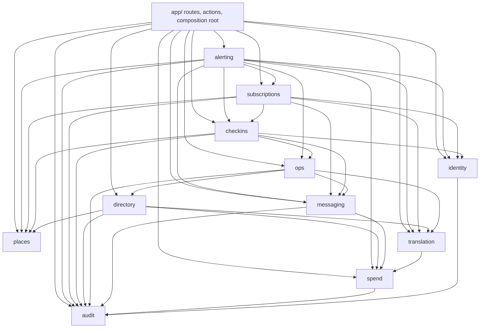
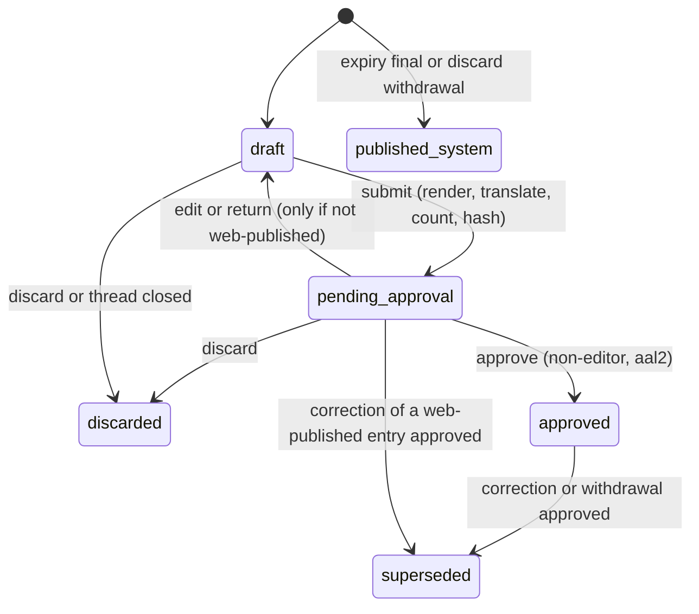
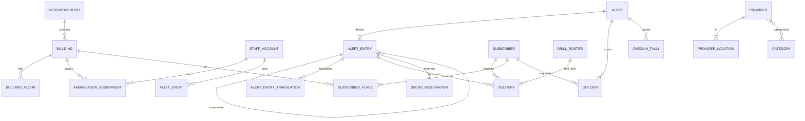

# Architecture Spine — CVH Pilot

## Design Paradigm

**Modular monolith, hexagonal per module, one Next.js app on Vercel.** Each module owns its tables and exposes one import surface; vendors (Supabase, Twilio, Cohere) sit behind ports.

| Layer | Lives in | May import |
| --- | --- | --- |
| Routes, server actions, route handlers, composition root | `src/app/` | module `index.ts` files, `src/contracts`, `src/platform`, `src/ui`, `src/i18n` |
| Wire contracts (zod schemas, code lists, the pure audience matcher) | `src/contracts/` | nothing but zod; safe to import in client code |
| Domain (pure rules, state machines) | `src/modules/<m>/domain/` | own `domain/`, `src/contracts`, `src/i18n` catalogs; no I/O, no clock |
| Application (use cases, port interfaces) | `src/modules/<m>/application/` | own `domain/`, other modules' `index.ts` per the graph |
| Adapters (Drizzle repos, Twilio, Cohere, Storage) | `src/modules/<m>/adapters/` | own `application/` ports |
| Platform (config, db, logger, clock, ids, http) | `src/platform/` | nothing in `src/modules` |

Every module may import `src/platform`, `src/contracts` and `src/i18n`; the diagram shows only module-to-module edges.



## Invariants & Rules

### AD-1 — One app, two surfaces, one origin

- **Binds:** all screens; N3; R-3
- **Prevents:** check-in phone numbers cached on an ambassador's phone; resident and staff code drifting on tokens, strings and auth.
- **Rule:** resident surface at `/[lang]/…` (public, service-worker cached); staff and ambassador surface at `/staff/…` (authenticated, `Cache-Control: no-store`). The service worker caches only `/[lang]/**`, `/api/feed`, the immutable `/api/directory/{v}/**` files, static assets and up to 200 viewed map tiles (the only cross-origin resident fetch); `/api/directory/manifest` is network-first with the last copy as offline fallback; every `/staff/**` and `/api/staff/**` response, and every subscription edit page and API (`/[lang]/subscription/**`, `/api/subscription/**`), is network-only and `no-store`. The one exception is the open check-in round page: once loaded, its data lives only in that page's memory (never the service worker, `localStorage`, IndexedDB or any other storage API, asserted by a test), marks made without signal queue in memory and send when signal returns, and the page clears its data when closed or after 10 minutes in the background. Apart from map tiles, residents fetch everything from the app's own origin (directory files are proxied, AD-11).

### AD-2 — Modules own their tables; dependencies point one way

- **Binds:** all modules
- **Prevents:** two modules writing one table; cycles; tables created with no owner.
- **Rule:** a table is written only by its owning module (Structural Seed ownership table); others call that module's `index.ts`. Imports follow the dependency diagram only. The dependency-cruiser config is generated from that diagram; a cycle, an undeclared edge or a deep import fails CI, and changing either needs a spine update. A migration that creates a table missing from the ownership table fails CI. Downstream modules return values; there is no event bus. The only writes that cross module tables are declared foreign-key actions (`ON DELETE CASCADE` / `SET NULL`). Ports whose implementations live in other modules (for example `messaging`'s `ContactResolver`) are wired in the app's composition root.

### AD-3 — Residents have no identity; personalisation is on the device

- **Binds:** P3, P4, P5, P10, A1, A12, A13, N3
- **Prevents:** the server learning a non-subscriber's building, floor or groups.
- **Rule:** resident choices (language, buildings, floors, groups, muted topics, basic mode) live only in `localStorage`. Resident routes set no cookies: next-intl runs with `localeCookie: false`, Supabase middleware matches only `/staff/**` and `/api/staff/**`, and an end-to-end test asserts no `Set-Cookie` on `/[lang]/**`, `/api/feed`, `/api/search`, `/api/directory/**`, `/api/metrics` and `/a/**`. Resident requests never carry building, floor or groups, except the SMS sign-up and edit-link POSTs. The server serves whole-neighbourhood data; the device orders and highlights with the same matcher as SMS targeting (AD-7). Language is a URL segment. Usage counts come only from `/api/metrics`, which accepts `{evt, lang, nbhd?}`, stores daily counts and nothing else (no IP, no identifier).

### AD-4 — Staff identity, roles and authority

- **Binds:** G1, G2, C3, D-2, E2, N5
- **Prevents:** a leaked anon key exposing data; authorization split between SQL and TypeScript; removed staff keeping access; two readings of who may author or approve.
- **Rule:** Supabase Auth, invite-only, with no email sent in the pilot: an Admin creates each account with a unique username and the staff member's email recorded as a contact detail (no mail is sent; the sign-in identity is confirmed at creation). The starting password is `rvh-firstname-lastname`, valid once: `staff_account.must_change_password` blocks every `/staff` action except choosing a new password until it is cleared, and an account whose starting password is unused after 24 hours is locked until an Admin re-issues it. After that, only an Admin resets a password or a second factor (both audited). The first Admin is created once by an audited CLI script. There are always at least two active Admins. TOTP (`aal2`) is required for every Admin and Coordinator session; their approve, correct, withdraw, drill, publish, cap, pause and account actions therefore run at `aal2`. Ambassadors and Directors sign in at `aal1`. Sessions end after 30 minutes idle for Ambassadors and after 12 hours for Coordinators, Directors and Admins. Every staff request loads `staff_account` and rejects unless `status = 'active'`; suspension also signs out globally. Authority is one table-driven function `identity/domain/policy.ts#can(role, action, context)`, evaluated at submit and again at approve against the author's current status and assignments:

| Action | Ambassador | Coordinator | Director | Admin |
| --- | --- | --- | --- | --- |
| Author ack, update, final for any floor of an assigned building | yes | yes | no | yes |
| Author neighbourhood scope, or heat, smoke, winter | no | yes | no | yes |
| Author correction or withdrawal | own pending entries only | yes | no | yes |
| Approve (never an editor of that entry, AD-5) | no | yes | no | yes |
| Drills, publish directory, accounts, cap, pause | no | no | no | yes |
| See open check-in rows | assigned floors, open alerts | no | no | yes |
| See counts and coverage | no | yes | yes (read-only) | yes |
| See spend | no | no | yes (read-only) | yes |

  Every table has RLS enabled with no anon or authenticated policies; the app reaches Postgres only server-side through Drizzle. `supabase-js` is used for Auth and Storage only.

### AD-5 — Alert threads and entries

- **Binds:** A4, A5, A7, A15, A16, D-1, E2
- **Prevents:** sending what nobody approved; self-approval through editing; quiet replacement of anything residents saw; two ways to close a thread.
- **Rule:** an `alert` is a thread (`open → closed{resolved|expired|withdrawn}`); an `alert_entry` (`ack|update|correction|withdrawal|final`) is anything published. Entry transitions exist only in `alerting/domain/lifecycle.ts`, and a trigger rejects any other. Dispatch progress is not an entry state (AD-8).
  - **Approval:** binds to `content_hash` (AD-21). `alert_entry.editor_ids` holds the author and every account that edited it; approval requires `approver_id <> ALL(editor_ids)` (also a trigger).
  - **Web publication:** an entry is web-published when `web_published_at` is set: at submit if D-1-eligible, else at approval. A web-published entry never returns to `draft`; changing it means a `correction` that supersedes it. Discarding a web-published entry creates a system `withdrawal` entry that supersedes it in the same transaction.
  - **D-1 eligibility:** decided only by `alerting/domain/d1.ts#isD1Eligible`: author role Ambassador, not a drill, kind `ack|update|correction`, and every type in `entry.types` has `disruption_type.direct = true` (null counts as false).
  - **Supersession:** a correction or withdrawal may target an entry that is `approved` (including mid-dispatch) or `pending_approval` and web-published. Its approval moves the target to `superseded` and cancels the target's queued deliveries in the same transaction; a superseded pending entry stays visible until its correction is published.
  - **Closing:** only `alerting.closeAlert(alertId, reason)` closes a thread, called from: approval of a `final` (`resolved`); approval of a withdrawal, or a discard or duplicate merge, that leaves no published, non-superseded substantive entry (`ack|update|correction|final`; withdrawal notices never count) (`withdrawn`); the expire job (`expired`, never shown as resolved). An ambassador's "mark resolved" submits a `final`. Closing a thread for its approved `final`, or for the withdrawal that leaves no substantive entry, cancels the queued deliveries of every other entry but never that closing entry's own, which stay sendable after the close. A `final` reaches every recipient of the thread on every channel used.
  - **System entries:** the only transition without a human author is `[*] → published_system`, for an expiry `final` or a discard `withdrawal`; it is web-only, creates no deliveries, and the trigger allows it only when the session variable `cvh.system_actor` is set by the expire job or the discard use case.
  - **Duplicates:** a new thread overlapping an open non-drill thread in audience and type shows the approver a "possible duplicate" link; in the pilot a duplicate is withdrawn with reason "duplicate" (merging threads is deferred to the MVP).



### AD-6 — Drills are isolated by data

- **Binds:** A17, R-2
- **Prevents:** a drill reaching a resident, a real check-in round, or a resident-facing page; a drill turning into a real alert.
- **Rule:** `alert.is_drill` is set at creation and immutable. A drill entry can create `delivery` rows only to `drill_roster` recipients (trigger). Inserting a `checkin` row for a drill alert is rejected (trigger). Every resident-reachable read (feed, archive, status, share landing, building page) goes through `alerting`'s resident queries, which select from the `nondrill_alert` view only; a lint rule forbids other alert relations in those query files, and an integration test hits every resident route and API with a drill present. `/a/{slug}` of a drill returns 404. Staff lists show drills in a separate labelled section. Every drill SMS and screen carries the exercise marker. Metrics partition by `is_drill`.

### AD-7 — One audience type and one matcher

- **Binds:** A1, A9, A13, A16, C7
- **Prevents:** web, SMS and check-in rounds disagreeing on who an alert is for; recipients or languages shifting after approval.
- **Rule:** `Audience` (in `src/contracts/audience.ts`) is `{scope:'neighbourhood', neighbourhood_ids} | {scope:'buildings', buildings:[{rsn, floors: number[] | null}]}` plus `groups` and `types`; floors are a sorted, deduplicated list (ranges expanded at input), `null` means the whole building. This exact value is stored in `alert_entry.audience`, hashed, sent in the feed and taken by the matcher. `src/contracts/audience.ts#matches(audience, profile)` (pure, used by the server and the device) is the only matching rule (neighbourhood → everyone there; building → that building and, when floors are given, those floors or no floor recorded; no building recorded → neighbourhood alerts only; groups → intersection; several places match once). Topic opt-outs and the fire and evacuation override are applied inside `matches`, never by callers. The SQL query in `subscriptions` must equal it (property test). At approval the recipient set, each recipient's language and SMS body are written into `delivery` rows. Correction and withdrawal recipients = the target's recipients (opt-outs never remove them) ∪ the entry's own audience, deduplicated. A final has no target: its recipients = the union of the recipients of every entry in the thread on the channels each used ∪ the final's own audience, deduplicated by recipient and channel. Language is each recipient's current language.

### AD-8 — One outbox for every outbound message

- **Binds:** A2, A15, A16, G6, N4, N9, D-7
- **Prevents:** double sends; sends that skip approval, spend accounting or masking; transactional texts with no sanctioned path.
- **Rule:** every outbound SMS is a `delivery` row with `kind`:
  - `alert`: created only by an approval.
  - `transactional`: confirmation, welcome, prompts, replies, approver and Hub notifications, ops alerts; created by `alerting`, `subscriptions`, `checkins` and `ops` use cases.
  - `campaign`: D-7 re-consent; needs an Admin with `aal2`.

  `recipient_kind` is `subscriber|pending_signup|roster|staff|oncall|inbound_reply` (`inbound_reply`: a number with no subscription, held at most 30 minutes and deleted in the hand-off transaction); staff on-duty and on-call numbers live in `ops.oncall_roster`. `idempotency_key` is unique (`entry_id:recipient:channel` for alerts, `kind:subject:purpose:nonce` otherwise). The dispatcher resolves phone numbers at claim time through a `ContactResolver` port, wired to `subscriptions`, `identity` and `ops` in the composition root. Delivery states: `queued → claimed → submitted → delivered|failed|undelivered|unknown`, plus `cancelled`, `skipped`, `skipped_env`. A dispatcher (run right after approval and every minute by pg_cron) commits `claimed` with `claimed_at` in its own short transaction before calling the provider, commits `submitted` with the provider id right after each call, and claims only `queued` rows, in one fixed order: fire and evacuation alert entries first, then on-call and other `transactional` texts, then building-level before neighbourhood-level alerts, then oldest first; `alerting` cancels queued rows whenever an entry is superseded or discarded, or its thread closes, except the rows of the closing entry (the approved `final`, or the withdrawal that left no substantive entry), which stay sendable after the close (AD-5, AD-18). A row claimed but not handed off for 5 minutes returns to `queued`; one handed off with no recorded outcome for 5 minutes, or `submitted` with no final status after 24 hours, becomes `unknown` and is never re-sent automatically. Retries (at most 3) apply only when the provider clearly did not accept the text (HTTP 429, or a connection that failed before sending); a 5xx, timeout or dropped connection after sending makes the row `unknown`. Only one dispatcher sends at a time (a lease row with an ownership token checked at every claim and hand-off), at a shared pace. The hand-off transaction locks the delivery row, checks the lease token, re-reads the pause, entry, thread and recipient, and commits `handed_off_at` only if the row is still sendable. Every change that must stop a send writes the delivery rows itself, in its own transaction: corrections, withdrawals, discards and closes cancel the affected entries' `queued` and claimed-but-not-handed-off rows (the closing entry's rows excepted); a recipient deletion sets that recipient's rows `skipped` before the recipient is deleted. So cancellation wins whenever it commits before the hand-off; a pause committed during an open hand-off lets that one text go, shown as in flight (disclosed allowance). Status callbacks carry an opaque delivery reference in their signed URL. The guarantee is no automatic duplicate submission, not exactly-once delivery. Before each claim and at the hand-off the dispatcher checks the pause on `messaging_control`, which only an Admin sets (audited); on-call texts are still sent during a pause. Sends go through one Twilio Messaging Service on a verified toll-free number; status comes from signed webhooks. Nothing else calls the SMS adapter. **Spend:** a text's estimate is counted once, when the provider accepts it or its outcome becomes `unknown`; actual SMS cost comes from reconciliations, each with an exact UTC interval and a stable id (`month:{YYYY-MM}` for a Toronto calendar month; `restore:{backup timestamp}:{re-enable timestamp}` for the gap a restore covers). A reconciliation lists the interval's outbound messages from the Twilio Messages API to the last page and records each message's price once by `MessageSid` (unique across all reconciliations), only when the listing is complete and every message is priced. An actual retires the delivery estimate whose provider id equals its `MessageSid`, whatever interval or timestamp either falls in, including an estimate found after the actual was imported; repeating an import changes nothing. Estimates with no matching actual stay counted as "unresolved estimates", and actuals with no matching delivery are counted as "unmatched actuals", both shown separately; an interval whose reconciliation is incomplete is labelled "pending reconciliation" with its estimates still counted, never zero. Texts a restore marks `unknown` keep their estimates on that basis. **Spend cap:** when month-to-date plus the entry's estimate (calendar month in `America/Toronto`) exceeds the cap, the approval view shows the shortfall, approval records `cap_overrun` in the audit and notifies Admins; it never refuses. There are no spend reservations in the pilot.

### AD-9 — Inbound SMS, consent and the end of the pilot

- **Binds:** A2, A12, C4, C6, D-6, D-7
- **Prevents:** two handlers acting on one reply; unconfirmed numbers receiving alerts; basic-phone users unable to change choices.
- **Rule:** one router, `subscriptions/application/handleInbound`, uses a decision table keyed by (keyword, the number's state `none|pending|active`, open prompt). A number receives alerts only after replying YES to its confirmation; pending sign-ups expire after 48 hours. Twilio Advanced Opt-Out owns STOP, START and HELP and sends their replies (its configured START and HELP replies include the sign-up link); on an opt-out event the app deletes the subscription and sends nothing itself. Inbound messages are de-duplicated by `MessageSid` (hash kept 48 hours), and deletion requests are handled before rate limits. Numbered replies: 1 and 2 start an SMS menu (state in `sms_prompt`) that goes street → building on that street → floor, or language by list number; options are numbered 1 to 7 per page; 0 is Back, 8 is More and 9 is the Hub's number at every step; menu 1 replaces all saved buildings and warns first when more than one is saved; a menu idle for 10 minutes resets with a message saying so. Every menu message is a catalog string in the subscriber's language and must fit one segment in that language's encoding (AD-21). A single-use 30-minute web edit link is offered as an alternative; 3 withdraws the check-in request and deletes its open check-in rows; outside a menu, 0 asks for confirmation and a second 0 deletes. After deletion the app sends nothing to that number. YES resolves to the open prompt with the latest `sent_at`. Every app-sent reply is a catalog string in the subscriber's language; the STOP, START and HELP replies are Twilio's and are tested on the verified toll-free number before launch. Inbound bodies are not stored, only keyword counts. D-7: at pilot end an Admin sends a `campaign`; `subscriber.retention_state` moves `active → reconsent_pending`; YES sets `retained`; receiving subscribers are `active`, `reconsent_pending` before the deadline, or `retained`; the campaign text is a frozen catalog string reviewed before the pilot; one Admin at `aal2` starts it after a rehearsal on the drill roster, idempotently; starting it deletes pending sign-ups and closes sign-ups; the purge job deletes `reconsent_pending` subscribers after the deadline (30 days after the campaign), re-checking state under the row lock.

### AD-10 — Translation is routed, checked, cached and labelled

- **Binds:** A3, D-4, D-5, D7, D2, N1
- **Prevents:** wrong-language text reaching residents; model choices scattered in code; vendor language codes leaking into data.
- **Rule:** all translation goes through `translation`'s `Translator` port using Cohere models only. `translation_route` (config, not code) holds per language: the ordered models and the check, which is either an `eld` code (for example `prs → fa`) plus the script check, or, for languages `eld` does not support (`ps`), the script and marker-letter check alone (Pashto letters ټ ډ ړ ږ ښ ګ ڼ ې ۍ; Urdu letters ٹ ڈ ڑ ں ے must be absent from Pashto and Dari). Languages run in parallel. Every attempt has its own timeout per route position (language, model), set from that model's measured p99 for the language (provisional, re-measured during the pilot), and each language has a route deadline (the sum of its attempt timeouts, at most 30 s) after which the attempt in flight is cancelled; a timeout counts as a failure. On failure the next model runs; if all fail, the result is `fallback_en`. Alert entries are translated once at submit into every launch language, and frozen; approval never re-translates. (Clarification: web readers may use any launch language, so for the web every language is present in the audience, as FR-A3 requires.) A recipient whose language has no frozen text gets the English text with `translation.unavailable`, and the approver sees how many. The app never translates directory listings: they come pre-translated and reviewed from `data/catalogue/` (AD-11). Guides are translated once at seed time by the same offline scripts and reviewed like the catalogue. `zh-Hant` is produced from approved `zh` by OpenCC conversion (`script_converted`). Cache key `(source_hash, lang, model_id, prompt_version, check_version)`, plus the OpenCC version and configuration for `zh-Hant`; only passing results are cached. Each call records its usage in `spend`. Vendor codes live only in adapters; everything else uses `LangCode` (AD-20).

### AD-11 — Directory publishes versioned files; search runs in memory

- **Binds:** D2, D2-Q, D3, D7, G4, N7
- **Prevents:** directory edits tied to deploys; search ids that don't match the listings on the device; queries embedded with a different model than the release.
- **Rule:** `data/catalogue/` in the repository is the single source of truth for directory content in all 15 languages: `providers.json` (English source, 99 providers, stable `id`) and `translations/{lang}.json`, produced and reviewed by the offline scripts in `scripts/` (translate, review, back-translation check, apply corrections, build), which re-translate only changed text. The app never translates or edits listing text. A text change means updating the seed CSV, re-running the scripts and committing the result; staff screens may only publish or unpublish a provider and set its last-confirmed date. Publish is a resumable job: it loads the committed catalogue into Postgres, embeds each provider's English text, writes per-language listing files and a vectors file to a private Storage bucket, records the embedding model, then marks the release current; it works in chunks under the function time limit and resumes from the last completed chunk. Languages whose catalogue entry is null show the English text with `translation.unavailable`. The client reads `/api/directory/manifest` (no-store), then same-origin `/api/directory/{v}/{lang}.json` (immutable). `/api/search` takes `{q, lang, v}` (`lang` is the page language), detects the language the question was written in, holds the current vectors in memory, embeds the question with the release's model (usage recorded in `spend`), adds an English translation of the question for `ps`, `prs` and romanized or mixed input and merges rankings (RRF), and returns `SearchV1` (AD-20). Results are shown in the language the question was written in: `query_lang` is that language when detection is confident and it is a launch language, otherwise the page language (romanized or mixed questions use the page language); the client loads that language's listing file if it doesn't have it. If the release is newer than the client's `v`, the client refreshes the manifest first. Below the similarity threshold the status is `no_clear_match` and the client shows categories and the Hub's number; `emergency_first` (set by the server) puts 911 first. No answer text is generated. Unconfirmed providers are loaded but not published. The map groups nearby pins with `leaflet.markercluster`; cooling spaces, water fountains and public washrooms are categories in the listing files, shown with distinct markers.

### AD-12 — Check-in rounds live only while needed

- **Binds:** C1, C3, C6, C7, E1, E3, E5
- **Prevents:** rounds that never start for heat; duplicate rows; phone numbers outliving a withdrawal, an unsubscribe or the disruption; unresolved help requests deleted mid follow-up.
- **Rule:** a check-in request is `subscriber.checkin_method` (`call|text|null`). Turning it on shows, in the resident's language, that an ambassador on her floor will see her phone number and floor, and records `subscriber.consent_version`. `disruption_type.checkin` marks round types (pilot: heat, power; Hub-editable). One round per thread: approving a non-drill `ack|update|correction` in an open thread with a round type calls `checkins.ensureRound(alertId, rows)` with the matched requesters (a neighbourhood audience covers every building), inserting `UNIQUE(alert_id, subscriber_id)` rows with `ON CONFLICT DO NOTHING`; a covered request activated while a matching round is open joins it at once (`checkins.joinActiveRounds`); changing the "where I live" building or floor withdraws the request (the resident asks again with fresh consent); D-1 publication never creates a round. `checkin` stores `subscriber_id` (`ON DELETE CASCADE` as a backstop), `rsn`, `floor` and status, never a phone number; unsubscribing and withdrawing both call `checkins.removeRequester` first, which tallies the rows and turns them into closed stubs; the round screen composes contacts in the app layer from `subscriptions` and keeps them in page memory only (AD-1). `ambassador_assignment(staff_id, rsn, floors | null)` limits round visibility; posting is building-level. `identity.coversFloor(rsn, floor)` is the only coverage test, used by the sign-up warning (C6), the round filter and the coverage view (E5). Each row has a stable, opaque random `round_ref`, used by the round page and marks. A removed row becomes a closed stub `(round_ref, alert, building, floor, closed_at)` with no resident data, deleted 2 hours later; a late mark is accepted only against an unexpired stub, from a signed-in, active Ambassador who covers that floor (or an Admin), with one escalation per `round_ref` and status; after expiry it is refused and the Ambassador is told to call the Hub. Marking "not reached" or "needs help" adds one escalation to the Hub list at once and sends a `transactional` SMS (exempt from the pause) to the on-duty Admin with a link, never a resident's number. Closing a thread tallies every row and turns `pending` and `done` rows into stubs; `needs_help` and `not_reached` rows keep their subscriber link until an Admin marks them handled or 24 hours after close. `checkin_tally` is keyed `(alert_id, rsn, floor, status)` with statuses `requested|done|not_reached|needs_help|withdrawn|unmarked`; `requested` is cumulative and the outcomes are mutually exclusive, one per row, recorded when the row leaves the round.

### AD-13 — Personal data is confined and deletable

- **Binds:** P4, P9, C4, D-7, N5
- **Prevents:** phone numbers or resident text spreading into logs, audit, search records or delivery history.
- **Rule:** personal data exists only in `subscriber`, `subscriber_place`, `subscriber_topic_optout`, `pending_signup`, `sms_prompt`, `subscription_edit_token`, `checkin`, `staff_account`, `drill_roster`, `oncall_roster`, `inbound_reply` (a number with no subscription awaiting one reply, at most 30 minutes) and `rate_limit` (salted hash, 24 hours). `inbound_seen` holds only hashed message ids for 48 hours. `delivery` never stores a phone number: the dispatcher resolves it at claim time, and `delivery.subscriber_id` is `ON DELETE SET NULL`. Unsubscribe is a hard delete. Before a deletion commits, a write-ahead intent holding a salted hash of the number is written to a Storage bucket outside the database and confirmed; without that confirmation the deletion does not commit. Only STOP (already enforced by Twilio) is then held for retry; other deletions fail visibly and are retried by the person or the purge. Ledger objects are kept for the backup window plus one day. Twilio's opt-out list cannot be read, so STOP evidence outside the database is Twilio's inbound message log (body redaction off, retention covering the backup window). A restore stays in maintenance, contacting nobody, until `scripts/restore-reconcile` reports complete: paginated listings of the ledger and the Twilio log read in full; the ledger bucket's retention policy (backup window plus one day) and its no-early-delete, no-overwrite controls verified from Storage's configuration; no redacted bodies; log retention covering the range; the opt-out keyword list current; and every record created within 2 minutes of a matching intent or STOP resolved by an Admin from evidence of the order of deletion and re-subscription (otherwise recovery stays blocked). It then applies every kept intent, and every STOP in the log since the backup, to records created at or before them (never to a later re-subscription), and re-runs the purge and, in an audited recovery mode while sending is disabled, marks every `queued` or `claimed` delivery `unknown` (the only path for that change); spend for the gap comes from a restore reconciliation (AD-8). Access and deletion on a resident's behalf require verified control of the number; in the pilot this is a call-back to the number and a read-only script (the access-request screen is deferred to the MVP). `audit_event` and `ops_event` hold no phone numbers, resident message bodies or subscriber ids. `search_log` holds `{at, lang, release_v, ms, result_count, status, top_score}` and never the question; the logger rejects a `q` field and masks phone numbers to the last two digits. Daily backups keep deleted data for the backup window; the terms say so. The terms name one privacy contact. A resident's access or correction request is handled by Hub staff, who look up the phone number, read back or correct what is held, and record the request in the audit trail. Sign-up states a minimum age of 16, or younger with a parent's or guardian's help, and records `subscriber.consent_version` (the terms version accepted).

### AD-14 — Audit is append-only and transactional

- **Binds:** G5, Section 9 measures
- **Prevents:** an action without a record, or a record rewritten.
- **Rule:** every send, approval, correction, withdrawal, discard, close, drill, publish, cap, pause and account change writes an `audit_event` in the same transaction. UPDATE and DELETE on `audit_event` are blocked. Section 9 timings are SQL views over `audit_event`, `delivery` and `alert.reported_at` (set by the author).

### AD-15 — Environments cannot reach residents by accident

- **Binds:** N4, N5, N6, R-2
- **Prevents:** a preview or staging build sending real SMS, acting on production data, or running production jobs.
- **Rule:**
  - **Regions:** production is Vercel `yul1` with Supabase `ca-central-1`; staging is a separate Supabase project.
  - **Separate accounts:** only production has a Twilio subaccount and a (verified) toll-free number; staging and previews have none. Each environment has its own Cohere key with a spend limit and its own pg_cron target URL and job secret in that database's Vault.
  - **SMS mode:** `SMS_MODE` is `live` only in production and `log` everywhere else (records each would-be send as `skipped_env`). Drills are rehearsed in production against the drill roster, relying on AD-6. The env schema (zod, checked at boot) rejects any other combination and requires `PUBLIC_BASE_URL`, which webhook signature checks use.
  - **Previews:** run no cron, apply no migrations, and use staging with synthetic subscribers only; production data is never copied out.
  - **Deploys:** `main` deploys to production through Vercel after CI passes (lint, dependency rules, tests, migrations applied to production first). Migrations stay backward-compatible for one release so app rollback is safe.
  - **Secrets:** live in Vercel env and Supabase Vault, and are rotated at pilot start, on departure of anyone who held them, and at pilot end. Twilio rotation uses the secondary token, and job routes accept the current and previous secret during rotation.

### AD-16 — Interface strings and look come from the prototype

- **Binds:** N1, N2, P1, P5
- **Prevents:** re-authored strings and tokens drifting from the approved prototype; RTL layouts breaking.
- **Rule:** UI strings are generated from `design/prototype/cvh/strings.*.js` into `next-intl` catalogs by a script; missing keys show the visible "[EN]" fallback and CI reports missing counts per language. Directions come from `design/prototype/cvh/data.js` (`ur`, `ps`, `prs` are RTL). Styling uses logical CSS properties only. Design tokens are generated from `design/prototype/ds/cvrh/tokens.json` in an early foundation story (S01.16), so the Hub and resident surfaces share them. `tokens.json` is first reconciled with the approved prototype: one spacing scale taken from the prototype's values, each rare value kept as a named step where an approved screen needs it or changed by a recorded design decision; the generator fails rather than default a missing token. Spacing in `src/` comes only from tokens, enforced proportionately: literal values in padding, margin and gap fail unless they carry a reviewed `spacing-exception` comment, while borders, icon sizes, positioning and line height are not checked. Layout primitives and spacing rules are specified in `docs/design-framework/spacing-container/`. Helpers ported from `design/prototype/cvh/lib.js` keep the prototype's outputs as test fixtures. Basic mode is a device choice that switches to the prototype's basic layouts. One catalog 911 block (when to call, what the CVH is not) appears on every alert, guide, essential-numbers page and check-in screen.

### AD-17 — Residents get alerts from a versioned public feed

- **Binds:** A1, A7, A11, D6, N3, N4
- **Prevents:** per-resident server queries; withdrawn or expired alerts lingering on screens; share previews in the wrong language.
- **Rule:** `/api/feed?lang=` returns `FeedV1` (AD-20): threads that are open and have a web-published entry, plus derived statuses (AD-19); `/api/feed/archive?lang=` returns closed threads. Every transaction that changes web-visible state increments `alerting.feed_version` and calls `revalidateTag('feed')` after commit; the feed is edge-cached for 15 seconds. The client polls every 60 seconds while visible and, like the service worker, keeps the highest `feed_version` seen and discards lower ones; offline views show when they were last updated. Share URLs are `/a/{slug}?l={lang}`; the server-rendered preview uses `l` and the thread's current verification and correction state, cached at most 15 seconds; after load the client switches to the device's language if set.

### AD-18 — Lifecycle changes are serialized per thread

- **Binds:** A7, A15, A16, C7, G6
- **Prevents:** approval, dispatch, correction, expiry and close interleaving into deliveries on closed threads, recreated check-in rows or deadlocks.
- **Rule:** every use case that changes a thread (submit, approve, discard, return, correct, withdraw, close, expire, round create, tally) runs in one transaction that starts with `SELECT … FROM alert WHERE id = $1 FOR UPDATE`, then locks rows in the order `alert → alert_entry → delivery → recipient row → checkin → checkin_tally → spend_cap` (the dispatcher's hand-off locks only its delivery row, and an `inbound_reply` row after it), re-reads the thread state and refuses with `ALERT_CLOSED` when closed. Closing moves every `draft` and `pending_approval` entry to `discarded` and cancels every `queued` and claimed-but-not-handed-off delivery (except the closing entry's) in the same transaction.

### AD-19 — Building and neighbourhood status are derived, never stored

- **Binds:** D6, D4-P, E2
- **Prevents:** two sources of "building status" disagreeing.
- **Rule:** status is computed only by `alerting/domain/status.ts#statusOf(place, threads)` over non-drill threads that are open or were closed `resolved` within the last 12 hours, whose covering entry (the latest published, non-superseded substantive entry) has an audience covering the place (a neighbourhood audience covers each building in it). Each `ack|update|correction` carries a required `phase` (`problem|in_progress`). `active` = an open thread whose latest published entry has phase `problem`; `in_progress` = latest phase `in_progress`; `resolved` = closed `resolved` within 12 hours; otherwise `none`. Precedence: active > in_progress > resolved > none. `verified` is true when at least one thread giving the winning status has a verified covering entry, and false only when all of them rest on unverified (D-1) entries. The `building` table holds facts only.

### AD-20 — Wire contracts are shared, versioned schemas

- **Binds:** all resident and staff JSON; A3, A7, A16, D2, D2-Q
- **Prevents:** client and server disagreeing on the shape of the feed, directory, search, translations, audience or language codes.
- **Rule:** every JSON body crossing the client–server boundary is a zod schema in `src/contracts/` with a `v` field, imported by both sides and contract-tested. The core types are below. Expected outcomes the resident must see (`no_clear_match`, sign-up already pending, edit link expired) are success bodies with `status`; `{error:{code, message_key}}` is only for failures.

| Contract | Shape |
| --- | --- |
| `LangCode` | The 15 `data.js` codes plus `zh-Hant`; the only language codes in the database, URLs, `localStorage` and payloads |
| `Translated` | `{lang, body, machine, model, status: source\|ok\|fallback_en\|script_converted, source_hash}`. For `fallback_en` the client and SMS renderer add the catalog string `translation.unavailable` in the target language |
| `FeedV1` | `{v, feed_version, server_now, threads[], places: {buildings: [{rsn, status, verified}], neighbourhoods: [{id, status, verified}]}}` |
| `Thread` | `{id, slug, types, audience, state, close_reason?, valid_until, entries[]}` |
| `Entry` | `{id, kind, supersedes_id?, phase?, verified, attribution: {role, rsn?}, published_at, text: Translated, original: {lang: 'en', body}}` |
| `DirectoryManifestV1` | `{v, published_at, embed_model, files: {lang: path}}` |
| `SearchV1` | `{v, release_v, query_lang, status: ok\|no_clear_match, emergency_first, results: [{provider_id, score}]}` |

### AD-21 — One renderer for every outbound text, frozen at submit

- **Binds:** A2, A3, A5, A11, A15, A17, E2, G6
- **Prevents:** the approver approving different text than residents receive; segment counts and costs that miss the footer; inconsistent markers across SMS, feed and share.
- **Rule:** `messaging/domain/smsBody.ts#render(entry, lang, isDrill, slug)` is the only SMS body builder. It fixes order and wording from catalog strings, leaving out parts that do not apply: exercise marker, correction marker, the 911 line (here only for fire, evacuation and "Other"), verification marker ("Verified by the Hub" / "Not yet verified"), role-and-building attribution, the text, the machine-translation label, the 911 line (here for every other type), the `/a/{slug}` link, and "Reply STOP". Every alert body has exactly one 911 line. Every SMS the app sends (alerts, menus, prompts, replies, notifications) is built by this module; menu and prompt messages must render to one segment per language, enforced by a CI fixture per language that counts the frozen body with the real encoder. The renderer applies its own fixed character normalisation before freezing, and Twilio Smart Encoding is off on the Messaging Service (checked before sending), so the frozen body is sent byte for byte. For alerts it runs at submit; its outputs are stored on the entry, counted for segments (GSM-7 160/153, UCS-2 70/67), costed, shown to the approver and sent byte-for-byte. Staff screens are phone-first: the approval view shows the English text, audience, recipient count, estimated cost and any fallback languages above the fold, every other language one tap away, and Approve within thumb reach. `content_hash` = sha256 of the RFC 8785 canonical JSON of `{kind, alert_id, supersedes_id, types, phase, audience, channels, is_drill, valid_until, sms_bodies, web_texts}` with lists sorted by language, computed only in `alerting/domain/hash.ts`.

### AD-22 — Public endpoints are throttled

- **Binds:** A2, D2-Q, G6, N9
- **Prevents:** scripts using sign-up or search to send texts to arbitrary numbers or drain the budget.
- **Rule:** sign-up accepts only Canadian `+1` numbers. The Twilio Messaging Service is limited to Canada by geo-permissions, with SMS pumping protection on. There is at most one pending confirmation per number per 48 hours. Per-client limits on sign-up and search are kept in Postgres against a salted IP hash that is deleted after 24 hours. Staff-assisted sign-up (a staff screen used at launch events and the Hub desk) is limited per staff account, not per IP; the resident still confirms with YES herself (A2). Search questions are capped at 200 characters. A daily ceiling on `transactional` sends (menu and prompt traffic included) raises an ops alert (AD-23) when crossed; one number may run at most 5 menus a day.

### AD-23 — Failures are detected and recorded

- **Binds:** N4, N6, G6
- **Prevents:** a stuck outbox, failed job, rejected webhook, translation outage or failed publish going unnoticed.
- **Rule:** `/api/jobs/health` runs every minute. It writes an `ops_event` (no personal data) and sends a `transactional` SMS to the Admin on-call roster when:
  - a delivery is `queued` more than 5 minutes (outside a pause), or `unknown`;
  - a pg_cron run failed;
  - webhook signature failures exceed 5 in 10 minutes;
  - a translation falls back for a whole language, or a publish fails;
  - the transactional ceiling is crossed;
  - a `cap_overrun` is recorded.

  The weekly N4 review is a SQL view over `ops_event`, `delivery` and `audit_event`. Written procedures (N6) cover pause, resend of failed deliveries (an Admin action that creates new idempotency keys), cap overrun and incident ownership.

### AD-24 — Tests prove the rules where they are enforced

- **Note:** the build happens before the two-month pilot starts, so this AD applies in full.

- **Binds:** all ADs
- **Prevents:** database triggers and constraints that no test exercises; vendor calls in tests.
- **Rule:** domain rules have pure unit tests. Every trigger, constraint and lock rule has an integration test against a local Supabase started in CI. Twilio and Cohere are reached only through port fakes in tests. End-to-end tests run on previews with `SMS_MODE=log`. The audience property test (AD-7), the contract tests (AD-20) and the no-cookie test (AD-3) are required. The search test set (about 150 questions, 10 per language) runs in CI on any change to the embedding model, question route, threshold, emergency categories or catalogue, and manually before launch and at week 4; the translation checks run on any model or route change and before launch.

### AD-25 — Reference data is seeded idempotently

- **Binds:** G3, G4, D7, A17
- **Prevents:** environments with different buildings, providers or routes; real subscriber data in staging.
- **Rule:** buildings (from `data/seed/apartment_building_reg.geojson`, keyed by `rsn`; duplicate addresses fail unless listed in `data/seed/building-merge.csv`), providers and their translations (from `data/catalogue/`, keyed by provider `id`, unconfirmed ones unpublished), guides and essential numbers are loaded by idempotent upsert scripts run per environment by an Admin through CI. Drill-roster and on-call phone numbers are entered by an Admin in the staff screens (audited), never stored in the repository or CI. `disruption_type` and `translation_route` are seeded by migration. Staging uses synthetic subscribers only.

## Consistency Conventions

| Concern | Convention |
| --- | --- |
| IDs | `building.rsn` is the building's primary key everywhere (FKs, payloads, `localStorage`); other rows use UUIDv7; threads expose a short public slug |
| Time | `timestamptz` in UTC; every payload timestamp is ISO-8601 with `Z`; staff wall-clock input is interpreted as `America/Toronto` by `platform/clock#fromToronto`; date arithmetic is done in the Toronto zone (never by adding milliseconds, e.g. across the 1 November 2026 change); `valid_until` is required, "until resolved" means now + 24 hours renewed by an update; "ago" is computed from the feed's `server_now` |
| Phone numbers | E.164 in storage; display formatting from the prototype's `phone()` |
| Languages | `LangCode` only (AD-20); BCP-47 for `Intl` from the prototype's `bcp` map (`prs → fa-AF`, `zh-Hant → zh-Hant-TW`) |
| Errors | Domain returns `Result<T, DomainError{code}>`; failures map to `{error:{code, message_key}}`; expected outcomes use `status` (AD-20); thrown exceptions are bugs |
| Logging | Structured JSON to stdout: `{evt, module, alert_id?, entry_id?, ms}`; masking per AD-13; operational failures also go to `ops_event` (AD-23) |
| Naming | Tables `snake_case` singular; modules lowercase nouns; use cases `verbNoun`; route handlers under `app/api/<area>/` |
| Database | SQL migrations in `db/migrations/` are canonical, created with the Supabase CLI and applied by CI; the Drizzle schema is hand-maintained beside each module's adapters and a CI drift test compares it with a migrated database; Drizzle connects through the Supabase transaction pooler with `prepare: false`; pg_cron and pg_net are enabled by the first migration |
| Jobs | `/api/jobs/{dispatch,expire,purge,health,publish}`; called by pg_cron with the environment's secret; idempotent |
| Webhooks | Twilio webhooks validate `X-Twilio-Signature` against `PUBLIC_BASE_URL` before any work |
| Money | Integer cents CAD; SMS cost from the renderer's segment count; translation cost from returned usage |
| Accessibility | Status never by colour alone; touch targets ≥ 44 px; WCAG 2.1 AA |

## Stack

| Name | Version |
| --- | --- |
| Next.js (App Router) | 16.3.8 |
| React | 19.3.0 |
| Serwist (`@serwist/turbopack`) | 9.5.12 |
| drizzle-orm | 0.45.3 |
| @supabase/supabase-js | 2.117.2 |
| @supabase/ssr | 0.12.7 |
| Supabase CLI | 2.119.0 |
| twilio (Node SDK) | 6.1.2 |
| cohere-ai (TypeScript SDK) | 8.1.0 |
| zod | 4.6.5 |
| next-intl | 4.14.8 |
| tailwindcss | 4.3.3 |
| leaflet | 1.9.4 |
| eld | 2.1.0 |
| leaflet.markercluster | 1.5.3 |
| opencc-js | 1.4.2 |
| canonicalize (RFC 8785) | 5.1.0 |
| postgres (driver) | 3.4.9 |
| drizzle-kit | 0.31.11 |
| dependency-cruiser | 18.5.0 |
| vitest | 5.0.3 |
| @playwright/test | 1.63.0 |
| Vercel | Pro, region `yul1` |
| Supabase | Pro, region `ca-central-1` |

## Structural Seed

```text
src/
  app/
    [lang]/(resident)/     # resident screens (R-xx in pilot scope)
    staff/                 # Hub, Coordinator, Director and ambassador screens (O-xx, A-xx)
    a/[slug]/              # share landing (A11)
    api/                   # feed, directory, search, metrics, staff, twilio/{inbound,status}, jobs/*
  contracts/               # zod wire schemas and code lists (AD-20)
  modules/
    identity/ places/ alerting/ subscriptions/ messaging/
    checkins/ translation/ directory/ audit/ spend/ ops/
      domain/ application/ adapters/ index.ts
  platform/                # config, db, logger, clock, ids, http
  ui/                      # tokens and components
  i18n/                    # generated catalogs
db/migrations/             # SQL, incl. constraints and triggers
scripts/                   # seed loaders, string and token generators, search test-set runner, first-Admin script
```

| Module | Owns |
| --- | --- |
| identity | `staff_account`, `ambassador_assignment` |
| places | `neighbourhood`, `building`, `building_floor`, `disruption_type` |
| alerting | `alert`, `alert_entry`, `alert_entry_translation`, `feed_version` |
| subscriptions | `subscriber`, `subscriber_place`, `subscriber_topic_optout`, `pending_signup`, `sms_prompt`, `subscription_edit_token`, `inbound_keyword_count`, `inbound_seen`, `inbound_reply`, `drill_roster`, `rate_limit`, `campaign` |
| messaging | `delivery`, `messaging_control` (pause), `dispatcher_lease` |
| checkins | `checkin`, `checkin_tally` |
| translation | `translation_cache`, `translation_route` |
| directory | `provider`, `provider_location`, `category`, `provider_category`, `guide`, `essential_number`, `directory_release`, `search_log`, `usage_count` |
| audit | `audit_event` |
| spend | `spend_cap`, `spend_event` |
| ops | `ops_event`, `oncall_roster` |

Partial entity view (relationships only):




## Capability → Architecture Map

| Capability / Area | Lives in | Governed by |
| --- | --- | --- |
| A1, A9, A13 targeting and tailoring | `src/contracts` (matcher), `subscriptions` (SQL), device | AD-3, AD-7 |
| A2, D-6 SMS sign-up, keywords, dialogues | `subscriptions`, `messaging` | AD-8, AD-9, AD-22 |
| A3, D-4, D-5, N1 languages | `translation`, `i18n` | AD-10, AD-16, AD-20 |
| A4, A5, A7, A15, A16, D-1, E2 alerts | `alerting` | AD-5, AD-7, AD-8, AD-18, AD-21 |
| A10 official alert (stretch) | `alerting` entry attribution | AD-5, AD-21 |
| A11 share | `app/a/[slug]` | AD-6, AD-17, AD-21 |
| A17 drills | `alerting`, `messaging`, `checkins` | AD-6, AD-15 |
| C1, C3, C4, C6, C7, E1, E3 check-ins | `checkins`, `subscriptions`, `identity` | AD-4, AD-12, AD-13 |
| D2, D2-Q, D3, D7, G4 directory, search, map, guides, numbers | `directory` | AD-11, AD-20, AD-25 |
| D4-P, D6, G3 buildings, facts, status | `places`, `alerting` | AD-19, AD-25 |
| E5 coverage | `identity` | AD-12 |
| G1, G2 roles and accounts | `identity` | AD-4 |
| G5 audit, Section 9 measures | `audit`, `directory` (usage), `messaging` | AD-3, AD-14 |
| G6, N9 spend | `spend`, `messaging`, `translation` | AD-8, AD-10, AD-22 |
| D-7 end of pilot | `subscriptions`, `messaging` | AD-9 |
| N3 offline, N4 reliability, N6 procedures | service worker, outbox, `ops` | AD-1, AD-8, AD-17, AD-23 |
| N5 privacy | all | AD-3, AD-4, AD-12, AD-13 |
| Environments, deploys, secrets | platform, CI | AD-15, AD-24 |

## Deferred

| Item | Why it can wait |
| --- | --- |
| Web push | Browsers require a visible notification for every push, so device-side filtering is impossible; targeted push would store choices centrally (P3). MVP. |
| Persisted offline check-in rounds | The pilot keeps a loaded round in page memory only (AD-1); storing rounds on the device waits for MVP safeguarding and device controls. |
| Supabase Realtime for staff screens | Needs browser database access and RLS policies (AD-4); staff screens poll every 15 seconds. |
| pgvector, rerank, generated answers | About 100 providers fit in memory; generated answers are out of pilot scope. |
| Embedding model comparison | The pilot uses `embed-v4.0` (a config value under AD-11); the three-way comparison (embed-multilingual-v3, v4, v5 fast) runs before launch only if v4 misses the search launch bar. |
| Map tile provider | One tile URL and key per environment in config, attribution shown, viewed tiles cached by the service worker up to 200; pick a free-tier provider at build (OpenStreetMap's public tiles are not for app traffic). |
| Official alert feeds, partner space, moderation, resident submissions, confirm receipt, need-help, audio | MVP scope (pilot PRD Section 6.3). |
| Canadian processing for Twilio and Cohere | Pilot accepts disclosed processors (P9); Vercel may fail over to a US region during a regional outage. MVP enforces residency. |
| Point-in-time recovery, multi-region, SLOs | Pilot sets no reliability targets (N4); Supabase Pro daily backups with one restore rehearsal before launch. |
| Pilot lean cut (2026-10-01) | Deferred to the MVP: merging duplicate alerts, the access-request screen with texted codes, spend reservations, the weekly-review and Director measures screens (SQL views and exports instead), the hourly Twilio price job (monthly reconciliation instead), signed check-in mark tickets with 24-hour validity (2-hour stubs instead), moving round rows on a location change, automated restore gating (reconciliation script instead), Lighthouse checks in CI, two-Admin campaign approval, and the official alert relay. The approved full spine is kept unchanged in `docs/planning/mvp/reference/architecture-spine-full.md`. |

## Pilot Risks Carried to the MVP

| Risk | Pilot stance |
| --- | --- |
| A fire, evacuation or "Other" post made when no second approver is awake reaches no one until someone approves it (AD-5, AD-8) | Accepted for the pilot; the welcome text says messages are checked by Hub staff and may not be sent overnight; MVP must define Hub hours, approval timeouts and an overnight path |
| SMS sending runs at the toll-free default of 3 segments per second; a neighbourhood alert in a non-Latin script to 400 subscribers takes about 11 minutes to finish | Accepted for the pilot; MVP decides on high-throughput sending |
| Every alert SMS carries the full footer (markers, attribution, machine-translation label, 911, link, STOP), adding about two segments in non-Latin scripts | Accepted for the pilot; cost estimate raised accordingly; MVP decides on a compact footer |
| Approvers cannot read most target languages; translations are machine output checked only for language, not meaning (AD-10) | Accepted: ambassadors are trusted to report bad translations, and residents can compare with the English original or their own translation tools |

## Open Questions

| Question | Owner | Needed by |
| --- | --- | --- |
| Toll-free verification: Hub business number, address and website submitted to Twilio (lead time days to weeks) | Hub | Week 1 |
| Cohere prices for Command A Translate, North Small Translate and Tiny Aya; organisation spend limit | Hub / IT | Before launch |
| Tiny Aya CC-BY-NC terms for the Hub's use | Hub | Before launch, if Tiny Aya is routed |
| Fire and evacuation alerts ignore topic opt-outs (safety default in AD-7; PRD A9 is silent) | Product owner | Before alert build |
| Who receives cap-overrun and ops alerts out of hours (Admin on-call roster) | Hub | Before launch |
| Translation timeout per language and total submit budget, from p99 latency tests against Cohere (AD-10) | IT | Before launch |
| Does Supabase Storage expose and enforce a retention policy of at least the backup window plus one day with no early deletion or overwrite, readable at run time, for the deletion ledger (AD-13)? If not, which alternative store preserves the deletion evidence with the same guarantees | IT | Decision before S09.03 implementation starts; verified enforcement before launch |
| Keep unresolved "needs help" and "not reached" check-ins up to 24 hours after an alert closes, so the Hub can finish follow-up (AD-12; PRD C7 deletes at close). If approved, state it in the terms | Product owner | Before check-in build |
