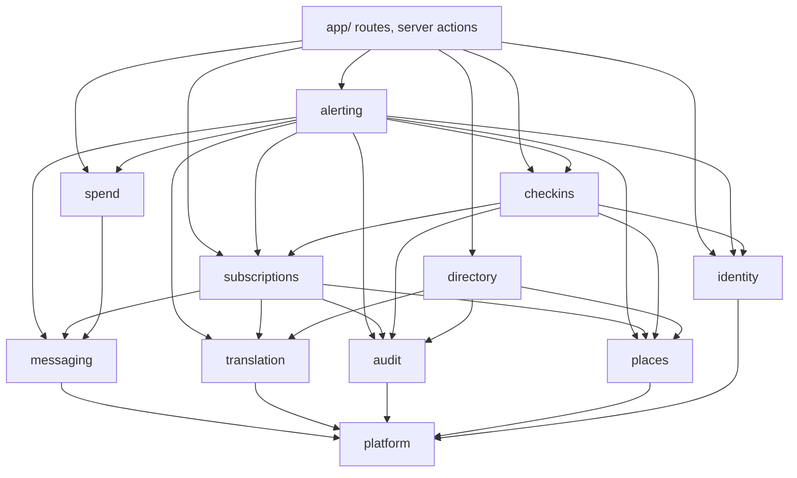
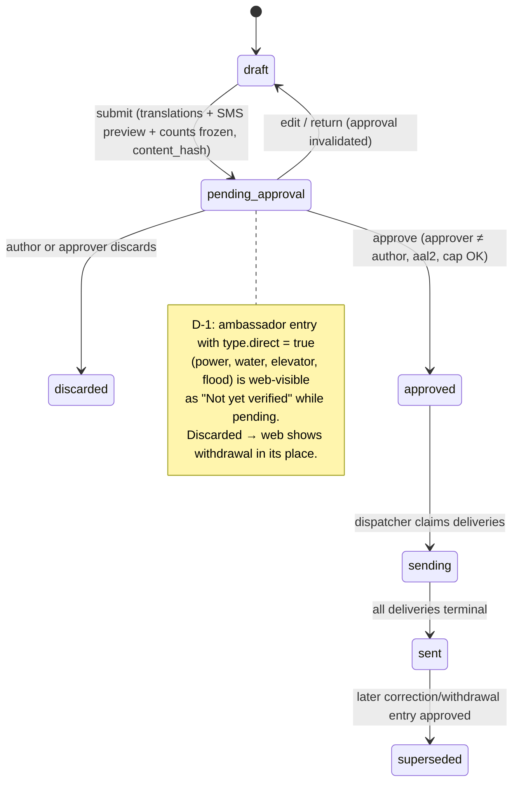
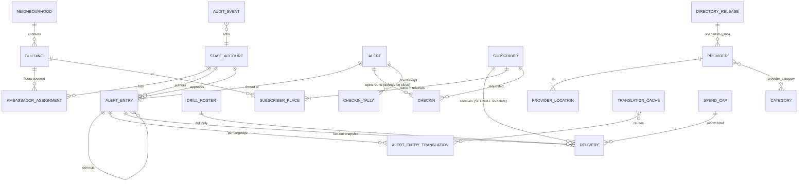

# CVH Pilot — Architect's Recommendation

## 0. Verdict in one paragraph

Build **one Next.js App Router application on Vercel**, organised as a **modular monolith with ports-and-adapters inside each module**. Use **Supabase as Postgres + Auth + Storage + pg_cron**, not as a browser-facing data API. No browser talks to Supabase. **Postgres is the work queue** (an outbox table), drained by Vercel functions. Safety-critical rules (two people, drill isolation, idempotency, append-only audit) are enforced **twice: in the TypeScript domain and as database constraints and triggers**. Resident personalisation happens **only on the device**: the server sends the whole neighbourhood and the device filters it. Deploy everything in **Canada (Vercel `yul1` + Supabase `ca-central-1`)**. It costs nothing extra and removes most of P9/R-10. Estimated 2-month spend is **about CAD 550**, and most of it is SMS.

## 1. Design paradigm

**Modular monolith, hexagonal per module, single deployable.**

- **Why monolith:** 1–2 developers (possibly agents), 8 weeks, one product. Microservices, or separate resident and staff apps, double the deploys, auth plumbing and env drift for no gain at 43 buildings.
- **Why hexagonal:** three vendors (Twilio, Cohere, Supabase) sit on life-safety paths, and each must be replaceable in tests and in preview. A `LogOnlySmsAdapter` in preview is what keeps a preview deploy from texting residents. MVP will re-evaluate Twilio and possibly open-EWS, so the ports pay for themselves.
- **Why single package, no Turborepo:** a single `package.json` with enforced import boundaries (dependency-cruiser in CI) gives monorepo discipline without workspace tooling. Shared design tokens and strings live in `src/ui` and `src/i18n`.

**Rejected:** separate resident and staff apps (two auth stories, two SW scopes, duplicate tokens); a Turborepo/pnpm workspace (ceremony for one app); Supabase Edge Functions as the backend (a second runtime, Deno, and split logs); RLS-as-the-authorization-model (see AD-3).

```text
src/
  app/
    [lang]/(resident)/...        # R-01..R-35 pilot screens; server-rendered per language
    staff/(hub)/... staff/(amb)/... # O-xx, A-xx; one layout, role-gated
    a/[id]/                      # share landing + OG metadata (A11)
    api/  feed/ search/ twilio/{inbound,status}/ jobs/{dispatch,publish,expire}/
  modules/
    identity/ places/ alerting/ subscriptions/ messaging/ checkins/
    translation/ directory/ audit/ spend/
      domain/       # pure TS: types, rules, state machines. Imports nothing outside domain/
      application/  # use cases (commands/queries) + port interfaces
      adapters/     # drizzle repos, twilio, cohere, storage
      index.ts      # the ONLY import surface for other modules and app/
  platform/  config/ db/ logger/ clock/ ids/ http/
  ui/        tokens (from ds/cvrh/tokens.json), components
  i18n/      catalogs generated from design/prototype/cvh/strings.*.js
db/migrations/   # Supabase CLI SQL migrations, incl. constraints/triggers
scripts/         # seed loaders (geojson, CSV), test-set runner
```

## 2. Modules and dependency direction

| Module | Owns (tables) | Responsibility |
|---|---|---|
| `identity` | staff_account, ambassador_assignment | Staff/ambassador accounts, roles, MFA level, suspension (G1, G2) |
| `places` | neighbourhood, building | 43 buildings, floors, building facts (G3, D4-P). **Shared kernel:** the pure A1 audience matcher |
| `alerting` | alert, alert_entry, alert_entry_translation | Alert threads, entries, lifecycle, approval, drills, corrections, expiry, building status (A1–A17, D6) |
| `subscriptions` | subscriber, subscriber_place, pending_signup, drill_roster | SMS sign-up, double opt-in, keywords, numbered replies, deletion (A2, A9, C1, C4, C6, D-6, D-7) |
| `messaging` | delivery | Outbox, Twilio adapter, status callbacks, retries, segment maths (A2, A16) |
| `checkins` | checkin, checkin_tally | Round creation, ambassador view, escalation, purge on close (C3, C7, E1, E3) |
| `translation` | translation_cache | Cohere routing, language check, fallback, labelling (A3, D-4, D-5) |
| `directory` | provider, provider_location, category, provider_category, guide, essential_number, directory_release | Editing store, publish pipeline, search (D2, D2-Q, D3, D7, G4) |
| `audit` | audit_event | Append-only trail (G5); source for the Section 9 timing measures |
| `spend` | spend_cap, (reads delivery, translation_cache) | Spend to date and caps (G6) |



**Rules.** (1) Edges only point down the graph above, and cycles fail CI. (2) A module's tables are written only by that module; others go through its `index.ts`. (3) `domain/` is pure: no I/O, no `Date.now()` (inject `clock`). (4) `alerting` is the orchestrator. Downstream modules never call back into it; they emit return values, not events. That keeps the pilot free of an event bus.

## 3. Architecture decisions (candidate ADs)

### AD-1 — One app, two surfaces, one origin
- **Decision:** a single Next.js app. Resident surface at `/[lang]/…` (public, PWA, cacheable). Staff surface at `/staff/…` (authenticated, `Cache-Control: no-store`, excluded from the service worker). Ambassador screens are a role-gated area of `/staff`.
- **Binds:** all screens; N3; R-3.
- **Prevents:** check-in phone numbers persisting in a service-worker cache on an ambassador's unmanaged phone. Also prevents two codebases drifting on tokens and strings.
- **Rule:** the SW caches only `/[lang]/**`, `/api/feed/**`, `/directory/**` and static assets. Any `/staff` or `/api/staff` response is NetworkOnly + `no-store`. The ambassador round needs a connection in the pilot.
- **Rejected:** a separate staff app (Vite SPA). It has a lower JS cost for residents, but doubles auth and deploys. A shared SW with "careful" caching rules is how PII leaks.

### AD-2 — Residents have no identity; personalisation is device-only
- **Decision:** resident choices (language, buildings, floor, groups, topics, basic mode) live in `localStorage` (wrapped in try/catch). The server only ever serves **whole-neighbourhood** data: the active alert feed for TP+FP, all 43 building statuses, and the per-language directory. Ordering and highlighting (A1 web, A13) run on the device using the **same pure matcher** as SMS targeting (`places/domain/audience.ts`).
- **Binds:** P3, P10, A1, A12, A13, N3.
- **Prevents:** the server learning a non-subscriber's building through a per-building fetch, cookie or analytics call.
- **Rule:** no cookies on resident routes. Language goes in the URL path (needed for SSR, `dir`, and caching). No request ever carries building, floor or group, except the sign-up POST. Analytics are aggregate, server-side counts per route and language only.
- **Rejected:** cookie-based personalisation (leaks choices to every request); Supabase anonymous auth (creates a resident identity the PRD forbids).

### AD-3 — Staff auth: Supabase Auth, invite-only, TOTP required for Admin/Coordinator; authorization in the app, RLS as lockdown
- **Decision:** Supabase Auth with email + password, self sign-up disabled, and accounts created by an Admin via the admin API (G2). TOTP MFA is mandatory (`aal2`) for Admin and Coordinator, and optional for Ambassador and Director. Each server request verifies claims (`@supabase/ssr` `getClaims`), loads `staff_account`, and rejects if `status <> 'active'`. Authorization checks are explicit functions in `identity/domain/policy.ts`. **Every table has RLS enabled with no anon/authenticated policies**, so PostgREST exposes nothing. The app reaches Postgres through Drizzle over the Supavisor pooler, server-side only.
- **Binds:** G1, G2, N5, C3, D-2.
- **Prevents:** (a) a leaked anon key exposing data; (b) authorization logic split between SQL policies and TS; (c) "removed" staff keeping access for the JWT lifetime. The status check runs on every request, not only at token expiry.
- **Rule:** approve/send/correct/withdraw/drill/account actions require `aal2`. Suspension sets status and calls `auth.admin.signOut(user, 'global')`. supabase-js is used for Auth and Storage only, never for table access.
- **Rejected:** RLS as the main authorization model. supabase-js/PostgREST has no multi-statement transactions, and approval must atomically transition state, snapshot the audience, enqueue deliveries and write audit. Policy-per-table is also hard for agents to test. Also rejected: phone/SMS MFA (costs SMS and is weaker), and magic links only (shared-device risk for ambassadors).

### AD-4 — Alert lifecycle is an explicit state machine on *entries*, mirrored in the database
- **Decision:** an **alert** is a thread (one disruption). An **entry** is anything sent: `ack | update | correction | withdrawal | final`. Each entry has its own approval lifecycle:



  The thread is `open → closed{resolved | expired | withdrawn}`. Closing requires an approved `final` or `withdrawal` entry, or the `expire` cron for `valid_until`. Expiry posts a system `final` entry to the web only and sends no SMS.
- **Binds:** A4, A7, A15, A16, A17, D-1, E2, O-02..O-16, A-02/A-03.
- **Prevents:** sending an unapproved edit (approval binds to `content_hash`); self-approval; drills mutating into real alerts.
- **Rule:** transitions live only in `alerting/domain/lifecycle.ts` (a table-driven transition function). A Postgres trigger rejects any other transition. `CHECK (approver_id IS DISTINCT FROM author_id)`. `alert.is_drill` is immutable (trigger). The D-1 web-visibility rule reads the prototype's `disruptionTypes[].direct` flag, which becomes the `disruption_type` seed table. Heat/smoke/winter entries require role ≥ Coordinator. Ambassadors may author only for buildings and floors in `ambassador_assignment`.
- **Rejected:** a single mutable `alert` row edited in place (contradicts P6/A16: "never a quiet replacement"); workflow engines (XState runtime, Temporal), which are overkill for 9 states.

### AD-5 — Drills are isolated by data, not by flags in queries
- **Decision:** drill entries can only create `delivery` rows whose recipient is a `drill_roster` row (staff-owned numbers). They can never reference `subscriber`. A DB trigger rejects violations; that is the A17 acceptance test. Every drill SMS and screen carries the localised exercise marker (X-10). The resident feed query excludes drills, and they appear only on `/staff`. All metric views are partitioned by `is_drill`.
- **Prevents:** R-2.
- **Rejected:** "drill mode" as an env or tenant (too easy to send real alerts from it).

### AD-6 — Audience targeting: one pure matcher, one SQL query, proven equal
- **Decision:** `matches(audience, place, groups, topics)` implements A1 exactly:
  - neighbourhood alert → any subscriber in that neighbourhood;
  - building alert → subscriber_place.building ∈ buildings AND (floors = all OR place.floor IS NULL OR floor ∈ floors);
  - no building → neighbourhood alerts only;
  - groups non-empty → intersection required (`checkin` group = has check-in request).
  - A subscriber can hold several places (A9, a relative's building) but is matched once.
  - **Topic opt-outs never suppress fire/evacuation** (my recommendation; confirm with the PO).

  The SQL audience query in `subscriptions` is property-tested against the pure function on generated data.
- **Rule:** at approval the matched recipient set is **snapshotted into `delivery` rows** in the same transaction. Recipient counts per language (A3) and the segment/cost estimate (G6) are computed from the same query at `submit`, and recomputed at `approve`.
- **Corrections (A16):** recipients = (all non-deleted subscribers with a `delivery` for the corrected entry, on every channel it used) ∪ (current matches for the correction's own audience). So a "floors 1–6 → 1–8" correction reaches both groups.

### AD-7 — Outbound pipeline: Postgres outbox + Vercel dispatcher + Twilio Messaging Service
- **Decision:**
  1. Approval inserts `delivery(idempotency_key = entry_id:recipient_id:channel UNIQUE, status=queued)`.
  2. The server action then calls `after(() => dispatch())`. **pg_cron + pg_net hits `/api/jobs/dispatch` every minute** as the safety net, authenticated with a shared secret.
  3. The dispatcher claims batches with `FOR UPDATE SKIP LOCKED`, sends via a **Twilio Messaging Service** (Smart Encoding on, Advanced Opt-Out on, `statusCallback` set), and stores `MessageSid`. Retries use exponential backoff on 429/5xx, at most 3. Twilio error 21610 (opted out) marks the recipient suppressed and triggers subscriber deletion.
  4. `/api/twilio/status` validates `X-Twilio-Signature` and updates status and price idempotently.
- **Sender:** **one verified toll-free number**, not a Canadian long code. Canadian carriers forbid A2P on long codes and filter it heavily. Toll-free verification needs the Hub's business number, address and website, and takes days to weeks. **Submit it in week 1.**
- **Cost cap (G6):** `approve` refuses when `estimate + spent_this_month > cap` and shows the shortfall. Only an Admin can raise the cap (audited). The estimate uses `segments(text, encoding)`: GSM-7 160/153, UCS-2 70/67.
- **Approver notification:** a pending approval sends an SMS to on-duty approvers' staff numbers through the same outbox (recipient_type `staff`). The staff home also polls every 15 s.
- **Rejected:** pgmq (a second queue abstraction when the outbox table already gives idempotency, reporting and correction reach in one place); Vercel Queues (more vendor surface, and the outbox is needed anyway for A16); Supabase Realtime for staff (needs RLS policies and browser DB access, contradicting AD-3); Edge Functions workers (second runtime).

### AD-8 — Inbound SMS, double opt-in, keywords
- **Decision:** `/api/twilio/inbound` validates the signature and routes by subscriber state:
  - `pending` (sign-up started on the web, possibly by a helper): only YES/Y or the localised "yes" list confirms, which sets `confirmed_at`. Pending rows expire after 48 h and are purged. CASL express consent is recorded as the confirmation time and sign-up text version.
  - `active`: Twilio Advanced Opt-Out owns STOP/START/HELP (English, all languages, D-6) and sends replies localised by the Messaging Service where possible. The app receives the `OptOutType` parameter and **deletes the subscription** on STOP. Numbered replies `1/2/3/0` are app-handled: 1 and 2 reply with a magic link to edit choices (token valid 30 min, single use), 3 withdraws the check-in, and 0 behaves like STOP (delete). The app doesn't send further SMS after a 0, and Twilio's own block is untouched.
  - Unknown text gets one help reply, rate-limited to 1 per number per day.
- **Rule:** inbound bodies are not stored. Only counts by keyword are kept.
- **Note:** after STOP plus deletion, START unblocks at Twilio but there is no subscription to restore. The reply points to the sign-up link.

### AD-9 — Translation pipeline (Cohere only, routed, checked, cached, labelled)
- **Decision:** a `Translator` port with a **routing table in config**, not code. Verified 2026-10-01: the production model ID is **`north-small-translate-1-0`**, not "-09-2026". Its official list includes Urdu, Filipino, Bengali, Tamil, Punjabi, Slovak, Hindi, Greek, Persian, Chinese (Simplified and Traditional), Spanish and French. **It excludes Gujarati and Pashto.** Recommended routing:

| Language(s) | 1st | 2nd |
|---|---|---|
| fr, es, zh, el, hi, ur, tl, sk, bn, ta, pa | north-small-translate-1-0 | command-a-translate-08-2025 (fr, es, zh, el, hi) / tiny-aya-fire or -water (others) |
| prs (Dari) | north-small-translate-1-0 (as Persian, Dari-glossary prompt) | command-a-translate-08-2025 |
| ps (Pashto) | north-small-translate-1-0 (unlisted; PO test passed) | none → labelled English |
| gu (Gujarati) | tiny-aya-fire | north-small-translate-1-0 (unlisted) |

- **Language check (guardrail):** a deterministic **script and distinguishing-letter check** runs first. Arabic-script outputs must contain language-marker letters: Pashto ټ ډ ړ ږ ښ ګ ڼ ې ۍ; Urdu ٹ ڈ ڑ ں ے; Dari has none of these. A statistical identifier (`eld`) runs second. It is local code, not a translation service, so it is outside the Cohere-only rule. If the check fails, the next model in the route is tried. If all fail, the output is the **English original labelled "Translation not available"**, which also goes into the SMS.
- **When:** alert entries are translated at `submit`, so the approver sees per-language status and segment counts. The translations are part of `content_hash`. Directory and guides are translated at publish (superseded: the spine's AD-10 and AD-11 have them translated offline by `scripts/`, reviewed and committed in `data/catalogue/`; the app never translates them). Search questions are translated only for ps/prs/romanized input (research R3).
- **Cache:** `translation_cache(source_hash, target_lang, model_id, prompt_version)`. Results are re-used and never re-billed.
- **Labelling:** every translated payload carries `{lang, machine:true, model, status: ok|fallback_en}`. The UI renders X-04 with the English original one tap away.
- **Rejected:** translating at read time (cost and latency, and unapproved text would reach residents); a single model everywhere (fails Gujarati and Pashto on paper).

### AD-10 — Directory publish: Supabase → versioned JSON in Storage; search in memory
- **Decision:**
  1. Admin presses **Publish**. A `directory_release` row is created, `/api/jobs/publish` runs, it translates changed fields (cache), and it embeds each provider's English text once.
  2. It writes **two kinds of artifact to Supabase Storage (public bucket, immutable, versioned names)**: `directory.{lang}.v{n}.json`, the client slice (~40–60 KB gz, no vectors), and `vectors.v{n}.json`, server only (~100 × 1,024 floats, float32 base64).
  3. It flips `directory_release.current` and calls `revalidateTag('directory')`.
  4. `/api/search` caches the vectors at module scope keyed by version (checked at most every 60 s), embeds the query, runs a dot product and RRF, and returns IDs and scores only. **The client renders listings from its language slice**, so browse, filter, map and offline need no server call.
- **Rule:** the embedding model ID is stored in the release. The search route **must** embed queries with the same model, and refuses with "no clear match" plus categories if they differ. Below the threshold the result is "no clear match", and emergency categories show 911 first.
- **Model choice:** keep the addendum's `embed-multilingual-v3.0` as the documented baseline. **Run the 150-question test set on v3, `embed-v4.0` and `embed-v5.0-fast` before launch** and pick by top-3 hit rate per language. It is a config change.
- **Rejected:** committing the JSON to git plus a deploy hook (couples content edits to deploys and breaks previews); pgvector (adds a DB round trip per question for 100 vectors); shipping vectors to the client (needs a client embedder, which isn't possible with Cohere-only).

### AD-11 — Check-in data lifecycle
- **Decision:** the check-in **request** is part of the subscription (C1). When an approved heat or outage entry targets building B, `checkins.openRound` creates a `checkin` row per subscriber whose home place is in B and who has a request. Each row holds only subscriber_id, floor, method and status. An ambassador sees rows **only for floors in their assignment while the alert is open**; the query enforces this and tests prove it. "Not reached" or "needs help" puts the row on the Hub's O-17 list immediately.
- **Purge:** in the **same transaction** that closes the alert, counts are upserted into `checkin_tally(alert, building, floor, done, not_reached, needs_help, untouched)` and the `checkin` rows are hard-deleted. A nightly pg_cron sweeper deletes any `checkin` row whose alert is closed (belt and braces). When no ambassador covers the floor, C6 says so at request time, using `ambassador_assignment` coverage.

### AD-12 — Audit trail
- `audit_event(id, at, actor_staff_id, action, subject_type, subject_id, is_drill, meta jsonb)`. It is written **inside the same transaction** as the change. UPDATE/DELETE are revoked and blocked by trigger. It **never contains phone numbers, message bodies to residents or subscriber IDs**. Section 9 timing measures (report → ack → approval → first delivery) are views over `audit_event` + `delivery`. Kept past the pilot (D-7).

### AD-13 — Data ownership and personal data
- Personal data lives only in `subscriber`, `subscriber_place`, `pending_signup`, `checkin`, `staff_account`, and `drill_roster`. `delivery` references `subscriber_id` with `ON DELETE SET NULL` and stores language and segments, never the phone. Unsubscribe is a hard delete. D-7 end-of-pilot: a scripted SMS asks subscribers to stay, and pg_cron deletes non-YES rows at day 30. Search questions are logged as `{text, detected_lang, latency_ms, top_ids}`, with no IP or user agent, to measure D2-Q. This must be stated in the terms.

### AD-14 — Conventions (errors, logging, config, IDs, time)
- **IDs:** UUIDv7 for rows. Buildings are keyed by `rsn` (unique), and alerts use a short public slug for share URLs.
- **Time:** `timestamptz` UTC in the DB, rendered in `America/Toronto`. Durations use the prototype's whole-unit rules (`lib.js duration/ago`).
- **Phones:** stored as E.164. Formatting is ported from `lib.js phone()`.
- **Errors:** the domain returns `Result<T, DomainError{code}>`. Route handlers and actions map to `{error:{code,message_key}}`, and message keys are i18n keys. Exceptions mean bugs.
- **Logging:** structured JSON to stdout (Vercel logs) with `{evt, module, alert_id?, entry_id?, ms}`. **PII scrubber:** phones are masked to the last 2 digits and resident SMS bodies are never logged. N4 learnings come from a weekly query over `delivery` and `audit_event`, not from logs.
- **Config:** `platform/config/env.ts` validates with zod at boot and fails fast. Secrets live only in Vercel env (Production and Preview scoped separately). The Twilio auth token is used for signature validation too.

### AD-15 — Environments
- **Production:** Vercel Pro project with region `yul1`; Supabase Pro project in `ca-central-1`.
- **Preview** (every PR): Vercel preview against a **separate free-tier Supabase project** (staging), seeded by script. `SMS_MODE=log` is forced by env schema, so a preview cannot construct the Twilio adapter. `SMS_MODE=roster` is allowed only on staging for drill-roster tests. Cohere uses a production key with a low spend budget, because trial keys are banned from production and limited to 1,000 calls.
- **Migrations:** Supabase CLI SQL in git, applied by CI on merge to `main`.

### AD-16 — i18n, RTL, tokens: port the prototype, don't re-author
- **Strings:** a build script converts `design/prototype/cvh/strings.{lang}.js` and `strings.en.screens.js` into JSON catalogs for `next-intl`. The prototype's **visible "[EN]" fallback** behaviour (`lib.js mergeMarked`) is kept for missing keys, and CI reports `missingCount` per language.
- **Languages:** codes and `dir` come from `data.js languages` (ur, ps, prs are RTL; `prs` is the Dari code). `<html lang dir>` is set per `[lang]` segment. CSS uses logical properties only (lint rule).
- **Fonts:** self-hosted Noto subsets (Naskh Arabic, Gujarati, Tamil, Bengali, Devanagari, Gurmukhi, SC), loaded only for the active language. D-5: Traditional Chinese comes from a labelled OpenCC conversion.
- **Tokens:** `ds/cvrh/tokens.json` generates CSS custom properties (light and navy themes) and a Tailwind v4 `@theme`. Component CSS is ported from `ds/cvrh/components/bundle.css` and `cvh/cvh.css` selectively.
- **Pure helpers:** functions in `cvh/lib.js` (`duration`, `ago`, `phone`, `fill`, `affectsBuilding`, `checkinCovered`) are ported to typed TS with the prototype's behaviour as test fixtures.

### AD-17 — Resident delivery of alerts: cached public feed + polling; push is opt-in stretch
- `/api/feed` returns open, non-drill entries for both neighbourhoods in one language, plus the 43 building statuses (D6, derived from open alerts). It is cached with `s-maxage=15, stale-while-revalidate=60` and `revalidateTag('feed')` on every approval or D-1 publish. The client polls every 60 s while visible. The SW keeps the last feed, building statuses, essential numbers and the opened guides per language (N3).
- **Web push is deferred** unless the PO accepts that a push subscription stores endpoint + chosen buildings centrally (see §8).
- **Share:** `/a/{slug}` server-renders OG title and description with origin, verification and time (A11), so a WhatsApp preview is readable without opening the link.

## 4. Stack (verified 2026-10-01)

| Concern | Choice | Version (date) | Source |
|---|---|---|---|
| Framework | Next.js App Router | 16.3.8 (2026-09-30) | npm registry |
| UI runtime | React | 19.3.0 | npm |
| PWA / SW | Serwist (`@serwist/turbopack`, Next ≥15) | 9.5.12 (2026-07-22) | npm, serwist docs |
| DB client | Drizzle ORM + postgres.js via Supavisor | drizzle-orm 0.45.3 | npm |
| Supabase | supabase-js / @supabase/ssr / CLI | 2.117.2 (2026-09-25) / 0.12.7 / 2.119.0 | npm |
| Auth MFA | Supabase Auth TOTP, `aal2` | current docs | supabase.com/docs/guides/auth/auth-mfa |
| Jobs | pg_cron + pg_net (on by default on all plans) | platform | supabase docs / crontap guide |
| SMS | Twilio Node SDK, Messaging Service, verified toll-free | twilio 6.1.2 (2026-09-28) | npm, twilio.com |
| AI | cohere-ai TS SDK | 8.1.0 (2026-08-26) | npm |
| Models | north-small-translate-1-0, command-a-translate-08-2025, tiny-aya-fire/-water, embed-multilingual-v3.0 / embed-v4.0 / embed-v5.0-fast | docs.cohere.com/docs/models (2026-10-01) | Cohere |
| Validation | zod | 4.6.5 | npm |
| i18n | next-intl | 4.14.8 | npm |
| Styling | Tailwind CSS (tokens via @theme) | 4.3.3 | npm |
| Map | Leaflet + markercluster, OSM tiles | leaflet 1.9.4 (markercluster: pin at install, unverified) | npm |
| Lang-ID guardrail | eld | 2.1.0 | npm |
| Web push (stretch) | web-push (VAPID) | 3.6.7 (2024-01, stable but unmaintained) | npm |
| Tests | Vitest / Playwright | 5.0.3 / 1.63.0 | npm |
| TypeScript | pin to what `create-next-app@16.3` installs; TS 7.0.2 (Go port) exists, but check Next compat first | 7.0.2 (2026-07-08) | npm |
| Hosting | Vercel Pro, region yul1 (Montréal); Supabase Pro, ca-central-1 | — | vercel.com/changelog, supabase regions |

**Framework alternatives rejected:**
- **SvelteKit** (2.70.3): the closest call, with smaller bundles for old phones, but agents and 1–2 devs are faster in React. Next also gives first-class `after()`, `revalidateTag`, OG metadata and Vercel cron.
- **Astro** (7.3.5): great for the static resident pages, but the staff workflow is an app.
- **Vite + React SPA:** no server-rendered OG cards for WhatsApp (A11), and no server actions.
- **Mitigation for Next's JS weight:** resident pages are Server Components with small client islands, and CI enforces a ≤150 KB gzipped JS budget on `/[lang]` home.

## 5. Diagrams

### Core entity ERD



### Containers and deployment

```mermaid
flowchart LR
  subgraph Devices
    R[Resident phone<br/>PWA + SW cache<br/>localStorage choices]
    S[Staff / ambassador browser<br/>no-store, TOTP]
    P[Basic phone<br/>SMS only]
  end
  subgraph Vercel["Vercel Pro — yul1 Montréal"]
    W[Next.js app<br/>/[lang] resident · /staff · /a share]
    API[Route handlers<br/>/api/feed · /api/search<br/>/api/twilio/inbound,status<br/>/api/jobs/dispatch,publish,expire]
  end
  subgraph Supabase["Supabase Pro — ca-central-1"]
    PG[(Postgres<br/>outbox · audit · RLS lockdown)]
    AU[Auth TOTP]
    ST[Storage<br/>directory.lang.vN.json<br/>vectors.vN.json]
    CR[pg_cron + pg_net<br/>dispatch 1/min · expire · purge]
  end
  TW[Twilio Messaging Service<br/>verified toll-free]
  CO[Cohere API<br/>translate · embed]
  R -->|HTTPS| W
  R -->|feed, search| API
  R -->|static JSON| ST
  S --> W
  W --> AU
  W & API -->|Drizzle via Supavisor| PG
  API --> CO
  API -->|send| TW
  TW -->|signed webhooks| API
  TW <-->|SMS| P
  TW -->|SMS| R
  CR -->|signed POST| API
  API --> ST
```

## 6. Cost estimate (2 months)

Assumptions: USD→CAD 1.38. **400 confirmed subscribers**, 60% in UCS-2 scripts. 25 SMS-sent entries (22 building-level at about 80 recipients each, 3 neighbourhood-level to all subscribers). Average 2 segments per message for GSM-7 and 4 for UCS-2. Twilio Canada (verified 2026-10-01): USD 0.0083 per segment plus a carrier fee of about USD 0.0073–0.0087 outbound and USD 0.015–0.032 inbound. Cohere translate prices aren't published, so I assumed Command-class rates (USD 2.5 per M input tokens, 10 per M output tokens).

| Item | Basis | CAD |
|---|---|---|
| Alerts SMS | ~2,960 msgs × 3.2 seg ≈ 9,500 seg × USD 0.0168 | 220 |
| Onboarding (confirm + welcome with menu) + D-7 re-consent | 400 × ~9 seg ≈ 3,600 seg | 85 |
| Drills, approver notifications | ~800 seg | 20 |
| Inbound (YES, keywords) | ~700 × ~USD 0.03 | 30 |
| Toll-free number | USD 2.15 × 2 | 6 |
| Vercel Pro (1 seat) | USD 20 × 2 | 55 |
| Supabase Pro (prod; staging on free org) | USD 25 × 2 (Micro covered by credits) | 70 |
| Cohere (directory 15-lang publish × ~5 re-runs, alerts, ~4k questions, test-set runs) | generous | 55 |
| Domain | — | 20 |
| **Total** | | **≈ 560** |
| Headroom | | ≈ 440 |

**Sensitivity:** each extra 100 subscribers adds about CAD 75. A chatty heat wave (three neighbourhood updates per day for three days to 400 people) adds about CAD 150. Set the G6 monthly SMS cap at **CAD 250** and review weekly.

## 7. Risks and MVP deferrals

| Risk | Mitigation in this architecture |
|---|---|
| **Toll-free verification not approved before launch** (days–weeks; nonprofit BN needed) | Submit in week 1. Meanwhile, drill-roster testing on an unverified number is limited. A long code is **not** a safe fallback in Canada. |
| **Translation in unlisted languages (Pashto, Gujarati) regresses or swaps language silently** | AD-9 guardrail with letter-marker checks; fallback to labelled English; test set re-run when any model ID changes (model ID is stored per translation). |
| **Approval stalls** (two people not reachable; R-4) | Approver SMS ping; D-1 web-first; time-to-approval measured. No single-person override in the pilot (PRD forbids it). |
| SMS budget overrun | Cap enforced at approve; segment preview per language at submit. |
| Ambassador PII exposure (R-3) | no-store; floor and time scoped; purge on close; suspension is effective immediately. |
| Serverless dispatch dies mid-batch | Idempotent outbox + 1-minute cron re-drive; Twilio `MessageSid` stored before marking sent. |

**Defer to MVP:**
- web push, unless the PO accepts central storage (§8);
- offline ambassador rounds;
- Supabase Realtime;
- pgvector, rerank (`rerank-v4.0`) and generated answers;
- partner space P-01..P-16, moderation O-08..O-10 and resident submissions R-17..R-23;
- confirm-receipt;
- the official alert relay (A10 stays a manual "Official alert from [source]" field, already supported as an entry attribute);
- audio (X-08);
- Traditional Chinese beyond OpenCC conversion;
- multi-region, PITR and an SLO.

## 8. Where the product owner's constraints are risky (candid)

1. **"Cohere only" is the weakest constraint.** Officially, Gujarati and Pashto have *no* listed Cohere translation model: Pashto rests on one sentence and one reviewer, and Gujarati on a CC-BY-NC research model whose commercial and non-profit terms are unconfirmed. For life-safety SMS, the "labelled English" fallback will reach the most vulnerable language groups. I would keep the `Translator` port open to one vetted fallback (Azure Translator, Canada Central) **for Pashto and Gujarati only**. If the PO holds the line, the pilot must publish per-language quality honestly (D-4 allows this).
2. **Cohere pricing for the translate models is unpublished** and production keys are pay-as-you-go. Get a written quote or set a hard org spend limit before launch.
3. **Web push conflicts with P3.** A push subscription needs to be targeted server-side, so it stores an endpoint plus buildings. Either broadcast neighbourhood-wide push (noisy) or treat push as a second "sign-up" with its own consent. I recommend deferring it.
4. **Vercel Hobby isn't an option.** It bans commercial and organisational use and has daily-only cron. Pro (USD 20/mo) is in the estimate.
5. **"In-memory search from generated JSON" is right, but "deployed with the app" is not.** Tying the directory to deploys breaks preview isolation and Hub self-service. Storage + versioned release (AD-10) honours the intent.
6. **Embedding model choice should not be fixed in the addendum.** Cohere now lists `embed-v4.0` and `embed-v5.0-*`. Let the 150-question test set decide.
7. **STOP deletes data (A2) but carriers keep the block.** After START there is nothing to restore, so residents must re-sign-up. That's acceptable, but it belongs in the welcome text and the written procedures (N6).
8. **Budget is SMS-dominated and scales with success.** Above about 900 subscribers, the CAD 1,000 envelope is at risk. The G6 cap will then block alerts during a real event, so decide now who can raise it at 2 a.m.

### Sources (fetched 2026-10-01)
- npm registry (`registry.npmjs.org/<pkg>`) for all package versions and dates
- [Cohere models](https://docs.cohere.com/docs/models); [North Small Translate](https://docs.cohere.com/docs/north-small-translate-1.0); [Cohere pricing](https://cohere.com/pricing)
- [Twilio Canada SMS pricing](https://www.twilio.com/en-us/sms/pricing/ca); [Twilio Canada SMS guidelines](https://www.twilio.com/en-us/guidelines/ca/sms); [Toll-free verification](https://help.twilio.com/articles/5377174717595-Toll-Free-Message-Verification-for-US-Canada)
- [Supabase MFA](https://supabase.com/docs/guides/auth/auth-mfa); [Supabase pricing](https://supabase.com/pricing); [Supabase regions](https://supabase.com/docs/guides/platform/regions); [Supabase cron guide](https://crontap.com/guides/supabase-cron-jobs)
- [Vercel yul1 region](https://vercel.com/changelog/introducing-the-montreal-canada-vercel-region-yul1); [Vercel cron pricing](https://vercel.com/docs/cron-jobs/usage-and-pricing)
- [Serwist Turbopack](https://serwist.pages.dev/docs/next/turbo)
