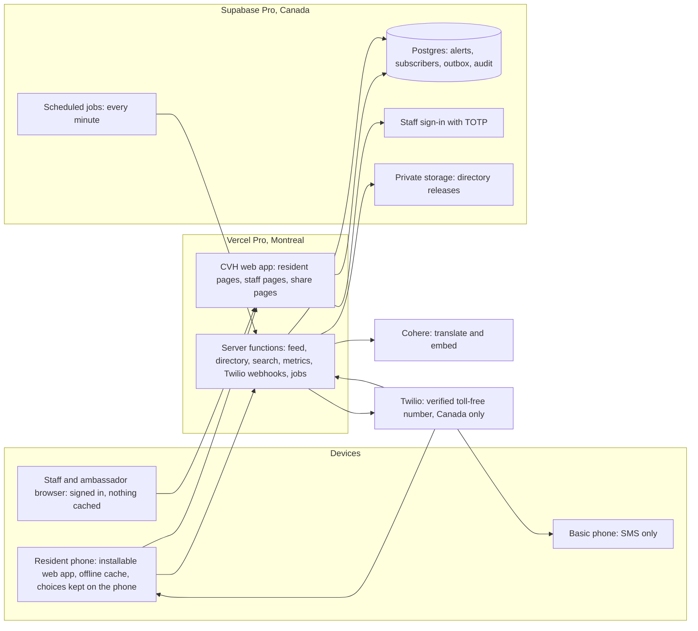

# Community Virtual Hub (CVH) Pilot — Solution Design

This document explains how the CVH pilot is built and run. The binding technical rules live in the architecture spine (`ARCHITECTURE-SPINE.md`). Where this document says "AD-8", it points to decision 8 in that spine. Requirement codes such as A15 or C7 come from the pilot PRD.

Figures marked "estimate" are estimates. Nothing here goes beyond the sources listed above.

## 1. Summary

**What is built.** One web application that residents open in any phone browser and can install to their home screen. It shows alerts, the status of each of the 43 pilot buildings, a directory and map of about 100 community providers, preparedness guides and essential numbers, in 15 languages. Residents who want text messages sign up with a phone number. Hub staff, coordinators, directors and ambassadors use a separate, signed-in area of the same application to write, approve and correct alerts, run check-in rounds and drills, and manage buildings, providers and accounts.

**For whom.** Residents of the 43 registered apartment buildings in Thorncliffe Park (32) and Flemingdon Park (11), with the design anchored on seniors living alone, newcomers, residents with disabilities and people with basic phones. Ambassadors are trusted residents assigned to buildings. Hub staff run the system.

**How it runs.** The application runs on Vercel (a hosting service) in its Montreal region. Data is kept in Supabase (a hosted Postgres database with sign-in and file storage) in its Canadian region. Text messages go through Twilio from one verified toll-free number. Translation and search matching use Cohere language models only. Residents who do not sign up have nothing stored about them: their choices stay on their own phone.

**Cost.** About CAD 560 for two months (estimate), against a budget of about CAD 1,000. Most of it is SMS. A monthly SMS cap of CAD 250 is suggested. The cap warns and records an overrun; it never stops an alert.

**Top risks.**
- Twilio's toll-free number verification takes days to weeks. It must be submitted in week 1.
- Pashto and Gujarati rely on Cohere models that do not officially list them. When a translation fails the language check, residents get the English original with a "translation not available" label.
- Cohere has not published prices for its translation models. A written quote or a spend limit is needed before launch.
- Two-person approval can slow urgent alerts when only one person is reachable.
- Ambassadors see phone numbers of residents who asked for a check-in, without formal vetting (safeguarding is MVP work).

## 2. What residents, ambassadors and Hub staff experience

### 2.1 Signing up for text alerts

1. A resident opens the web app, chooses her language and, if she wants, her building, floor and groups (senior, newcomer, family with young children). These choices stay on her phone (AD-3).
2. She taps "Get text alerts". The form is filled from her choices. She adds her phone number (Canadian numbers only, AD-22) and her neighbourhood. Building, floor, groups and a check-in request are optional. No name, unit number, email or password is asked.
3. If she asks for a check-in and no ambassador covers her floor, the form tells her at once and offers the Hub's number instead (C6, AD-12).
4. She receives a confirmation text. She must reply YES herself, even if a neighbour helped her fill the form. Until she does, she gets no alerts. An unconfirmed sign-up expires after 48 hours (AD-9).
5. After YES, a welcome text in her language explains the numbered replies: 1 change building or floor, 2 change language, 3 withdraw check-in, 0 stop. Every text ends with "Reply STOP".
6. Replying 1 or 2 starts a short text dialogue: she picks her building by street number, her floor by number and her language from a numbered list. A single-use web link valid for 30 minutes is offered as an alternative. This means a basic-phone user can change everything by text.
7. Replying 0 or STOP deletes her subscription. If she later sends START, she gets the sign-up link, because nothing is kept to restore.

### 2.2 Receiving an alert on the web and by SMS

- **Web.** The app checks for new alerts every 60 seconds while open (AD-17). Everyone gets the same neighbourhood-wide list; the phone puts first the alerts that match her building, floor and groups, using the same matching rule the server uses for SMS (AD-7). Each alert shows who sent it ("Building ambassador, Building X" or the Hub, never a person's name), whether it is verified, the machine-translation label and a one-tap link to the English original. Without a connection, she still sees the last alerts loaded, her building's status and essential numbers, with the time they were last updated.
- **SMS.** At approval, the system writes one delivery record per matching subscriber, in that subscriber's language, with the exact text the approver saw (AD-7, AD-21). A sending job sends them through Twilio within about a minute and records the result from Twilio's delivery reports (AD-8).
- **Sharing.** Any alert can be shared to WhatsApp. The preview shows origin, verification and time without opening the link. The link opens the live alert, with any correction, in the opener's language (AD-17).

### 2.3 An ambassador posts and a second person approves

1. An ambassador signs in and writes a post for any floor of an assigned building: floors (a range, a list or the whole building), one or more disruption types, whether it is a problem or work in progress, and the text. The attribution "Building ambassador, Building X" is shown before submitting (E2).
2. On submit, the system freezes everything: it builds the SMS text for each language, translates it, counts recipients and message segments per language, estimates the cost and computes a fingerprint (a "content hash") of the whole package (AD-21).
3. **Lower-risk posts** (power, water or plumbing, elevator, flood or leak) appear on the web app at once, marked "Not yet verified". **Fire, evacuation and "Other"** posts appear nowhere until approved (decision D-1, AD-5).
4. Approvers receive a text saying something is waiting.
5. A Coordinator or Admin, signed in with a second factor (a code from an authenticator app, called TOTP), sees the exact text per language, the audience, the channels, recipients per language and the cost. If the cost would take spending past the monthly cap, the screen shows the shortfall and Admins are notified, but approval still goes ahead (AD-8).
6. The approver must not be the author or anyone who edited the post. Approval applies only to the fingerprinted package; any edit means a new approval (AD-5).
7. After approval, the web post shows "Verified by the Hub" and the SMS goes out.

### 2.4 A correction

A correction never quietly replaces what residents saw (P6, A16). The author writes a correction that points to the earlier entry. It needs its own second-person approval. On approval:

- the earlier entry is marked as superseded, and any of its texts not yet sent are cancelled;
- the correction goes to everyone who received the original, on every channel used, plus anyone in the correction's own audience (for example floors 1 to 6 corrected to 1 to 8 reaches both groups). Topic opt-outs never remove someone who got the original;
- the web app shows the original with the correction above it (AD-5, AD-7).

A withdrawal works the same way. If a web-published post is discarded, the system posts a withdrawal in its place.

### 2.5 A check-in round during a heat wave

1. A Coordinator or Admin writes a neighbourhood heat alert (ambassadors cannot write heat, smoke or winter alerts, AD-4). It is approved by a second person.
2. Approval opens one check-in round for the alert. Every subscriber in the neighbourhood who asked for a check-in gets one row on the round, in every building (AD-12). Later updates in the same alert do not create duplicates. Web-only "Not yet verified" posts never open a round.
3. Each ambassador sees only the floors assigned to them: phone number, floor and preferred contact method (call or text). No name, no reason. The screen is never stored on the phone (AD-1).
4. The ambassador marks each person done, not reached or needs help in one tap. "Not reached" and "needs help" go to the Hub's list at once, and the on-duty Hub number gets a text with a link, never the resident's number.
5. When the alert closes, the system keeps only counts by building and floor. It deletes rows marked done or still pending. Rows marked needs help or not reached stay until an Admin marks them handled, or 24 hours after closing, whichever comes first. (pending the product owner's confirmation; see Open questions)

### 2.6 Asking a question in your own language

A resident types "mujhe bachon ke liye khana chahiye" (romanized Urdu for "I need food for my children"). The system finds the meaning of the question and returns the three to five best-matching directory listings, in her language, exactly as published, with their "Last confirmed by the Hub" date. It never writes an answer of its own. If nothing matches clearly, she sees "We couldn't find a clear match", the category list and the Hub's number. Results in emergency categories show 911 first (AD-11). Her question is not stored (AD-13).

### 2.7 A drill

An Admin creates an alert marked as a drill. The drill mark cannot be removed later (AD-6).

- Drill texts go only to numbers on the drill roster (staff-owned numbers). The database refuses any other recipient.
- Every drill text and screen carries the exercise marker.
- A drill never opens a check-in round, never appears on a resident page, and its share link shows "not found".
- Staff screens list drills in a separate, labelled section. Every count and report separates drills from real alerts.

## 3. System overview

The CVH is one application with one code base, split into modules (alerting, subscriptions, messaging, check-ins, translation, directory, places, identity, audit, spend, operations). Each module owns its own tables (AD-2).

**Providers.**

| Provider | Used for | Region |
|---|---|---|
| Vercel Pro | Runs the web app and its server functions | Montreal (`yul1`); may fail over to the US during a regional outage |
| Supabase Pro | Postgres database, staff sign-in with TOTP, private file storage, scheduled jobs (pg_cron) | Canada (`ca-central-1`) |
| Twilio | SMS out and in, one verified toll-free number, Canada only, STOP/START/HELP handling | Non-Canadian processor, disclosed in the terms (P9) |
| Cohere | Translation and search matching (embeddings) | Non-Canadian processing not excluded; disclosed |
| Map tiles | Neutral base map | Free-tier provider to be chosen at build |

**Key design choices, briefly.**
- **One app, two areas** (AD-1). Residents use `/[language]/…`; staff use `/staff/…`, which is never cached on a device.
- **Residents have no account** (AD-3). Resident pages set no cookies; the phone does the tailoring.
- **One outbox** (AD-8). Every outgoing text is first a row in a database table (the "outbox"), then a job sends it. This prevents double sends and unapproved sends.
- **Rules are enforced twice**: in the application code and again by the database (triggers, which are rules the database runs on every change). Tests cover both (AD-24).

## 4. How the main safety rules are guaranteed

**911 on every screen that matters** (AD-16, AD-21). Every alert text carries a 911 line, placed first for fire, evacuation and "Other"; every guide, the essential-numbers page and the check-in screen show the same 911 block.

**Two-person approval** (A15). No text goes to residents without a second person's approval. Approval is tied to the fingerprint of the exact package: text in every language, audience, channels, drill flag and expiry. The system records everyone who edited an entry, and the database refuses an approval from any of them. Approvers must sign in with a second factor. The sending job only sends texts whose entry is approved (AD-4, AD-5, AD-8, AD-21).

**Corrections** (A16). Entries are never edited after residents saw them. A change is a new correction entry. It goes to everyone who received the original plus the new audience, and opt-outs cannot remove them (AD-5, AD-7). Every change to an alert runs one step at a time per alert, so approval, sending, correction and closing cannot overlap (AD-18).

**Drills** (A17). Drill status is set once and cannot change. The database refuses a drill text to anyone not on the drill roster and refuses check-in rows for a drill. Resident pages read only from a view that excludes drills, and a code check blocks resident pages from reading anything else (AD-6). In addition, the staging environment can only text the drill roster, and preview builds cannot send texts at all (AD-15).

**No names** (P4). Resident names are never asked for and have nowhere to be stored. Posts carry only the role and building. Check-in rows hold a subscriber reference, building, floor and status, never a phone number; the ambassador's screen looks up the number at the moment it is shown (AD-12, AD-13).

**Check-in data deletion** (C7). Rows exist only while the alert is open, with the 24-hour hold for unresolved cases. Deleting a subscriber deletes her check-in rows automatically. Withdrawing a check-in by replying 3 deletes her open rows (AD-9, AD-12).

**Wrong-language protection** (D-4). Every translation is checked for the expected language and script before anyone sees it. If the check fails, the next model is tried. If all fail, residents get the English original with a "translation not available" line in their language. Text in the wrong language is never sent (AD-10). Translations are made once at submit and frozen, so the approver sees exactly what goes out.

## 5. Languages, translation and directory search

### 5.1 Translation routing

All translation uses Cohere models only (product-owner decision; a suggestion to keep a non-Cohere fallback for Pashto and Gujarati was rejected). The route for each language is configuration, not code, so it can change without a new release (AD-10). The table below is the starting route proposed by the architect. The addendum put Command A Translate first for French, Spanish, Mandarin, Greek and Hindi; the final order should follow the native-speaker translation review.

| Language | First model | Second model | Language check |
|---|---|---|---|
| English | Source text, not translated | — | — |
| French, Spanish, Mandarin (Simplified), Greek, Hindi | Command A Translate (officially supported) | North Small Translate | Language detector plus script |
| Urdu, Bengali, Tamil, Punjabi (Gurmukhi) | North Small Translate | Tiny Aya Fire | Language detector plus script |
| Tagalog, Slovak | North Small Translate | Tiny Aya Water | Language detector plus script |
| Dari | North Small Translate, as Persian with a Dari word list | Command A Translate | Detector reads it as Persian; script check; Pashto and Urdu-only letters must be absent |
| Pashto | North Small Translate (not officially listed; passed the product owner's test) | None | Script check; Pashto letters (ټ ډ ړ ږ ښ ګ ڼ ې ۍ) present, Urdu-only letters (ٹ ڈ ڑ ں ے) absent |
| Gujarati | Tiny Aya Fire | North Small Translate (not officially listed) | Language detector plus script |
| Traditional Chinese | Converted from the approved Simplified text (OpenCC), labelled as a script conversion | — | — |

Model identifiers: `north-small-translate-1-0` (the architect verified this as the production id; whether the tested `north-small-translate-09-2026` id is accepted is still open), `command-a-translate-08-2025`, `tiny-aya-fire`, `tiny-aya-water`. Shahmukhi Punjabi readers are offered Urdu (D-5).

**The language check.** It runs inside the app, not at a translation service. A small open-source language detector (`eld`) names the language and a script check confirms the alphabet. The detector does not know Pashto, so Pashto relies on its distinctive letters.

**The fallback label.** When every model in a route fails, the text is the English original, and the app and SMS add the "translation not available" line in the target language. If a whole language falls back, Admins are alerted (AD-23).

**Caching and cost.** Each translation is stored and reused by source text, language, model and prompt version, so the same text is never paid for twice. Each call's usage is recorded in the spend module. Directory listings and guides are translated when the Hub publishes them, not when a resident reads them.

### 5.2 Directory search

**How it works** (AD-11):

1. The Hub edits providers in the database. Pressing Publish creates a numbered release: one listing file per language and one file of "embeddings". An embedding is a list of numbers that represents the meaning of a text, so that texts with similar meaning have similar numbers, across languages. Each provider's English description is embedded once.
2. When a resident asks a question, the server turns her question into an embedding with the same model and compares it with the roughly 100 provider embeddings held in memory.
3. For Pashto, Dari and romanized or mixed-language questions, the server also translates the question to English, embeds that, and merges the two rankings (reciprocal rank fusion, a standard way to combine two ranked lists).
4. The server returns only provider numbers and scores. The phone shows the listings from the language file it already has. Nothing is translated back.
5. Below a similarity threshold the answer is "no clear match". Emergency categories put 911 first. No generated text, ever.

The embedding model is chosen before launch by running the test set on three Cohere candidates (`embed-multilingual-v3.0`, `embed-v4.0`, `embed-v5.0-fast`). The release records which model it used, and questions are always embedded with that same model.

**Why not Elasticsearch.** Elasticsearch matches words. A Pashto question shares no words with an English description. In published tests, keyword search found the right answer about 40% of the time across languages, against about 70 to 75% for multilingual embeddings. Elasticsearch also has no language support for 7 of the 15 languages. With about 100 providers, a search cluster or vector database would add cost and a network hop for no gain (research §1, §3a).

**Latency.** One network call per question for most languages, two in parallel for Pashto, Dari and romanized input. Comparing against 100 embeddings in memory takes well under a millisecond (the researcher's own arithmetic, unverified). Cohere call times have not been measured. Every question's time is logged so the pilot learns the real figure. Category buttons work with no network call at all.

## 6. Data

### 6.1 What is stored, where, how long, who can see it

All central data is in the Supabase database in Canada, except directory release files, which are in Supabase private storage. The application reaches the database only from the server; no browser can query it directly (AD-4).

| Data | Contains | Kept for | Who can see it |
|---|---|---|---|
| Subscriber and places | Phone number, language, neighbourhood, buildings, floors, groups, topic opt-outs, check-in method, confirmation time | Until STOP, 0 or unsubscribe (hard delete); at pilot end, deleted 30 days after the re-consent text unless she replies YES | Admins; ambassadors see only the phone number, floor and method of check-in requesters on their floors during an open alert |
| Pending sign-up | Phone number and choices before YES | 48 hours | System only |
| SMS dialogue state and edit link | Open prompt; single-use link | Link valid 30 minutes | System only |
| Check-in rows | Subscriber reference, building, floor, status (no phone number) | Until the alert closes; needs help and not reached up to 24 hours after close | Ambassadors (assigned floors, open alerts), Admins |
| Check-in counts | Counts by alert, building, floor and status | Kept | Coordinators, Directors (read-only), Admins |
| Alerts and entries | Text, translations, audience, channels, drill flag, author and approver | Kept | Published entries: everyone. Drafts and drills: staff |
| Delivery records | Recipient reference, language, segments, status (no phone number) | Kept; recipient reference cleared when a subscriber is deleted | Staff by role |
| Staff accounts and assignments | Name, sign-in, role, assigned buildings and floors | While the account exists | Admins |
| Drill roster | Staff-owned phone numbers | Maintained by Admins | Admins |
| Audit trail | Who did what and when (staff only) | Kept past the pilot; cannot be changed or deleted | Admins; timing measures shown to staff as aggregate reports |
| Search log | Time, language, release, response time, result count, status, top score | Kept | Staff, as aggregate reports |
| Usage counts | Daily counts per event and language | Kept | Staff |
| Rate-limit records | Salted, one-way hash of the visitor's IP address | 24 hours | System only |
| Buildings, providers, guides | Public facts | Kept | Everyone |
| Backups | Daily copies of the database | Supabase Pro backup window; deleted data stays in backups until they expire, and the terms say so | Supabase project owners |

### 6.2 What is never stored

- Resident names, unit numbers, email addresses or passwords.
- Anything about residents who do not sign up for texts. Their choices stay on their phone.
- The text of incoming SMS replies (only counts by keyword).
- The text of search questions.
- Phone numbers in delivery records, the audit trail, operations records or logs. Logs mask phone numbers to the last two digits.
- The reason someone asked for a check-in.
- Who shared an alert.

## 7. Hosting, environments, deployment, monitoring and incidents

### 7.1 Environments (AD-15)

| Environment | Database | Texts | Scheduled jobs |
|---|---|---|---|
| Production | Supabase Pro, Canada | Live, to subscribers | Yes |
| Staging | Separate Supabase project, synthetic subscribers only | Drill roster only; everything else recorded as skipped | Yes, own secret |
| Preview (one per code change) | Staging data | Logged only, never sent | No |

Each environment has its own Twilio subaccount and number, its own Cohere key with a spend limit, and its own job secret. The application refuses to start if the text mode and environment do not match. Production data is never copied out.

### 7.2 Deployment

Code merged to `main` is checked automatically (lint, module dependency rules, tests, database migrations), then Vercel deploys it to production. Migrations are applied before the new code and stay compatible with the previous release, so rolling back the app is safe. Buildings, providers, guides, essential numbers and the drill roster are loaded by repeatable scripts that an Admin runs per environment (AD-25). The first Admin account is created once by an audited script; all other accounts are created by an Admin (AD-4).

Secrets are kept in Vercel and Supabase settings. They are changed at pilot start, when anyone who held them leaves, and at pilot end.

### 7.3 Scheduled jobs

| Job | When | Does |
|---|---|---|
| Dispatch | Right after each approval and every minute | Sends queued texts |
| Expire | Scheduled | Closes alerts past their "valid until" with a web-only final entry |
| Purge | Scheduled | Deletes expired sign-ups, check-in rows and, at pilot end, non-consenting subscribers |
| Health | Every minute | Checks for failures (below) |
| Publish | On demand | Builds a directory release |

"Valid until" is required on every alert. "Until resolved" means 24 hours, renewed by each update.

### 7.4 Monitoring (AD-23)

The health job texts the Admin on-call roster and writes an operations record when:
- a text has been queued for more than 5 minutes, or its outcome is unknown;
- a scheduled job failed;
- Twilio webhook signature failures exceed 5 in 10 minutes (a sign of misconfiguration or tampering);
- a whole language fell back to English, or a directory publish failed;
- the daily ceiling on non-alert texts was crossed (a sign of abuse of the sign-up form);
- a spending cap overrun was recorded.

Each week the Hub reviews outages, failed sends and slow deliveries from a prepared report (N4). The pilot has no reliability targets.

### 7.5 Incident handling

Written procedures (N6) cover:
- **Pause.** Only an Admin can pause all sending. It is recorded in the audit trail.
- **Resend.** A text whose outcome is unknown is never resent automatically, to avoid duplicates. An Admin can resend failed texts as a deliberate action.
- **Cap overrun.** Approval continues; Admins are notified and decide whether to raise the cap.
- **Ownership.** Who owns an incident, and who is on call out of hours.
- **Restore.** Supabase Pro takes daily backups. One restore is rehearsed before launch.

## 8. Cost for two months

All figures are estimates in CAD, from the architect's recommendation, at USD 1 = CAD 1.38.

| Item | Basis | CAD |
|---|---|---|
| Alert texts | About 2,960 messages, about 14,200 segments (full footer on every alert) | 330 |
| Sign-up confirmation, welcome and end-of-pilot re-consent | 400 subscribers, about 9 segments each | 85 |
| Drills, approver notifications | About 800 segments | 20 |
| Incoming texts (YES, keywords) | About 700 | 30 |
| Toll-free number | 2 months | 6 |
| Vercel Pro | 1 seat, 2 months | 55 |
| Supabase Pro | Production, plus staging compute in the same organisation | 100 |
| Cohere | Directory translation and re-runs, alerts, about 4,000 questions, test-set runs | 55 |
| Domain | — | 20 |
| **Total** | | **about 700** |
| Headroom within CAD 1,000 | | about 300 |

**Assumptions.** 400 confirmed subscribers, 60% reading a non-Latin script. 25 alert entries sent by SMS: 22 at building level to about 80 people each, 3 neighbourhood-wide. Average 3 segments per text in Latin scripts and 6 in non-Latin scripts, because every alert carries the full footer (verification and machine-translation labels, 911 line, link, "Reply STOP") in the pilot. A segment is the unit Twilio charges: 160 characters in Latin scripts but only 70 in scripts like Urdu or Tamil, so the same alert costs more in those languages. Cohere has not published prices for its translation models; the Cohere line assumes rates similar to its Command models.

**Sensitivity.** Each extra 100 subscribers adds about CAD 75. A busy heat wave (three neighbourhood updates a day for three days to 400 people) adds about CAD 150. Above about 700 subscribers the CAD 1,000 envelope is at risk. Sending speed is Twilio's toll-free default of 3 segments per second: a neighbourhood alert in a non-Latin script to 400 subscribers takes about 11 minutes to finish. A compact footer and faster sending are MVP decisions.

**SMS cap.** Set a monthly SMS cap of CAD 250 and review spend weekly. When an approval would exceed the cap, the approver sees the shortfall, the overrun is recorded, and Admins are notified. The alert is still sent (AD-8). Spend to date is visible to Coordinators, Directors and Admins.

## 9. Risks, mitigations and launch checklist

### 9.1 Risks

| Risk | Mitigation |
|---|---|
| Toll-free verification is not approved before launch | Submit in week 1. A regular Canadian long-code number is not a safe fallback, because carriers filter organizational texts sent from them. |
| Pashto or Gujarati translation is poor or silently in the wrong language | Language and letter checks; fallback to labelled English; native-speaker review; re-test when a model changes; publish per-language quality honestly (D-4). With Cohere-only, labelled English may reach the language groups most at risk. |
| Cohere translation prices unknown | Written quote or a spend limit on each key before launch. |
| Tiny Aya licence (CC-BY-NC, non-commercial) may not cover the Hub's use | Confirm before routing Tiny Aya; otherwise remove it from the routes. |
| Two-person approval delays urgent alerts | Approvers are texted; lower-risk posts show on the web at once; time to approval measured. No single-person override. |
| SMS spending exceeds budget | Cost shown per language before approval; cap warns; weekly review. |
| Ambassador sees phone numbers without formal vetting | Own floors only, open alerts only, never cached on the phone, no names, deleted on close, access removable at once. |
| A drill reaches residents | Database refuses non-roster recipients; staging can only text the roster; previews cannot text. |
| Sending stops part-way through | Outbox with unique keys; job reruns every minute; unknown outcomes are flagged, not resent. |
| Abuse of the sign-up form to send texts | Canada-only numbers; Twilio pumping protection; one pending sign-up per number per 48 hours; rate limits; daily ceiling alert. |
| Data processed outside Canada (Twilio, Cohere, Vercel failover) | Named in plain-language terms; minimum data; residency is MVP work. |
| Search quality in Pashto, Dari, Tagalog, Gujarati, Punjabi and romanized Urdu is unknown | 150-question test set before launch and monthly. |

### 9.2 Launch checklist

| Item | Owner | When |
|---|---|---|
| Submit toll-free verification to Twilio (Hub business number, address, website) | Hub | Week 1 |
| Written Cohere price quote, and spend limits on every key | Hub and IT | Before launch |
| Confirm the Tiny Aya CC-BY-NC licence covers the Hub's use | Hub | Before launch, if Tiny Aya is routed |
| Confirm the North Small Translate model id | IT | Before translation build |
| Create the first Admin with the audited script; set up TOTP | IT | Before staff onboarding |
| Name the Admin on-call roster and the on-duty Hub number | Hub | Before launch |
| Load the drill roster; rehearse a full drill on staging and production | Hub and IT | Before launch |
| Rehearse a database restore from backup | IT | Before launch |
| Build the search test set with ambassadors (about 10 questions per language, 150 total); pick the embedding model; set the "no clear match" threshold | Hub, ambassadors, IT | Before launch |
| Native-speaker review of translations in every language on its routed model | Hub and community reviewers | Before launch, and after any model change |
| Clean the provider list; hold back unconfirmed providers | Hub | Before first publish |
| Confirm the 43 buildings and their floors (one duplicate address) | Hub | Before seeding |
| Assign ambassadors; check floor coverage | Hub | Before launch |
| Publish plain-language terms naming Twilio, Cohere, Vercel and Supabase | Hub | Before launch |
| Rotate all secrets | IT | Pilot start |
| Choose a map tile provider | IT | During build |

## 10. Deferred to the MVP

- **Web push notifications.** Phones must show every push, so the phone cannot filter them privately. Targeted push would mean storing residents' choices on the server.
- **Offline check-in rounds** for ambassadors, together with device controls and safeguarding (vetting, minimum age).
- **Live-updating staff screens.** Staff screens refresh every 15 seconds instead.
- **Vector database, reranking, generated answers.**
- **Canadian processing** for SMS and translation; data governance; 3 to 7 year retention; privacy review.
- **Point-in-time recovery, multiple regions, reliability targets.**
- From the PRD: native apps, email, official alert feeds (a manual "Official alert from [source]" is a pilot stretch only), partner alerts and coordination space, confirm receipt, "I need help", resident reports and moderation, trusted helpers, audio and human-checked templates, advanced directory filters, buildings outside the 43, Hub hours and approval timeouts.

## 11. Open questions

| Question | Owner | Needed by |
|---|---|---|
| Toll-free verification submitted and approved | Hub | Week 1 (submission) |
| Which North Small Translate model id the API accepts (`north-small-translate-09-2026` or `north-small-translate-1-0`) | IT | Before translation build |
| Cohere prices for Command A Translate, North Small Translate and Tiny Aya; organization spend limit | Hub and IT | Before launch |
| Whether Tiny Aya's CC-BY-NC terms allow the Hub's use | Hub | Before launch, if routed |
| Fire and evacuation alerts ignore topic opt-outs (a safety default in AD-7; the PRD is silent). Confirm, and tell residents at sign-up | Product owner | Before alert build |
| Who receives cap-overrun and operations alerts out of hours (Admin on-call roster) | Hub | Before launch |
| Which embedding model to use | IT, from the test set | Before launch |
| Which map tile provider to use | IT | During build |
